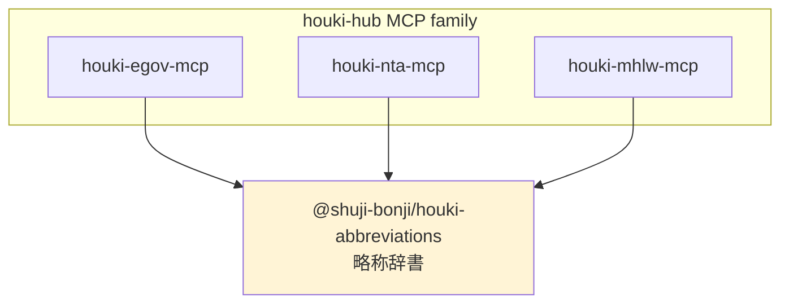

# @shuji-bonji/houki-abbreviations

> 日本の法令略称・通称の共有辞書。houki-hub MCP family が共通で利用する基盤パッケージ。

[](https://github.com/shuji-bonji/houki-abbreviations/actions/workflows/ci.yml)
[](https://www.npmjs.com/package/@shuji-bonji/houki-abbreviations)
[](LICENSE)

## 何のパッケージか

日本の法令には「消法」「労基法」「電帳法」のような**略称**と、「電子帳簿保存法」のような**通称**があります。条文を参照したい LLM や MCP は、ユーザーがどの呼称で入力しても正式名称・e-Gov law_id に解決できる必要があります。

このパッケージは、houki-hub MCP family（`houki-egov-mcp`、`houki-nta-mcp`、`houki-mhlw-mcp` 等）が**共通で参照する辞書層**です。各 MCP が独自に同じデータを持たないように、ここに一元化しています。



## 収録範囲（v0.2.0 時点）

- **174 エントリ**（6 分野）
- **法律・政令・省令・規則・憲法**（e-Gov 法令 API 配下、`source_mcp_hint='houki-egov'`）
- **基本通達 8 件＋個別通達 1 件**（v0.2.0 追加分、`source_mcp_hint='houki-nta'`）

| 分野 | 件数 | 例 |
|---|---|---|
| tax | 35 | 所法、消法、電帳法、消基通、所基通、電帳法取通 |
| labor | 28 | 労基法、安衛法、フリーランス新法 |
| accounting | 9 | 公認会計士法、会計士法 |
| commercial | 31 | 会社、商法、電子署名法、資金決済法 |
| civil | 23 | 民、民訴法、不動産登記法 |
| administrative | 48 | 憲法、行手法、個情法、プロ責法 |

## インストール

```sh
npm install @shuji-bonji/houki-abbreviations
```

## 使い方

```ts
import {
  resolveAbbreviation,
  listByDomain,
  listByCategory,
  listBySourceMcpHint,
  getAbbreviationStats,
} from '@shuji-bonji/houki-abbreviations';

// 略称・通称・正式名称のいずれからもエントリを引ける
const r = resolveAbbreviation('消法');
// {
//   abbr: '消法',
//   formal: '消費税法',
//   law_id: '363AC0000000108',
//   law_num: '昭和六十三年法律第百八号',
//   law_type: 'Act',
//   domain: 'tax',
//   category: 'law',
//   source_mcp_hint: 'houki-egov',
//   aliases: ['消費税']
// }

// 通称・aliases でも引ける
resolveAbbreviation('電子帳簿保存法')?.abbr;  // '電帳法'
resolveAbbreviation('PL法')?.formal;          // '製造物責任法'

// 分野別・カテゴリ別・MCP 別の一覧
listByDomain('tax');                  // 26 件
listByCategory('cabinet-order');      // 政令系
listBySourceMcpHint('houki-egov');    // e-Gov 管轄全件

// 統計
getAbbreviationStats();
// { total: 174, byDomain: {...}, byCategory: {...}, bySourceMcpHint: {...} }
```

### 正規化 API（v0.3.0〜）

ユーザー入力に全角／半角の表記揺れがあっても照合できるようにする正規化ユーティリティ群です。houki-hub MCP family 全体で同じ正規化ルールを使うことで、検索・解決の挙動を統一できます。

```ts
import {
  normalizeJpText,
  normalizeSearchQuery,
  resolveAbbreviation,
} from '@shuji-bonji/houki-abbreviations';

// 全角ゆらぎを保守的に半角化（大文字小文字は保持）
normalizeJpText('１８３－２');     // '183-2'
normalizeJpText('ＰＬ法');         // 'PL法'
normalizeJpText('消　法');         // '消 法'

// 検索クエリ向けの積極的な正規化（さらに小文字化＋空白畳み込み）
normalizeSearchQuery('ＰＬ法');     // 'pl法'
normalizeSearchQuery(' 消    法 '); // '消 法'

// resolveAbbreviation の normalize オプション（デフォルト OFF で後方互換）
resolveAbbreviation('ＰＬ法', { normalize: true })?.formal;
// '製造物責任法'（全角→半角を吸収）

resolveAbbreviation('消　法', { normalize: true })?.formal;
// '消費税法'（全角スペースを吸収）

resolveAbbreviation('ＰＬ法');  // null（normalize: false がデフォルト）
```

正規化ルールは [houki-nta-mcp の Normalize-everywhere パターン](https://github.com/shuji-bonji/houki-nta-mcp) と同じで、漢字・ひらがな・カタカナ・中黒（`・`）は変更しません。詳細は [`src/normalize.ts`](src/normalize.ts) のドキュメントを参照。

### 検索 API（v0.4.0〜）

`resolveAbbreviation` が**完全一致**しか返さないのに対し、本 API は**部分一致**と**あいまい一致**を提供します。LLM が "労働" のような不完全なキーワードや "労働基準法施行例"（"令" の typo）を投げてきた場合に、候補を返してリカバリーするためのものです。

```ts
import {
  abbreviationEntries,
  searchByName,
  findSimilar,
  suggestCorrection,
} from '@shuji-bonji/houki-abbreviations';

// 部分一致（contains がデフォルト）
searchByName(abbreviationEntries, '労働');
// → 労基法 / 労契法 / 労安衛法 / 労組法 ...

// prefix モード：先頭一致
searchByName(abbreviationEntries, '労働', { mode: 'prefix' });

// filter + limit
searchByName(abbreviationEntries, '税法', {
  mode: 'contains',
  filter: { domain: 'tax' },
  limit: 5,
});

// あいまい一致（typo 救済）
findSimilar(abbreviationEntries, '労働基準法施行例');
// → [{ entry: <労基法施行令>, matchedKey: '労働基準法施行令', distance: 1 }, ...]

// "もしかして" — formal だけ欲しい場合
suggestCorrection(abbreviationEntries, '労働基準法施行例');
// → ['労働基準法施行令', ...]
```

#### `searchByName` のモード別挙動

`abbr` / `formal` / `aliases` のいずれかにマッチを試みます。`normalize: true`（デフォルト）の場合は全角ゆらぎを吸収して比較します。

| `mode` | マッチ条件 | クエリ `労働` での挙動例 |
|---|---|---|
| `'prefix'` | 候補文字列の **先頭** に query が出現 | `労働基準法` ✅ / `労働者派遣法` ✅ / `改正労働法` ❌ |
| `'contains'`（default） | 候補文字列の **どこか** に query を含む | `労働基準法` ✅ / `改正労働基準法` ✅ |
| `'suffix'` | 候補文字列の **末尾** に query が出現 | `民法・労働法` ✅ / `労働基準法` ❌ |

返却順は元の辞書順（`abbreviationEntries` の並び）を維持し、`limit` 件で打ち切ります。重複エントリ（同じ `abbr` が複数キーにヒット）は最初の 1 件だけ返します。

#### `findSimilar` の Levenshtein 距離

[Levenshtein 距離](https://ja.wikipedia.org/wiki/レーベンシュタイン距離)（編集距離）= 1 文字単位の挿入・削除・置換コストの合計。`maxDistance`（デフォルト `2`）以下のエントリだけ返します。

| クエリ | マッチしたキー | 距離 | 操作 |
|---|---|---|---|
| `消費税法施行令例` | `消費税法施行令`（`formal`） | 1 | 末尾「例」を削除 |
| `労働基準法施行例` | `労働基準法施行規則`（`formal`） | 2 | 「例」→「規」置換 + 「則」挿入 |
| `所得税基本通達` | `所得税基本通達`（`aliases`） | 0 | 完全一致（abbr=所基通） |
| `民訴` | `民訴`（`abbr`） | 0 | 完全一致 |

`maxDistance` を超える候補は返しません。例えば `あいうえお` のようなまったく関係ない文字列を投げても結果は空配列です。

> **注意**: あいまい一致は **typo 救済が目的** です。略称↔正式名称のような距離が大きいペアは、`aliases` で**完全一致辞書側**に登録するのが本筋です（`findSimilar` ではヒットしません）。

実装の詳細（O(m\*n) 時間 / O(min(m,n)) 空間の自前 DP）は [`src/search.ts`](src/search.ts) の `levenshtein` を参照。外部依存はゼロです。

### 鮮度判定 API（v0.4.1〜）

houki-hub MCP family が **同じ感覚で `fetched_at` の staleness を判定する**ための共有ヘルパです。判定の **しきい値・型・純関数** だけを共通化し、DB アクセスやレスポンス整形は各 MCP 側に残します（[memory `houki_resilience_locality.md`](https://github.com/shuji-bonji) の「検知ロジックは各 MCP に置き、集約は結果レイヤーで」スタンスに従う設計判断）。

> **重要**: `freshness` は **エントリ単位のフィールドではありません**。`AbbreviationEntry` には `freshness` 関連フィールドは存在せず、各 MCP が自前で持つ `fetched_at` を本パッケージのヘルパで判定する形です。

```ts
import {
  judgeStaleness,
  computeDaysSince,
  STALENESS_THRESHOLDS,
} from '@shuji-bonji/houki-abbreviations';

const days = computeDaysSince('2026-04-15T00:00:00Z');
const level = judgeStaleness(days);
// level: 'fresh' | 'stale' | 'outdated'

STALENESS_THRESHOLDS.fresh_days; // 7
STALENESS_THRESHOLDS.stale_days; // 30
```

| `level` | 経過日数 | 想定運用 |
|---|---|---|
| `'fresh'` | `< 7 日` | 週次 health-check 想定。そのまま使ってよい |
| `'stale'` | `7 日 ≦ x < 30 日` | 利用は可だが、bulk DL 推奨を warning として返す |
| `'outdated'` | `≧ 30 日` | 月次 bulk DL 想定。利用前に再取得を促す |

しきい値は houki-nta-mcp v0.6.0（Phase 5 Resilience）で確立した慣行値です。MCP 側で固有のしきい値が必要な場合は `judgeStaleness` をラップしてください（`STALENESS_THRESHOLDS` を上書きしないこと）。

### 逆引き API（v0.5.0〜）

`law_id` / `law_num` から辞書を引く逆引きと、エントリの **全別表記** を一発で取得するヘルパです。

```ts
import {
  lookupByLawId,
  lookupByLawNum,
  getAllNames,
} from '@shuji-bonji/houki-abbreviations';

// e-Gov law_id から逆引き
lookupByLawId('363AC0000000108')?.formal;  // '消費税法'
lookupByLawId('321CONSTITUTION')?.formal;  // '日本国憲法'

// 法令番号（漢数字）から逆引き
lookupByLawNum('昭和六十三年法律第百八号')?.formal;  // '消費税法'

// エントリの全別表記を列挙（LLM プロンプト生成用）
getAllNames('消法');
// → ['消法', '消費税法', '消費税', 'インボイス', 'インボイス制度', ...]
```

> **注意**: `lookupByLawNum` は v0.5.0 では **完全一致のみ**。漢数字↔算用数字の正規化は将来追加予定（`昭和63年法律第108号` のような算用数字表記は現状ヒットしません）。

### 検証 API（v0.5.0〜）

`law_id` の形式チェック、辞書全体の整合性チェック、テキスト中の法令名抽出を提供します。

```ts
import {
  isValidLawId,
  validateAllEntries,
  extractLawNames,
} from '@shuji-bonji/houki-abbreviations';

// law_id 形式チェック（外部 API は叩かない純粋関数）
isValidLawId('363AC0000000108');  // true
isValidLawId('321CONSTITUTION');  // true
isValidLawId('AAA');              // false

// 辞書全体の整合性（CI 用途）
const report = validateAllEntries();
report.valid;     // boolean (errors.length === 0)
report.errors;    // 重大な不整合
report.warnings;  // 軽微な不整合

// テキスト中の法令名抽出（LLM 出力チェック用途）
extractLawNames('消費税法と法人税法の改正について。インボイス制度も対象。');
// → [
//   { entry: <消法>,   matchedKey: '消費税法',         position: 0,  length: 4 },
//   { entry: <法法>,   matchedKey: '法人税法',         position: 5,  length: 4 },
//   { entry: <消法>,   matchedKey: 'インボイス制度', position: 17, length: 7 },
// ]
```

#### `validateAllEntries` のチェック内容

| レベル | コード | 内容 |
|---|---|---|
| error | `duplicate_abbr` | `abbr` の重複 |
| error | `duplicate_law_id` | `law_id` の重複 |
| error | `invalid_law_id` | `law_id` 形式が `isValidLawId` で false |
| error | `missing_required_field` | 必須フィールド欠損（`abbr` / `formal` / `domain` / `category` / `source_mcp_hint`） |
| warning | `category_hint_mismatch` | `category` × `source_mcp_hint` の組合せが想定外 |
| warning | `duplicate_alias_within_entry` | 同一エントリ内の `aliases` 重複 |
| warning | `alias_collides_with_abbr` | `aliases` が他エントリの `abbr` と衝突 |

CI で `npm run validate` を呼ぶと、`errors > 0` の場合に exit 1 を返します。

#### `isValidLawId` が認識するパターン

| パターン | 例 | 説明 |
|---|---|---|
| `\d{3}(AC\|CO\|IO\|MO\|RU)\d{10}` | `363AC0000000108` | 標準: 元号(1)+年(2)+種別(2)+連番(10) |
| `\d{3}CONSTITUTION` | `321CONSTITUTION` | 憲法専用 |

> **未対応**: e-Gov の bulk data には他の種別コード（例: `DF` 系、`M\d{2}` 形式の省令系）も存在しますが、正確な仕様未確定のため v0.5.0 では未対応です。新種別の law_id を持つエントリを辞書に追加する場合は、本パッケージ側でパターンを拡張するまで `validateAllEntries` が `invalid_law_id` error を返します。

#### `extractLawNames` のオプション

| オプション | デフォルト | 役割 |
|---|---|---|
| `minLength` | `2` | これより短いキーは抽出対象外（1 文字略称のノイズ抑制） |
| `preferLonger` | `true` | 部分包含時に長い方を優先（例: `民法等の一部を改正する法律` 内の `民法` を捨てる） |
| `dedupe` | `false` | 同一エントリのマッチを 1 件に絞る |

## API

### `resolveAbbreviation(name: string, options?: ResolveAbbreviationOptions): AbbreviationEntry | null`

略称・通称・正式名称のいずれかからエントリを引きます。前後の空白はトリムされます。完全一致のみ（部分一致なし）。見つからない場合は `null`。

`options.normalize`（デフォルト `false`）を `true` にすると、全角／半角の表記揺れを吸収して照合します。**大文字小文字は保持**されるため、`PL法` と `pl法` は別物として扱われます。

### `normalizeJpText(input: string): string`

全角数字・全角 ASCII 文字・全角ハイフン（`－` → `-`）・全角チルダ（`～` `〜` → `~`）・全角スペース（`　` → ` `）を半角化します。漢字・かな・中黒は保持。`.trim()` 込み。

### `normalizeSearchQuery(input: string): string`

`normalizeJpText` の処理に加えて、ASCII 大文字を小文字へ変換し、連続する空白文字を単一の半角スペースに畳み込みます。FTS5 検索など、ユーザー入力の揺れを最大限吸収したいケース向け。

### `listByDomain(domain: Domain): AbbreviationEntry[]`

`'tax' | 'labor' | 'accounting' | 'commercial' | 'civil' | 'administrative'` のいずれかで絞り込み。

### `listByCategory(category: Category): AbbreviationEntry[]`

法令種別で絞り込み。`'constitution' | 'law' | 'cabinet-order' | 'imperial-ordinance' | 'ministerial-ordinance' | 'rule' | 'kihon-tsutatsu' | 'kobetsu-tsutatsu' | 'qa-jirei' | 'tax-answer' | 'hanrei' | 'saiketsu'` のいずれか。

### `listBySourceMcpHint(hint: SourceMcpHint): AbbreviationEntry[]`

このエントリを処理すべき MCP で絞り込み。各 MCP が起動時に「自分の管轄エントリだけ」を抽出する用途を想定。

### `getAbbreviationStats(): AbbreviationStats`

辞書全体の統計（総数、ドメイン別、カテゴリ別、MCP 別）。

### `searchByName(entries, query, options?): AbbreviationEntry[]`

部分一致検索。`mode`（`'prefix' | 'contains' | 'suffix'`、default `'contains'`）、`filter`（`domain` / `category` / `source_mcp_hint` を単一値または配列で）、`limit`（default `50`、上限 `500`）、`normalize`（default `true`）を受け取ります。空クエリは `[]` を返します。挙動と例は [検索 API 節](#検索-apiv040) を参照。

### `findSimilar(entries, query, options?): FuzzyMatch[]`

Levenshtein 距離ベースのあいまい一致。`maxDistance`（default `2`）、`limit`（default `5`）、`sortByScore`（default `true`、距離昇順）、`filter`、`normalize` を受け取ります。各 `FuzzyMatch` は `{ entry, matchedKey, distance }`。

### `suggestCorrection(entries, query, limit?): string[]`

`findSimilar` の薄いラッパで、上位 N 件の `formal` だけを文字列配列で返します。LLM プロンプトに直接埋め込みやすい形。

### `levenshtein(a, b): number`

純関数の Levenshtein 距離。検索 API 内部から export されており、テストや独自検索ロジックでも利用可能。

### `judgeStaleness(daysSince): StalenessLevel`

経過日数（整数）から `'fresh' | 'stale' | 'outdated'` を返す純関数。しきい値は `STALENESS_THRESHOLDS`。

### `computeDaysSince(fetchedAt, nowMs?): number`

ISO 8601 の `fetched_at` 文字列と `nowMs`（default `Date.now()`）から経過日数を計算（小数なし、`floor`）。未来時刻・パース不能はすべて `0` を返すので、呼び出し側で warning に出すかどうかは MCP 側で判断します。

### `STALENESS_THRESHOLDS`

`{ fresh_days: 7, stale_days: 30 }` の `as const`。family 全体で同じ感覚を持つために共有しています。MCP 固有のしきい値が必要な場合は本定数を**上書きせず** `judgeStaleness` をラップする形が正典です。

### `lookupByLawId(law_id): AbbreviationEntry | null`

e-Gov `law_id` から辞書エントリを引きます。`law_id !== null` のエントリのみが対象。完全一致（前後空白は trim）。

### `lookupByLawNum(law_num): AbbreviationEntry | null`

法令番号（漢数字表記）から辞書エントリを引きます。完全一致のみ（v0.5.0 では漢数字正規化なし）。

### `getAllNames(name): string[]`

`abbr` / `formal` / `aliases` のいずれかから、そのエントリの全別表記を `[abbr, formal, ...aliases]` 順・重複除去済みで返します。見つからなければ `[]`。

### `isValidLawId(law_id): boolean`

`law_id` の形式が e-Gov 仕様に沿うか純粋関数で判定。外部 API は叩きません。

### `validateAllEntries(): ValidationReport`

辞書全体の静的整合性を検査し、`{ valid, errors, warnings }` を返します。CI で `npm run validate` から呼ぶ想定。

### `extractLawNames(text, options?): LawNameMatch[]`

入力テキスト中の法令名らしき文字列を辞書マッチで抽出します。位置順、`preferLonger` で部分包含を整理。LLM 出力に法令名が含まれているかのチェックに使えます。

## エントリ型

```ts
interface AbbreviationEntry {
  abbr: string;            // 略称（例: '消法'）
  formal: string;          // 正式名称（例: '消費税法'）
  law_id: string | null;   // e-Gov law_id（verified 済みのみ。それ以外は null）
  law_num?: string;        // 法令番号（例: '昭和六十三年法律第百八号'）
  law_type?: LawTypeCode;  // 'Act' | 'CabinetOrder' | ...（後方互換）
  domain: Domain;          // 分野タグ
  category: Category;      // 法令カテゴリ
  source_mcp_hint: SourceMcpHint;  // 参照すべき MCP
  aliases?: string[];      // 同義の別表記
  note?: string;           // 備考
}
```

### `law_id` の方針

- **格納するのは e-Gov 法令 API で動作確認済み（verified）の `law_id` のみ**です
- 未確認・未調査・該当なしのエントリは `null` を入れます
- 通達系（`source_mcp_hint='houki-nta'` 等）は e-Gov 配下ではないため、設計上 `law_id` は基本的に `null` です
- 利用側で `if (entry.law_id !== null) { /* e-Gov 取得 */ }` のような分岐を期待しています

## category と source_mcp_hint の対応

| category | 例 | source_mcp_hint |
|---|---|---|
| `constitution` | 日本国憲法 | houki-egov |
| `law` | 消費税法、労働基準法 | houki-egov |
| `cabinet-order` | 消費税法施行令 | houki-egov |
| `ministerial-ordinance` | 消費税法施行規則 | houki-egov |
| `rule` | 各庁規則 | houki-egov |
| `kihon-tsutatsu` *(将来)* | 消費税法基本通達 | houki-nta |
| `kobetsu-tsutatsu` *(将来)* | 個別通達 | houki-nta / houki-mhlw |
| `qa-jirei` *(将来)* | 質疑応答事例 | houki-nta |
| `hanrei` *(将来)* | 判例 | houki-court |
| `saiketsu` *(将来)* | 国税不服審判所裁決 | houki-saiketsu |

v0.1.0 では `houki-egov` 管轄のみ。`houki-nta-mcp` 等の開発と並行してエントリを追加していきます。

## ロードマップ

中期計画は [docs/v0.4.0-roadmap.md](docs/v0.4.0-roadmap.md) を参照。v0.4.0 で検索拡張（部分一致・あいまい一致）、v0.5.0 で逆引き API と検証ヘルパーを追加済み。ルーティングヘルパーは YAGNI 判断で延期（3 つ目の MCP 着手時に再評価、[docs/v0.5-v0.6-design.md](docs/v0.5-v0.6-design.md) 参照）。辞書増強（aliases / 通称の網羅）は patch release で継続的に。

## 貢献方法

辞書の追加・修正は PR でお願いします。詳しくは [CONTRIBUTING.md](CONTRIBUTING.md) を参照。

## リリース

リリース手順・Trusted Publisher 設定・トラブルシュートは [docs/RELEASE.md](docs/RELEASE.md) を参照。

## ライセンス

MIT
