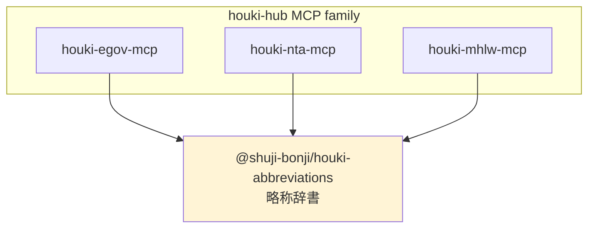

# @shuji-bonji/houki-abbreviations

> 日本の法令略称・通称の共有辞書。houki-hub MCP family が共通で利用する基盤パッケージ。

[](https://github.com/shuji-bonji/houki-abbreviations/actions/workflows/ci.yml)
[](https://www.npmjs.com/package/@shuji-bonji/houki-abbreviations)
[](LICENSE)

## 何のパッケージか

日本の法令には「消法」「労基法」「電帳法」のような**略称**と、「電子帳簿保存法」のような**通称**があります。条文を参照したい LLM や MCP は、ユーザーがどの呼称で入力しても正式名称・e-Gov law_id に解決できる必要があります。

このパッケージは、houki-hub MCP family（`houki-egov-mcp`、`houki-nta-mcp`、`houki-mhlw-mcp` 等）が**共通で参照する辞書層**です。各 MCP が独自に同じデータを持たないように、ここに一元化しています。



## v0.1.0 の収録範囲

- **165 エントリ**（6 分野）
- **法律・政令・省令・規則・憲法**（e-Gov 法令API 配下）
- 全エントリ `source_mcp_hint='houki-egov'`

| 分野 | 件数 | 例 |
|---|---|---|
| tax | 26 | 所法、消法、電帳法 |
| labor | 28 | 労基法、安衛法、フリーランス新法 |
| accounting | 9 | 公認会計士法、会計士法 |
| commercial | 31 | 会社、商法、電子署名法、資金決済法 |
| civil | 23 | 民、民訴法、不動産登記法 |
| administrative | 48 | 憲法、行手法、個情法、プロ責法 |

## インストール

```sh
npm install @shuji-bonji/houki-abbreviations
```

## 使い方

```ts
import {
  resolveAbbreviation,
  listByDomain,
  listByCategory,
  listBySourceMcpHint,
  getAbbreviationStats,
} from '@shuji-bonji/houki-abbreviations';

// 略称・通称・正式名称のいずれからもエントリを引ける
const r = resolveAbbreviation('消法');
// {
//   abbr: '消法',
//   formal: '消費税法',
//   law_id: '363AC0000000108',
//   law_num: '昭和六十三年法律第百八号',
//   law_type: 'Act',
//   domain: 'tax',
//   category: 'law',
//   source_mcp_hint: 'houki-egov',
//   aliases: ['消費税']
// }

// 通称・aliases でも引ける
resolveAbbreviation('電子帳簿保存法')?.abbr;  // '電帳法'
resolveAbbreviation('PL法')?.formal;          // '製造物責任法'

// 分野別・カテゴリ別・MCP 別の一覧
listByDomain('tax');                  // 26 件
listByCategory('cabinet-order');      // 政令系
listBySourceMcpHint('houki-egov');    // e-Gov 管轄全件

// 統計
getAbbreviationStats();
// { total: 165, byDomain: {...}, byCategory: {...}, bySourceMcpHint: {...} }
```

## API

### `resolveAbbreviation(name: string): AbbreviationEntry | null`

略称・通称・正式名称のいずれかからエントリを引きます。前後の空白はトリムされます。完全一致のみ（部分一致なし）。見つからない場合は `null`。

### `listByDomain(domain: Domain): AbbreviationEntry[]`

`'tax' | 'labor' | 'accounting' | 'commercial' | 'civil' | 'administrative'` のいずれかで絞り込み。

### `listByCategory(category: Category): AbbreviationEntry[]`

法令種別で絞り込み。`'constitution' | 'law' | 'cabinet-order' | 'imperial-ordinance' | 'ministerial-ordinance' | 'rule' | 'kihon-tsutatsu' | 'kobetsu-tsutatsu' | 'qa-jirei' | 'tax-answer' | 'hanrei' | 'saiketsu'` のいずれか。

### `listBySourceMcpHint(hint: SourceMcpHint): AbbreviationEntry[]`

このエントリを処理すべき MCP で絞り込み。各 MCP が起動時に「自分の管轄エントリだけ」を抽出する用途を想定。

### `getAbbreviationStats(): AbbreviationStats`

辞書全体の統計（総数、ドメイン別、カテゴリ別、MCP 別）。

## エントリ型

```ts
interface AbbreviationEntry {
  abbr: string;            // 略称（例: '消法'）
  formal: string;          // 正式名称（例: '消費税法'）
  law_id: string | null;   // e-Gov law_id（verified 済みのみ）
  law_num?: string;        // 法令番号（例: '昭和六十三年法律第百八号'）
  law_type?: LawTypeCode;  // 'Act' | 'CabinetOrder' | ...（後方互換）
  domain: Domain;          // 分野タグ
  category: Category;      // 法令カテゴリ
  source_mcp_hint: SourceMcpHint;  // 参照すべき MCP
  aliases?: string[];      // 同義の別表記
  note?: string;           // 備考
}
```

## category と source_mcp_hint の対応

| category | 例 | source_mcp_hint |
|---|---|---|
| `constitution` | 日本国憲法 | houki-egov |
| `law` | 消費税法、労働基準法 | houki-egov |
| `cabinet-order` | 消費税法施行令 | houki-egov |
| `ministerial-ordinance` | 消費税法施行規則 | houki-egov |
| `rule` | 各庁規則 | houki-egov |
| `kihon-tsutatsu` *(将来)* | 消費税法基本通達 | houki-nta |
| `kobetsu-tsutatsu` *(将来)* | 個別通達 | houki-nta / houki-mhlw |
| `qa-jirei` *(将来)* | 質疑応答事例 | houki-nta |
| `hanrei` *(将来)* | 判例 | houki-court |
| `saiketsu` *(将来)* | 国税不服審判所裁決 | houki-saiketsu |

v0.1.0 では `houki-egov` 管轄のみ。`houki-nta-mcp` 等の開発と並行してエントリを追加していきます。

## 貢献方法

辞書の追加・修正は PR でお願いします。詳しくは [CONTRIBUTING.md](CONTRIBUTING.md) を参照。

## ライセンス

MIT
