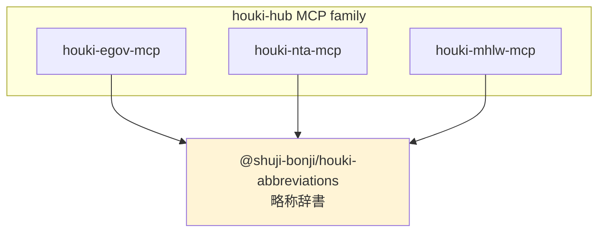

# @shuji-bonji/houki-abbreviations

> 日本の法令略称・通称の共有辞書。houki-hub MCP family が共通で利用する基盤パッケージ。

[](https://github.com/shuji-bonji/houki-abbreviations/actions/workflows/ci.yml)
[](https://www.npmjs.com/package/@shuji-bonji/houki-abbreviations)
[](LICENSE)

## 何のパッケージか

日本の法令には「消法」「労基法」「電帳法」のような**略称**と、「電子帳簿保存法」のような**通称**があります。条文を参照したい LLM や MCP は、ユーザーがどの呼称で入力しても正式名称・e-Gov law_id に解決できる必要があります。

このパッケージは、houki-hub MCP family（`houki-egov-mcp`、`houki-nta-mcp`、`houki-mhlw-mcp` 等）が**共通で参照する辞書層**です。各 MCP が独自に同じデータを持たないように、ここに一元化しています。


```mermaid
graph TB
    subgraph "houki-hub MCP family"
        Egov[houki-egov-mcp]
        NTA[houki-nta-mcp]
        MHLW[houki-mhlw-mcp]
    end

    Abbr["@shuji-bonji/houki-abbreviations<br/>略称辞書"]

    Egov --> Abbr
    NTA --> Abbr
    MHLW --> Abbr

    style Abbr fill:#fff4d6
```

## 収録範囲（v0.7.0 時点。エントリの件数は v0.2.0 から変更なし）

- **174 エントリ**（6 分野）。v0.7.0 で 33 件の `aliases` から自分の `formal` と同じ値を外した（エントリの件数と名前で引ける範囲は変わらない）
- **法律・政令・省令・規則・憲法**（e-Gov 法令 API 配下、`source_mcp_hint='houki-egov'`）
- **基本通達 8 件＋個別通達 1 件**（`source_mcp_hint='houki-nta'`）

| 分野           | 件数 | 例                                             |
| -------------- | ---- | ---------------------------------------------- |
| tax            | 35   | 所法、消法、電帳法、消基通、所基通、電帳法取通 |
| labor          | 28   | 労基法、安衛法、フリーランス新法               |
| accounting     | 9    | 公認会計士法、会計士法                         |
| commercial     | 31   | 会社、商法、電子署名法、資金決済法             |
| civil          | 23   | 民、民訴法、不動産登記法                       |
| administrative | 48   | 憲法、行手法、個情法、プロ責法                 |

## インストール

```sh
npm install @shuji-bonji/houki-abbreviations
```

## 使い方

```ts
import {
  resolveAbbreviation,
  listByDomain,
  listByCategory,
  listBySourceMcpHint,
  getAbbreviationStats,
} from '@shuji-bonji/houki-abbreviations';

// 略称・通称・正式名称のいずれからもエントリを引ける
const r = resolveAbbreviation('消法');
// {
//   abbr: '消法',
//   formal: '消費税法',
//   law_id: '363AC0000000108',
//   law_num: '昭和六十三年法律第百八号',
//   law_type: 'Act',
//   domain: 'tax',
//   category: 'law',
//   source_mcp_hint: 'houki-egov',
//   aliases: ['消費税']
// }

// 通称・aliases でも引ける
resolveAbbreviation('電子帳簿保存法')?.abbr; // '電帳法'
resolveAbbreviation('PL法')?.formal; // '製造物責任法'

// 分野別・カテゴリ別・MCP 別の一覧
listByDomain('tax'); // 35 件
listByCategory('cabinet-order'); // 政令系
listBySourceMcpHint('houki-egov'); // e-Gov 管轄全件

// 統計（byDomain / byCategory / bySourceMcpHint は定数の全値がキーで、無い値は 0。v0.7.0〜）
getAbbreviationStats();
// { total: 174, byDomain: {...}, byCategory: { ..., hanrei: 0, ... }, bySourceMcpHint: {...} }
```

返ってくるエントリは辞書の要素そのもので、**凍結されています**（v0.7.0〜）。フィールドへの代入や `aliases` への `push` は `TypeError` になるので、書き換えたいときは `structuredClone(entry)` や `{ ...entry }` で自分のコピーを作ってください。`DOMAINS` / `CATEGORIES` / `SOURCE_MCP_HINTS` / `LAW_TYPE_CODES` / `STALENESS_THRESHOLDS` も凍結されています。

### 正規化 API（v0.3.0〜）

ユーザー入力に全角／半角の表記揺れがあっても照合できるようにする正規化ユーティリティ群です。houki-hub MCP family 全体で同じ正規化ルールを使うことで、検索・解決の挙動を統一できます。

```ts
import {
  normalizeJpText,
  normalizeSearchQuery,
  resolveAbbreviation,
} from '@shuji-bonji/houki-abbreviations';

// 全角ゆらぎを保守的に半角化（大文字小文字は保持）
normalizeJpText('１８３－２'); // '183-2'
normalizeJpText('１８３―２'); // '183-2'（U+2015 などのダッシュ類も。v0.7.0〜）
normalizeJpText('ＰＬ法'); // 'PL法'
normalizeJpText('消　法'); // '消 法'（全角スペースは半角スペースになる。取り除かれはしない）

// 検索クエリ向けの積極的な正規化（さらに A〜Z の小文字化＋空白畳み込み）
normalizeSearchQuery('ＰＬ法'); // 'pl法'
normalizeSearchQuery(' 消    法 '); // '消 法'
normalizeSearchQuery('Ⅰ Α À PL'); // 'Ⅰ Α À pl'（英字以外の大文字は変えない。v0.7.0〜）

// resolveAbbreviation の normalize オプション（デフォルト OFF で後方互換）
resolveAbbreviation('ＰＬ法', { normalize: true })?.formal;
// '製造物責任法'（全角→半角を吸収）

resolveAbbreviation('　消法　', { normalize: true })?.formal;
// '消費税法'（前後の全角スペースを吸収。名前の途中の空白は取り除かないので '消　法' は null）

resolveAbbreviation('ＰＬ法'); // null（normalize: false がデフォルト）
```

`normalizeJpText` が `-` に揃えるダッシュ類は `－` `‐` `‑` `–` `—` `―` `−` の 7 文字です（v0.7.0〜。v0.6.1 までは全角ハイフン `－` だけ）。罫線 `─` と長音 `ー` は変えません。`normalizeJpText` を使う `searchByName` / `findSimilar` / `normalizeSearchQuery` / `normalizeLawNum` も同じ範囲を `-` にして比べます。

名前や ID を受け取る関数には `options.normalize` があります。既定はどれも `false`（`searchByName` / `findSimilar` は `true`）で、MCP サーバーは入口で `true` を渡します。

| 関数                                       | `normalize: true` で吸収するもの                                   |
| ------------------------------------------ | ------------------------------------------------------------------ |
| `resolveAbbreviation(name, { normalize })` | 全角英数字・ダッシュ類・全角チルダ・全角スペース（v0.3.0〜）       |
| `getAllNames(name, { normalize })`         | 同上。返す名前は辞書の表記のまま（v0.7.0〜）                       |
| `lookupByLawId(law_id, { normalize })`     | 全角英数字。小文字は大文字にしない（v0.7.0〜）                     |
| `extractLawNames(text, { normalize })`     | 同上。`position` / `length` は元の `text` の位置で返す（v0.7.0〜） |

法令番号には専用の `normalizeLawNum` があります（v0.6.0〜）。漢数字（位取りの `二十五` と位ごとの `二五` の両方）・算用数字・全角数字を算用数字に揃え、`元年` を `1年` にし、空白を取り除きます。`lookupByLawNum` はこの関数で入力と辞書の両方を揃えてから比較します。算用数字にする漢数字は、年・番号の位置（`年` `号` の直前、`第` の直後、ダッシュの隣）にあるものだけで、地名や語の一部（`千葉県` `一般`）は変えません（v0.7.0〜）。桁数の大きい算用数字も丸めません。

```ts
import { normalizeLawNum, kanjiToNumber } from '@shuji-bonji/houki-abbreviations';

normalizeLawNum('昭和二十五年法律第百三十七号'); // '昭和25年法律第137号'
normalizeLawNum('昭和２５年法律第１３７号'); // '昭和25年法律第137号'
normalizeLawNum('昭和二五年法律第一三七号'); // '昭和25年法律第137号'
normalizeLawNum('令和元年法律第一号'); // '令和1年法律第1号'
normalizeLawNum('千葉県条例第一号'); // '千葉県条例第1号'（v0.7.0〜。v0.6.1 までは '1000葉県条例第1号'）

kanjiToNumber('百三十七'); // 137
kanjiToNumber('一三七'); // 137（位ごと）
kanjiToNumber('十十'); // null（読めない並び）
kanjiToNumber('一'.repeat(16)); // null（位ごとの並びは 15 文字まで。v0.7.0〜）
```

揃えないもの: 元号の別表記（`S25`）、`第` `号` の省略、種別名（`法律` / `政令`）の補完。これらは表記の揺れではなく別の書き方なので、呼び出し側で揃えてください。

正規化ルールは [houki-nta-mcp の Normalize-everywhere パターン](https://github.com/shuji-bonji/houki-nta-mcp) と同じで、漢字・ひらがな・カタカナ・中黒（`・`）は変更しません。詳細は [`src/normalize.ts`](src/normalize.ts) のドキュメントを参照。

### 検索 API（v0.4.0〜）

`resolveAbbreviation` が**完全一致**しか返さないのに対し、本 API は**部分一致**と**あいまい一致**を提供します。LLM が "労働" のような不完全なキーワードや "労働基準法施行例"（"令" の typo）を投げてきた場合に、候補を返してリカバリーするためのものです。

辞書は関数の側が持っているので、エントリ配列を渡す必要はありません。

```ts
import { searchByName, findSimilar, suggestCorrection } from '@shuji-bonji/houki-abbreviations';

// 部分一致（contains がデフォルト）
searchByName('労働');
// → 労基法 / 労契法 / 労安衛法 / 労組法 ...

// prefix モード：先頭一致
searchByName('労働', { mode: 'prefix' });

// filter + limit
searchByName('税法', {
  mode: 'contains',
  filter: { domain: 'tax' },
  limit: 5,
});

// あいまい一致（typo 救済）
findSimilar('労働基準法施行例');
// → [{ entry: <労基則>, matchedKey: '労働基準法施行規則', distance: 2 }]

// "もしかして" — formal だけ欲しい場合（query と一致したエントリは入らない。v0.7.0〜）
suggestCorrection('労働基準法施行例');
// → ['労働基準法施行規則']
suggestCorrection('民法');
// → ['民事訴訟法', '民事執行法', '民事保全法']（'民法' 自身は入らない）
```

`limit` は 3 つの関数とも **1 以上 500 以下の整数** だけを受け付けます（v0.7.0〜）。それ以外の数（0、小数、501、`NaN`、`Infinity`）は `RangeError`、数でない値は `TypeError` を投げ、丸めません。省くと `searchByName` は 50、`findSimilar` / `suggestCorrection` は 5 です。

#### `searchByName` のモード別挙動

`abbr` / `formal` / `aliases` のいずれかにマッチを試みます。`normalize: true`（デフォルト）の場合は全角ゆらぎを吸収して比較します。

| `mode`                  | マッチ条件                              | クエリ `労働` での挙動例                              |
| ----------------------- | --------------------------------------- | ----------------------------------------------------- |
| `'prefix'`              | 候補文字列の **先頭** に query が出現   | `労働基準法` ✅ / `労働者派遣法` ✅ / `改正労働法` ❌ |
| `'contains'`（default） | 候補文字列の **どこか** に query を含む | `労働基準法` ✅ / `改正労働基準法` ✅                 |
| `'suffix'`              | 候補文字列の **末尾** に query が出現   | `民法・労働法` ✅ / `労働基準法` ❌                   |

返却順は元の辞書順（`abbreviationEntries` の並び）を維持し、`limit` 件で打ち切ります。重複エントリ（同じ `abbr` が複数キーにヒット）は最初の 1 件だけ返します。

#### `findSimilar` の Levenshtein 距離

[Levenshtein 距離](https://ja.wikipedia.org/wiki/レーベンシュタイン距離)（編集距離）= 1 文字単位（コードポイント単位。`𠮷` は 1 文字。v0.7.0〜）の挿入・削除・置換コストの合計。`maxDistance`（デフォルト `2`）以下のエントリだけ返します。

| クエリ             | マッチしたキー                   | 距離 | 操作                           |
| ------------------ | -------------------------------- | ---- | ------------------------------ |
| `消費税法施行令例` | `消費税法施行令`（`formal`）     | 1    | 末尾「例」を削除               |
| `労働基準法施行例` | `労働基準法施行規則`（`formal`） | 2    | 「例」→「規」置換 + 「則」挿入 |
| `所得税基本通達`   | `所得税基本通達`（`formal`）     | 0    | 完全一致（abbr=所基通）        |
| `民訴`             | `民訴`（`abbr`）                 | 0    | 完全一致                       |

`maxDistance` を超える候補は返しません。例えば `あいうえお` のようなまったく関係ない文字列を投げても結果は空配列です。

さらに、名前ごとに **距離の比** で足切りします（v0.7.0〜）。`query` と名前の編集距離を長い方の文字数で割った比が 1/3 を超える名前は、`maxDistance` 以下でも返しません（`距離 × 3 ≤ 長い方の文字数` のときだけ返す。距離 0 は文字数によらず返す）。`民法` に `所法` `法法` のような 2 文字の別の略称が距離 1 で並ぶことを防ぐためで、`findSimilar('民法')` は `民`（`民法`、0）・`民訴`（`民訴法`、1）・`民執`（`民執法`、1）・`民保`（`民保法`、1）の 4 件、`findSimilar('法')` は `[]` です。

`findSimilar` は編集距離で近い名前を返す関数で、名前の一部から一覧を得る関数ではありません。`民法` のような短い名前を渡しても `民` で始まる法令の一覧にはならないので、一覧が欲しいときは `searchByName` を使ってください。

> **注意**: あいまい一致は **typo 救済が目的** です。略称↔正式名称のような距離が大きいペアは、`aliases` で**完全一致辞書側**に登録するのが本筋です（`findSimilar` ではヒットしません）。

実装の詳細（O(m\*n) 時間 / O(min(m,n)) 空間の自前 DP）は [`src/search.ts`](src/search.ts) の `levenshtein` を参照。外部依存はゼロです。

### 鮮度判定 API（v0.4.1〜）

houki-hub MCP family が **同じ感覚で `fetched_at` の staleness を判定する**ための共有ヘルパです。判定の **しきい値・型・純関数** だけを共通化し、DB アクセスやレスポンス整形は各 MCP 側に残します（検知ロジックは各 MCP に置き、集約は結果レイヤーで行う、という family 共通の設計方針に従っています）。

> **重要**: `freshness` は **エントリ単位のフィールドではありません**。`AbbreviationEntry` には `freshness` 関連フィールドは存在せず、各 MCP が自前で持つ `fetched_at` を本パッケージのヘルパで判定する形です。

```ts
import {
  judgeStaleness,
  computeDaysSince,
  STALENESS_THRESHOLDS,
} from '@shuji-bonji/houki-abbreviations';

const days = computeDaysSince('2026-04-15T00:00:00Z');
const level = judgeStaleness(days);
// level: 'fresh' | 'stale' | 'outdated'

STALENESS_THRESHOLDS.fresh_days; // 7
STALENESS_THRESHOLDS.stale_days; // 30
```

`computeDaysSince` の `fetchedAt` は ISO 8601 の 3 つの形（日付だけ `YYYY-MM-DD`（UTC の 0 時）、UTC `YYYY-MM-DDTHH:mm:ss(.sss)Z`、時差付き `YYYY-MM-DDTHH:mm:ss(.sss)±hh:mm`）だけを受け付けます（v0.7.0〜）。それ以外の書き方（`2026/05/07`）、時差の無い時刻、暦に無い日付（2 月 30 日）は `RangeError`、文字列でない値は `TypeError` を投げます。v0.6.1 までは解釈できない文字列に `0` を返していたため、壊れた取得時刻が `fresh` になっていました。今より後の取得時刻は時計のずれとみなし、これまでどおり `0` を返します。`judgeStaleness` も負の値・`NaN`・`±Infinity` に `RangeError`、数でない値に `TypeError` を投げます。DB の `fetched_at` が壊れているときは、MCP 側でこの例外を捕まえて応答の `code` に変えてください。

| `level`      | 経過日数           | 想定運用                                        |
| ------------ | ------------------ | ----------------------------------------------- |
| `'fresh'`    | `< 7 日`           | 週次 health-check 想定。そのまま使ってよい      |
| `'stale'`    | `7 日 ≦ x < 30 日` | 利用は可だが、bulk DL 推奨を warning として返す |
| `'outdated'` | `≧ 30 日`          | 月次 bulk DL 想定。利用前に再取得を促す         |

しきい値は houki-nta-mcp v0.6.0（Phase 5 Resilience）で確立した慣行値です。MCP 側で固有のしきい値が必要な場合は `judgeStaleness` をラップしてください（`STALENESS_THRESHOLDS` を上書きしないこと）。

### 逆引き API（v0.5.0〜）

`law_id` / `law_num` から辞書を引く逆引きと、エントリの **全別表記** を一発で取得するヘルパです。

```ts
import { lookupByLawId, lookupByLawNum, getAllNames } from '@shuji-bonji/houki-abbreviations';

// e-Gov law_id から逆引き
lookupByLawId('363AC0000000108')?.formal; // '消費税法'
lookupByLawId('321CONSTITUTION')?.formal; // '日本国憲法'
lookupByLawId('３６３AC0000000108', { normalize: true })?.formal; // '消費税法'（全角を吸収。v0.7.0〜）

// 法令番号から逆引き（漢数字・算用数字・全角数字のどれでも同じエントリ。v0.6.0〜）
lookupByLawNum('昭和六十三年法律第百八号')?.formal; // '消費税法'
lookupByLawNum('昭和63年法律第108号')?.formal; // '消費税法'

// エントリの全別表記を列挙（LLM プロンプト生成用）
getAllNames('消法');
// → ['消法', '消費税法', '消費税', 'インボイス', 'インボイス制度', ...]
getAllNames('ＰＬ法', { normalize: true });
// → ['製造物責任法', 'PL法']（全角を吸収。返す名前は辞書の表記のまま。v0.7.0〜）
```

> `lookupByLawNum` は入力と辞書の `law_num` を `normalizeLawNum` で揃えてから比較します（v0.5.x は漢数字の完全一致のみでした）。元号の別表記（`S63`）や `第` `号` の省略は吸収しません。

### 検証 API（v0.5.0〜）

`law_id` の形式チェック、辞書全体の整合性チェック、テキスト中の法令名抽出を提供します。

```ts
import {
  isValidLawId,
  validateAllEntries,
  extractLawNames,
} from '@shuji-bonji/houki-abbreviations';

// law_id 形式チェック（外部 API は叩かない純粋関数）
isValidLawId('363AC0000000108'); // true
isValidLawId('321CONSTITUTION'); // true
isValidLawId('363CONSTITUTION'); // false（v0.7.0〜。v0.6.1 では true）
isValidLawId('AAA'); // false

// 辞書全体の整合性（CI 用途）
const report = validateAllEntries();
report.valid; // boolean (errors.length === 0)
report.errors; // 重大な不整合
report.warnings; // 軽微な不整合

// テキスト中の法令名抽出（LLM 出力チェック用途）
extractLawNames('消費税法と法人税法の改正について。インボイス制度も対象。');
// → [
//   { entry: <消法>,   matchedKey: '消費税法',         position: 0,  length: 4 },
//   { entry: <法法>,   matchedKey: '法人税法',         position: 5,  length: 4 },
//   { entry: <消法>,   matchedKey: 'インボイス制度', position: 17, length: 7 },
// ]
extractLawNames('ＰＬ法の規定', { normalize: true });
// → [{ entry: <PL法>, matchedKey: 'PL法', position: 0, length: 3 }]（全角を吸収。v0.7.0〜）
```

#### `validateAllEntries` のチェック内容

辞書の約束（`abbr` が一意、名前がエントリをまたいで重ならない、`aliases` に自分の名前を入れない、など）を CI で固定するための検査です。

| レベル  | コード                                                            | 内容                                                                                                                                 |
| ------- | ----------------------------------------------------------------- | ------------------------------------------------------------------------------------------------------------------------------------ |
| error   | `missing_required_field`                                          | 必須フィールド欠損（`abbr` / `formal` / `domain` / `category` / `source_mcp_hint`）                                                  |
| error   | `invalid_domain` / `invalid_category` / `invalid_source_mcp_hint` | `DOMAINS` / `CATEGORIES` / `SOURCE_MCP_HINTS` に無い値（v0.7.0〜）                                                                   |
| error   | `duplicate_abbr`                                                  | `abbr` の重複                                                                                                                        |
| error   | `duplicate_name`                                                  | `abbr` / `formal` / `aliases` が `normalizeJpText` 後に別のエントリの名前と重なる（`abbr` どうしは `duplicate_abbr` だけ。v0.7.0〜） |
| error   | `alias_equals_own_name`                                           | `aliases` に自分の `abbr` / `formal` と同じ値がある（v0.7.0〜）                                                                      |
| error   | `invalid_law_id`                                                  | `law_id` 形式が `isValidLawId` で false                                                                                              |
| error   | `duplicate_law_id`                                                | `law_id` の重複                                                                                                                      |
| warning | `category_hint_mismatch`                                          | `category` × `source_mcp_hint` の組合せが想定外                                                                                      |
| warning | `duplicate_alias_within_entry`                                    | 同一エントリ内の `aliases` 重複                                                                                                      |

v0.6.1 にあった警告 `alias_collides_with_abbr` は `duplicate_name` のエラーに含まれるので無くしました。CI（`ci.yml` の build ジョブ）で `npm run build` の後に `npm run validate` を呼び、`errors > 0` の場合に exit 1 を返します。

#### `isValidLawId` が認識するパターン

e-Gov の公式仕様（[法令種別と法令ID](https://laws.e-gov.go.jp/docs/law-data-basic/607318a-lawtypes-and-lawid/)）に合わせた 6 つの形だけを受け付けます（v0.7.0〜）。長さはすべて 15 文字、英字は大文字だけ、元号の 1 桁は `1`（明治）〜`5`（令和）です。件数は 2026-09-30 に e-Gov 法令 API v2（`GET /api/2/laws`）で取得した全 9,570 件の内訳で、6 つの形で全件が `true` になります（`scripts/verify-law-ids.mjs` が月次で確かめます）。

| パターン                                   | 件数  | 例                | 説明                                                                                                                        |
| ------------------------------------------ | ----- | ----------------- | --------------------------------------------------------------------------------------------------------------------------- |
| `[1-5]\d{2}(AC\|CO\|IO\|DF\|DT\|DH)\d{10}` | 4,677 | `363AC0000000108` | 法律・政令・勅令・太政官布告・太政官達・太政官布達: 元号(1)+年(2)+種別(2)+番号(10)。`DH` は v0.7.0 から                     |
| `[1-5]\d{2}M[1-6][0-9A-F]{7}\d{3}`         | 4,687 | `340M50000040011` | 府省令: 元号(1)+年(2)+`M`+世代(1)+府省令ビットフラグ(16 進 7 文字)+番号(3)。共同省令は `415M60000F4A003` のように英字が並ぶ |
| `[1-5]\d{2}R\d{8}\d{3}`                    | 49    | `322R00000001001` | 会計検査院規則・行政機関の規則など: 元号(1)+年(2)+`R`+機関番号(10 進 8 桁)+番号(3)                                          |
| `[1-5]\d{2}RJNJ\d{8}`                      | 142   | `324RJNJ01001000` | 人事院規則                                                                                                                  |
| `[1-5]\d{2}RPMD\d{8}`                      | 14    | `351RPMD12230000` | 内閣総理大臣決定                                                                                                            |
| `321CONSTITUTION`                          | 1     | `321CONSTITUTION` | 日本国憲法（この 1 件だけ）                                                                                                 |

v0.6.1 までは元号の桁・`M` の次の桁・`R` の機関番号・`CONSTITUTION` の先頭を確かめていなかったため、`000AC0000000000` `340M70000040011` `322R0000000A001` `363CONSTITUTION` も `true` でした。年の 2 桁の値、`R` の機関番号の値の範囲、`AC` などの 6〜12 桁目の値は確かめません（新しい機関や区分が足されたときに、パッケージを上げるまで `false` になるのを避けるため）。v0.5.x が受け付けていた `MO` / `RU` は e-Gov の実データに 1 件も無かったため v0.6.0 で外しました。

#### `extractLawNames` のオプション

| オプション     | デフォルト | 役割                                                                                                                                                                                                                           |
| -------------- | ---------- | ------------------------------------------------------------------------------------------------------------------------------------------------------------------------------------------------------------------------------ |
| `minLength`    | `2`        | これより短いキーは抽出対象外（1 文字略称のノイズ抑制）                                                                                                                                                                         |
| `preferLonger` | `true`     | ほかの、より長い一致と 1 文字でも重なる短い一致を捨てる（例: `民法等の一部を改正する法律` 内の `民法`、`消費税法法人税法` の `法法`）。長さが同じ一致は両方返す（v0.7.0〜。v0.6.1 まではすっぽり含まれる一致だけを捨てていた） |
| `dedupe`       | `false`    | 同一エントリのマッチを 1 件に絞る                                                                                                                                                                                              |
| `normalize`    | `false`    | 全角英数字などを半角にしてから探す。`position` / `length` は元の `text` の位置（v0.7.0〜）                                                                                                                                     |

同じエントリの同じ位置・同じ長さの一致（`abbr` と `formal` がどちらも `酒税法` など）は 1 件にします（v0.7.0〜）。

## API

公開している 44 記号（値 25・型 19）の完全な一覧は、型定義から自動生成している
[API リファレンス](https://shuji-bonji.github.io/houki-hub/reference/lib/houki-abbreviations)にあります。
以下はよく使うものの抜粋です。

### `resolveAbbreviation(name: string, options?: ResolveAbbreviationOptions): AbbreviationEntry | null`

略称・通称・正式名称のいずれかからエントリを引きます。前後の空白はトリムされます。完全一致のみ（部分一致なし）。見つからない場合は `null`。

`options.normalize`（デフォルト `false`）を `true` にすると、全角／半角の表記揺れを吸収して照合します。**大文字小文字は保持**されるため、`PL法` と `pl法` は別物として扱われます。

### `normalizeJpText(input: string): string`

全角数字・全角 ASCII 文字・ダッシュ類（`－` `‐` `‑` `–` `—` `―` `−` → `-`。v0.7.0〜。それまでは `－` だけ）・全角チルダ（`～` `〜` → `~`）・全角スペース（`　` → ` `）を半角化します。漢字・かな・中黒・罫線 `─`・長音 `ー` は保持。`.trim()` 込み。

### `normalizeLawNum(input: string): string`

法令番号の漢数字（位取り・位ごと）・全角数字を算用数字に揃え、`元年` を `1年` にし、空白を取り除きます（v0.6.0〜）。`昭和二十五年法律第百三十七号` → `昭和25年法律第137号`。算用数字にするのは年・番号の位置（`年` `号` の直前、`第` の直後、ダッシュの隣）の漢数字だけで、桁数の大きい数も丸めません（v0.7.0〜）。

### `kanjiToNumber(input: string): number | null`

漢数字だけの文字列を数値にします（v0.6.0〜）。位取り（`百三十七`）と位ごと（`一三七`）の両方を読み、どちらとも読めない並び（`十十`）は `null`。千の位までを扱います。位ごとの並びは 15 文字までで、16 文字以上は丸めずに `null`（v0.7.0〜）。

### `normalizeSearchQuery(input: string): string`

`normalizeJpText` の処理に加えて、ASCII 大文字 `A`〜`Z`（全角なら `Ａ`〜`Ｚ`）を小文字へ変換し、連続する空白文字を単一の半角スペースに畳み込みます。英字以外の大文字（`Ⅰ` `Α` `À`）は変えません（v0.7.0〜）。FTS5 検索など、ユーザー入力の揺れを最大限吸収したいケース向け。

### `listByDomain(domain: Domain): AbbreviationEntry[]`

`'tax' | 'labor' | 'accounting' | 'commercial' | 'civil' | 'administrative'` のいずれかで絞り込み。

### `listByCategory(category: Category): AbbreviationEntry[]`

法令種別で絞り込み。`'constitution' | 'law' | 'cabinet-order' | 'imperial-ordinance' | 'ministerial-ordinance' | 'rule' | 'kokuji' | 'kihon-tsutatsu' | 'kobetsu-tsutatsu' | 'qa-jirei' | 'tax-answer' | 'hanrei' | 'saiketsu'` のいずれか（`kokuji`（告示）は v0.7.0 から）。

### `listBySourceMcpHint(hint: SourceMcpHint): AbbreviationEntry[]`

このエントリを処理すべき MCP で絞り込み。各 MCP が起動時に「自分の管轄エントリだけ」を抽出する用途を想定。

### `getAbbreviationStats(): AbbreviationStats`

辞書全体の統計（総数、ドメイン別、カテゴリ別、MCP 別）。`byDomain` / `byCategory` / `bySourceMcpHint` の型は `Record<Domain, number>` / `Record<Category, number>` / `Record<SourceMcpHint, number>` で、定数の全値を定数の順でキーに持ち、辞書に無い値は `0`（v0.7.0〜。v0.6.1 までは 1 件以上ある値だけがキーで、`byCategory.hanrei` は `undefined` だった）。

### `searchByName(query: string, options?: SearchOptions): AbbreviationEntry[]`

部分一致検索。`mode`（`'prefix' | 'contains' | 'suffix'`、default `'contains'`）、`filter`（`domain` / `category` / `source_mcp_hint` を単一値または配列で）、`limit`（default `50`。1 以上 500 以下の整数だけ。それ以外は `RangeError` / `TypeError`）、`normalize`（default `true`）を受け取ります。空クエリは `[]` を返します。挙動と例は [検索 API 節](#検索-apiv040) を参照。

### `findSimilar(query: string, options?: FuzzyOptions): FuzzyMatch[]`

Levenshtein 距離ベースのあいまい一致。`maxDistance`（default `2`）、`limit`（default `5`。1 以上 500 以下の整数だけ）、`sortByScore`（default `true`、距離昇順）、`filter`、`normalize` を受け取ります。各 `FuzzyMatch` は `{ entry, matchedKey, distance }`。距離の比が 1/3 を超える名前は返しません（v0.7.0〜）。

### `suggestCorrection(query: string, limit?: number): string[]`

`findSimilar` の薄いラッパで、上位 N 件の `formal` だけを文字列配列で返します。LLM プロンプトに直接埋め込みやすい形。`query` と一致したエントリ（距離 0）は除いてから `limit`（default `5`。1 以上 500 以下の整数だけ）件で打ち切ります（v0.7.0〜）。

### `levenshtein(a, b): number`

純関数の Levenshtein 距離（コードポイント単位。v0.7.0〜）。検索 API 内部から export されており、テストや独自検索ロジックでも利用可能。

### `judgeStaleness(daysSince): StalenessLevel`

経過日数（0 以上の有限の数）から `'fresh' | 'stale' | 'outdated'` を返す純関数。しきい値は `STALENESS_THRESHOLDS`。負の値・`NaN`・`±Infinity` は `RangeError`、数でない値は `TypeError`（v0.7.0〜）。

### `computeDaysSince(fetchedAt, nowMs?): number`

ISO 8601 の `fetched_at` 文字列と `nowMs`（default `Date.now()`）から経過日数を計算（小数なし、`floor`）。未来時刻は `0`。受け付けるのは日付だけ・UTC・時差付きの 3 つの形だけで、それ以外の書き方・時差の無い時刻・暦に無い日付は `RangeError`、文字列でない値は `TypeError`（v0.7.0〜。v0.6.1 までは `0`）。

### `STALENESS_THRESHOLDS`

`{ fresh_days: 7, stale_days: 30 }` の `as const`。凍結されているので代入は `TypeError`（v0.7.0〜）。family 全体で同じ感覚を持つために共有しています。MCP 固有のしきい値が必要な場合は `judgeStaleness` をラップする形が正典です。

### `lookupByLawId(law_id, options?): AbbreviationEntry | null`

e-Gov `law_id` から辞書エントリを引きます。`law_id !== null` のエントリのみが対象。完全一致（前後空白は trim）。`options.normalize`（`LookupByLawIdOptions`、default `false`）を `true` にすると全角英数字を半角にしてから比べます。小文字は大文字にしません（v0.7.0〜）。

### `lookupByLawNum(law_num): AbbreviationEntry | null`

法令番号から辞書エントリを引きます。入力と辞書の `law_num` を `normalizeLawNum` で揃えてから比較するので、漢数字・算用数字・全角数字のどれでも同じエントリが返ります（v0.6.0〜）。

### `getAllNames(name, options?): string[]`

`abbr` / `formal` / `aliases` のいずれかから、そのエントリの全別表記を `[abbr, formal, ...aliases]` 順・重複除去済みで返します。見つからなければ `[]`。`options.normalize`（`GetAllNamesOptions`、default `false`）を `true` にすると全角英数字・ダッシュ類・全角チルダ・全角スペースを半角にしてから比べます。返す名前は辞書の表記のまま（v0.7.0〜）。

### `isValidLawId(law_id): boolean`

`law_id` の形式が e-Gov の公式仕様の 6 つの形（上の「`isValidLawId` が認識するパターン」）に沿うか純粋関数で判定。外部 API は叩きません。

### `validateAllEntries(): ValidationReport`

辞書全体の静的整合性を検査し、`{ valid, errors, warnings }` を返します。CI で `npm run validate` から呼ぶ想定。

### `extractLawNames(text, options?): LawNameMatch[]`

入力テキスト中の法令名らしき文字列を辞書マッチで抽出します。位置順、`preferLonger` で長い一致と重なる短い一致を整理、`normalize` で全角を吸収（v0.7.0〜）。LLM 出力に法令名が含まれているかのチェックに使えます。

## エントリ型

```ts
interface AbbreviationEntry {
  abbr: string; // 略称（例: '消法'）
  formal: string; // 正式名称（例: '消費税法'）
  law_id: string | null; // e-Gov law_id（verified 済みのみ。それ以外は null）
  law_num?: string; // 法令番号（例: '昭和六十三年法律第百八号'）
  law_type?: LawTypeCode; // 'Act' | 'CabinetOrder' | ...（後方互換）
  domain: Domain; // 分野タグ
  category: Category; // 法令カテゴリ
  source_mcp_hint: SourceMcpHint; // 参照すべき MCP
  aliases?: string[]; // 同義の別表記（自分の abbr / formal と同じ値は入れない）
  note?: string; // 備考
}
```

辞書の名前（`abbr` / `formal` / `aliases`）は `normalizeJpText` を通した後もエントリをまたいで重なりません（v0.7.0〜、`validateAllEntries` の `duplicate_name`）。名前から 1 件を返す関数がどの名前でも 1 件に決まります。

### `law_id` の方針

- **格納するのは e-Gov 法令 API で動作確認済み（verified）の `law_id` のみ**です
- 未確認・未調査・該当なしのエントリは `null` を入れます
- 通達系（`source_mcp_hint='houki-nta'` 等）は e-Gov 配下ではないため、設計上 `law_id` は基本的に `null` です
- 利用側で `if (entry.law_id !== null) { /* e-Gov 取得 */ }` のような分岐を期待しています

## category と source_mcp_hint の対応

| category                                       | 例                       | source_mcp_hint                                           |
| ---------------------------------------------- | ------------------------ | --------------------------------------------------------- |
| `constitution`                                 | 日本国憲法               | houki-egov                                                |
| `law`                                          | 消費税法、労働基準法     | houki-egov                                                |
| `cabinet-order`                                | 消費税法施行令           | houki-egov                                                |
| `ministerial-ordinance`                        | 消費税法施行規則         | houki-egov                                                |
| `rule`                                         | 各庁規則                 | houki-egov                                                |
| `kokuji` _(v0.7.0 で追加。エントリはまだ無い)_ | 告示                     | houki-nta / houki-mhlw（e-Gov 法令 API は告示を持たない） |
| `kihon-tsutatsu`                               | 消費税法基本通達（8 件） | houki-nta                                                 |
| `kobetsu-tsutatsu`                             | 個別通達（1 件）         | houki-nta / houki-mhlw                                    |
| `qa-jirei` _(将来)_                            | 質疑応答事例             | houki-nta                                                 |
| `tax-answer` _(将来)_                          | タックスアンサー         | houki-nta                                                 |
| `hanrei` _(将来)_                              | 判例                     | houki-court                                               |
| `saiketsu` _(将来)_                            | 国税不服審判所裁決       | houki-saiketsu                                            |

現在の管轄は `houki-egov`（165 件）と `houki-nta`（9 件）の 2 つです。`houki-mhlw-mcp` 等の開発と並行してエントリを追加していきます。

> **MCP 側が取り込んでいる版について**: 0.x 系の `^` は minor を跨がないため、本パッケージを minor で上げたときは MCP 側の依存範囲も上げて publish し直してください。0.7.0 で振る舞いが変わる点（例外を投げるようになった引数、正規化結果が変わる入力、凍結、`isValidLawId` の狭まり）は [CHANGELOG の 0.7.0「互換性」](CHANGELOG.md) にまとめてあります。

## ロードマップ

中期計画は [docs/v0.4.0-roadmap.md](docs/v0.4.0-roadmap.md) を参照。v0.4.0 で検索拡張（部分一致・あいまい一致）、v0.5.0 で逆引き API と検証ヘルパーを追加済み。ルーティングヘルパーは YAGNI 判断で延期（3 つ目の MCP 着手時に再評価、[docs/v0.5-v0.6-design.md](docs/v0.5-v0.6-design.md) 参照）。辞書増強（aliases / 通称の網羅）は patch release で継続的に。

## 貢献方法

辞書の追加・修正は PR でお願いします。詳しくは [CONTRIBUTING.md](CONTRIBUTING.md) を参照。

## リリース

リリース手順・Trusted Publisher 設定・トラブルシュートは [docs/RELEASE.md](docs/RELEASE.md) を参照。

## ライセンス

MIT
