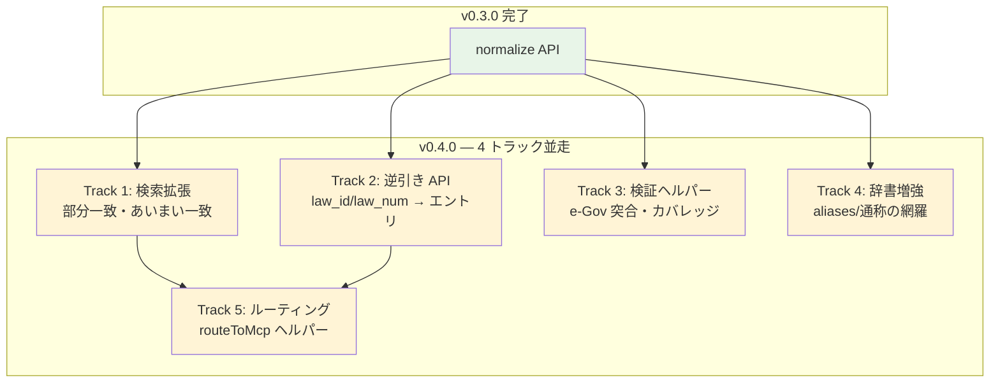
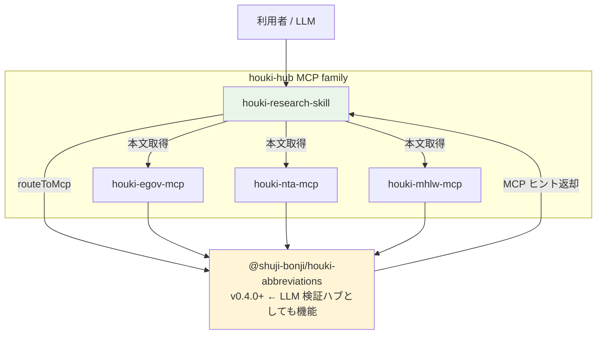

# v0.4.0 Roadmap

> 単なる略称辞書から「**LLM 検証に耐える法令メタデータ・ハブ**」へ進化させる中期計画。

## 目的の再定義

このパッケージは元々 houki-hub MCP family の共通辞書として始まったが、長期的な利用価値を考えると以下の役割を担う:

1. **開発の実現可能性調査の起点** — ある法令を扱う実装を始める前に、関連法令・通達・別表記を網羅的に把握できる
2. **他 LLM の見解の答え合わせ** — LLM が出した法令名・law_id・通称が正しいかを機械的に検証できる
3. **個人利用での法令リファレンス** — `resolveAbbreviation` だけでなく、検索・逆引き・サジェストまで網羅した小型ナレッジベースとして使える

v0.4.0 ではこの 3 役割を満たすために、以下 5 トラックの API/データ拡張を行う。

## トラック概要



## リリース戦略

トラックを 1 つずつ順に release する。インクリメンタル release のほうがテスト・フィードバック収集・破綻リスクの観点で安全。

| 版 | 含むトラック | 規模感 |
|---|---|---|
| v0.4.0 | Track 1 + Track 2 | コア API 拡張。最も価値が高い |
| v0.5.0 | Track 5 | 1+2 を組み合わせた高位ヘルパー |
| v0.6.0 | Track 3 | CI 検証ツール |
| Track 4 | 各 patch release で継続的に | データ作業はコード release と非同期 |

## Track 1: 検索拡張

### 目的

ユーザー入力の表記揺れ・うろ覚え・部分指定でも目的のエントリにたどり着ける。

### API

```ts
/**
 * 部分一致モード
 *
 * - 'prefix': 前方一致（例: '労働' → 労基法、労契法、労安衛法）
 * - 'contains': 含む一致（例: '税法' → 法人税法、消費税法、所得税法）
 * - 'suffix': 後方一致（例: '施行令' → 各種施行令）
 */
export type SearchMode = 'prefix' | 'contains' | 'suffix';

export interface SearchOptions {
  /** 検索モード（デフォルト 'contains'） */
  mode?: SearchMode;
  /** 全角/半角の表記ゆらぎを吸収（デフォルト true） */
  normalize?: boolean;
  /** 結果の最大件数（デフォルト 50） */
  limit?: number;
  /** 結果を絞り込むフィルター */
  filter?: {
    domain?: Domain | Domain[];
    category?: Category | Category[];
    source_mcp_hint?: SourceMcpHint | SourceMcpHint[];
  };
}

/**
 * 名前で検索（部分一致）。
 * abbr / formal / aliases のどれかに対してマッチを試みる。
 */
export function searchByName(query: string, options?: SearchOptions): AbbreviationEntry[];

/**
 * あいまい一致（Levenshtein 距離ベース）。
 * 「うろ覚え」入力で類似エントリを探すときに使う。
 */
export interface FuzzyOptions {
  /** 最大編集距離（デフォルト 2） */
  maxDistance?: number;
  /** 結果の最大件数（デフォルト 5） */
  limit?: number;
  /** スコア順にソート（true）/ 元順序（false。デフォルト true） */
  sortByScore?: boolean;
  /** filter は SearchOptions と同じ */
  filter?: SearchOptions['filter'];
}

export interface FuzzyMatch {
  entry: AbbreviationEntry;
  /** マッチしたキー（abbr/formal/aliases のいずれか） */
  matchedKey: string;
  /** 編集距離（小さいほど近い） */
  distance: number;
}

export function findSimilar(query: string, options?: FuzzyOptions): FuzzyMatch[];

/**
 * 「もしかして」サジェスト。findSimilar の薄いラッパーで、
 * 上位 N 件の `formal` だけを返す。LLM プロンプトでそのまま使える形。
 */
export function suggestCorrection(query: string, limit?: number): string[];
```

### 実装方針

- Levenshtein は外部依存を増やさず自前実装（~50 行で済む）
- 全件走査でも 200 件強なので fuzzy でも問題なし。最適化は不要
- `searchByName` 用に `(prefix, suffix, contains)` 各インデックスを持つ必要はない。線形走査で十分
- normalize は v0.3.0 の `normalizeJpText` を活用

### テスト方針

- 「労働」→ 労働系の法令一覧（10 件以上ヒット想定）
- 「税法」→ 税法系
- 「労働基準法施行例」→ findSimilar で「労働基準法施行令」が distance=1 でヒット
- filter による絞り込みの組み合わせケース
- normalize: true で 全角入力でもヒットすること

## Track 2: 逆引き API

### 目的

LLM や外部システムが出力した law_id / law_num の正当性検証。

### API

```ts
/**
 * e-Gov law_id からエントリを引く。
 *
 * - 完全一致のみ
 * - 該当エントリがなければ null
 * - law_id が null のエントリはマッチしない
 */
export function findByLawId(law_id: string): AbbreviationEntry | null;

/**
 * 法令番号（law_num）からエントリを引く。
 *
 * - 完全一致 + 表記揺れ吸収（漢数字↔算用数字、年号、号）
 * - 該当エントリがなければ null
 */
export function findByLawNum(law_num: string, options?: { normalize?: boolean }): AbbreviationEntry | null;

/**
 * 正式名称（formal）からエントリを引く。
 *
 * resolveAbbreviation のサブセットだが、明示的に「正式名称で逆引き」
 * することを意図したコードを書きたいときに使う。
 */
export function findByFormal(formal: string, options?: { normalize?: boolean }): AbbreviationEntry | null;

/**
 * 略称（abbr）からエントリを引く。同上。
 */
export function findByAbbr(abbr: string, options?: { normalize?: boolean }): AbbreviationEntry | null;
```

### 実装方針

- `lookupByLawId` / `lookupByLawNum` の `Map` インデックスを起動時に構築
- `law_id` が null のエントリはインデックスに含めない
- `law_num` は将来的に表記揺れ吸収（漢数字↔算用数字）に拡張するが、v0.4.0 では完全一致のみ

### テスト方針

- `findByLawId('363AC0000000108')?.formal === '消費税法'`
- `findByLawId('321CONSTITUTION')?.formal === '日本国憲法'`
- `findByLawId('存在しないID')` → null
- `findByLawNum('昭和六十三年法律第百八号')?.formal === '消費税法'`
- 通達系（law_id=null）は逆引き対象外であることの確認

## Track 3: 検証ヘルパー / データ品質

### 目的

辞書自体の信頼性を CI で機械的に担保する。手動メンテで品質を保つコストを下げる。

### API

```ts
/**
 * 辞書全体の整合性チェック結果。
 */
export interface ValidationReport {
  /** 検証件数 */
  total: number;
  /** 必須フィールド未設定エントリ */
  missingFields: Array<{ entry: AbbreviationEntry; missing: string[] }>;
  /** law_id 形式エラー */
  invalidLawId: AbbreviationEntry[];
  /** law_id が verified なのに category と整合しないエントリ */
  inconsistentCategory: AbbreviationEntry[];
  /** abbr / formal が他エントリと衝突 */
  duplicates: Array<{ key: string; entries: AbbreviationEntry[] }>;
  /** verified 済みカバレッジ（law_id != null の比率） */
  lawIdCoverage: { verified: number; total: number; ratio: number };
}

export function validateAllEntries(): ValidationReport;

/**
 * 辞書のカバレッジ・配置状況のサマリ。
 */
export interface CoverageReport {
  total: number;
  byDomain: Record<Domain, number>;
  byCategory: Record<Category, number>;
  bySourceMcpHint: Record<SourceMcpHint, number>;
  /** law_id verified 率 */
  lawIdVerifiedRatio: number;
  /** alias を 1 件以上持つエントリの比率 */
  hasAliasesRatio: number;
  /** 各 source_mcp_hint の "未配備" カテゴリリスト */
  missingCategories: Array<{ hint: SourceMcpHint; categories: Category[] }>;
}

export function getCoverageReport(): CoverageReport;
```

### 別途用意するスクリプト（src 外）

- `scripts/verify-against-egov.mjs` — e-Gov 法令 API に問い合わせて、すべての law_id が「現存し、formal 名と一致する」ことを検証。週 1 回 CI で走らせる
- `scripts/check-abbreviation-overlap.mjs` — abbr/formal/aliases の重複を厳密に検査（既存 test と重複する部分もあるが、より細かいレポート）

### 実装方針

- pure function で実装。ネットワーク依存は scripts に分離
- 既存 test の整合性検証を `validateAllEntries` に統合し、test ではこの関数を呼んで assertion する形に整理する

## Track 4: 辞書増強

### 目的

カバレッジを上げ、「LLM が変な略称を出してきても辞書で受け止められる」状態に近づける。

### 増強対象（優先度順）

1. **既存エントリの aliases 拡充**
   - 一般通称（「派遣法」「労派法」「労働者派遣事業の適正な運営の確保及び派遣労働者の保護等に関する法律」など）
   - 英語名（個情法 → "APPI", "Personal Information Protection Act" 等）
   - 関係者がよく使う口語名

2. **未収録の主要法令の追加**
   - 監督官庁ごとに棚卸し（金融庁・国交省・経産省・総務省など）
   - 個人事業主・フリーランスに関係しやすい法令を優先
   - サイバーセキュリティ系・知財系

3. **通達系エントリの拡充**（houki-nta-mcp Phase 1 と歩調を合わせる）
   - 国税庁の主要 Q&A・タックスアンサー領域
   - 厚労省・労基署の通達
   - 金融庁ノーアクションレター

### データソース

- e-Gov 法令検索の「法令名 50 音検索」一覧
- 各省庁の法令所管リスト
- 既存の `houki-hub-mcp` `houki-nta-mcp` 開発で発見した略称

### 進め方

- データ作業はコード release と非同期に進める
- 1 PR = 1 ドメインの増強、または 1 テーマ（英語名一斉追加など）にまとめる
- 自動 schema 検証（Track 3 の `validateAllEntries`）が通ることを CI で必須化

## Track 5: ルーティングヘルパー

### 目的

houki-research-skill や他 MCP が「この問い合わせはどの MCP に投げるべきか」を統一的に判断できる高位 API を提供。

### API

```ts
export interface RouteResult {
  /** 解決されたエントリ。null の場合は辞書ヒットなし */
  entry: AbbreviationEntry | null;
  /** 投げるべき MCP。entry が null の場合は null */
  mcp: SourceMcpHint | null;
  /** 解決の確からしさ */
  confidence: 'high' | 'medium' | 'low' | 'none';
  /** confidence != 'high' のとき、サジェスト候補（findSimilar 経由） */
  suggestions?: string[];
  /** 解決ロジックの説明（デバッグ用） */
  reason: string;
}

export interface RouteOptions {
  /** 表記ゆらぎの吸収（デフォルト true） */
  normalize?: boolean;
  /** あいまい一致の閾値（デフォルト distance=2） */
  fuzzyMaxDistance?: number;
}

/**
 * 法令名・略称から、適切な MCP と該当エントリを返す。
 *
 * 解決の優先順位:
 * 1. 完全一致（resolveAbbreviation） → confidence: 'high'
 * 2. 正規化込み完全一致（resolveAbbreviation, { normalize: true }）
 *    → confidence: 'high'
 * 3. 部分一致が 1 件のみ → confidence: 'medium'
 * 4. あいまい一致（findSimilar） → confidence: 'low'、suggestions あり
 * 5. ヒットなし → confidence: 'none'、suggestions あり（あれば）
 */
export function routeToMcp(name: string, options?: RouteOptions): RouteResult;
```

### 実装方針

- Track 1 + Track 2 が完成してから着手
- houki-research-skill の routing ロジックを観察して、本当に必要な signature に絞る

## 互換性方針

- v0.3.0 以前の API は **破壊的変更なし**
- 新しい API は追加のみ
- `AbbreviationEntry` インターフェースに追加フィールドが必要になった場合は **必ず optional**（`?`）にする
- Track 4 のデータ追加は entries の数が増えるだけなので、`getAbbreviationStats()` の戻り値の数値が変わる以外には破壊的影響なし

## ドキュメント / 配布

- README に「使い方の代表例」を 5 シナリオ程度（うろ覚え検索、law_id 検証、ルーティング、データ品質、辞書統計）で追加
- 各 API は JSDoc を充実させる（v0.3.0 までと同じ品質）
- CHANGELOG は Keep a Changelog 準拠で track ごとに分けて記載
- リポジトリの `docs/USAGE.md` を新規作成して、5 シナリオの詳細サンプルを置く

## オープン課題（要検討）

1. **他言語名の優先度** — `aliases` に英語・中国語まで入れると検索/正規化のコスト増。まず英語名のみに限定する案
2. **あいまい一致のスコアリング** — Levenshtein 単独でいいか、それとも長さ補正・編集系統補正を入れるか
3. **通達の law_id 相当の識別子** — 国税庁通達は e-Gov law_id を持たないが、`source_mcp_hint='houki-nta'` の中で一意な ID 体系が欲しい（例: `'shoukibun-1'` のような形）
4. **`law_num` の表記揺れ吸収** — v0.4.0 では完全一致のみだが、漢数字↔算用数字を吸収するなら `normalizeLawNum` のような専用 helper が必要

## 参考: houki-hub MCP family 内での位置づけ


