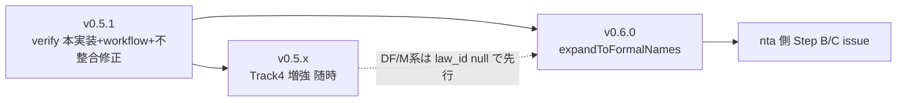

# v0.5.1 / v0.6.0 計画: verify workflow 化 + 辞書増強 + synonym 展開

作成日: 2026-07-19 / 現行: v0.5.0

## 0. 版付け方針（RELEASE.md の運用実績に準拠）

| 版 | 内容 | 種別 |
|---|---|---|
| **v0.5.1** | verify-law-ids 本実装 + workflow 新設 + 既知の不整合修正 | patch（公開 API 変更なし） |
| **v0.5.x** | Track 4 辞書増強（1 PR = 1 テーマで随時） | patch |
| **v0.6.0** | `expandToFormalNames`（nta Issue #3）+ law_id パターン拡張 | minor（新規 export） |

`normalizeLawNum`（漢数字↔算用数字）は独立した設計領域のため **v0.6.0 に含めない**（§4 参照）。

---

## 1. v0.5.1 — verify-law-ids の完成と CI 化

### 1-1. `scripts/verify-law-ids.mjs` の照合ロジック実装

現状は雛形: HTTP 404 検出のみ動作し、L120-122 の TODO（formal / law_num 照合)が未実装。

- e-Gov 法令 API v2 `GET /api/2/lawdata/{law_id}` のレスポンスから `LawName`（→ `formal` と照合）と `LawNumber`（→ `law_num` と照合）を取り出す
- パース方法は houki-egov-mcp の `src/services/egov-api/client.ts` の JSON 形を参照（依存は増やさずレスポンス形だけ流用。script は standalone 維持）
- 照合は `normalizeJpText` を通した上での完全一致（Normalize-everywhere）。law_num は漢数字表記同士の比較なので現時点で正規化不要
- 失敗種別: `not_found`（404）/ `name_mismatch` / `law_num_mismatch`。すべて `console.error` + `exit(1)`
- レート制限: 既存の 500ms sleep を維持（検証対象は **law_id 非 null の 9 件のみ**なので実行時間は数秒）

### 1-2. `.github/workflows/verify-law-ids.yml` 新設

```yaml
on:
  schedule:
    - cron: '0 3 1 * *'   # 月次（毎月1日 03:00 UTC）
  workflow_dispatch:        # 手動実行
```

- ジョブは ci.yml のパターン踏襲: `checkout@v4` + `setup-node@v4`（Node 22, cache: npm）+ `npm ci` + `npm run build` + `npm run verify-law-ids`
- 失敗時: まず素の workflow 失敗通知で運用開始。`gh issue create` 自動起票は resilience 共通化の判断（family 方針: 通知・可視化は共通化してよい）と合わせて後日
- PR では走らせない（既定方針どおり）

### 1-3. 既知の不整合修正（同 patch に同梱）

1. **CHANGELOG.md L19 の虚偽記述**: 「`M\d{2}` 省令系の 3 パターン対応」→ 実装は 2 パターン（STANDARD + CONSTITUTION）のみ。CHANGELOG を実装に合わせて訂正
2. **law_id 判定の二重基準解消**: `src/index.test.ts` L18 の `LAW_ID_PATTERN`（`[A-Z]{2}` 緩め）を削除し、`isValidLawId` を import して単一基準にする。DF 系を誤って許容する経路を塞ぐ

### 完了判定（v0.5.1）

- [ ] `npm run verify-law-ids` が 9 件の存在・名称・法令番号を照合し全 pass
- [ ] 月次 workflow が `workflow_dispatch` で手動実行して緑
- [ ] CHANGELOG 訂正 + テスト基準統一
- [ ] `npm version patch` → publish

---

## 2. v0.5.x — Track 4 辞書増強（継続 patch）

v0.4.0 で基本通称（派遣法・フリーランス新法・下請法・サイバーセキュリティ基本法等）は消化済み。残る増強テーマ:

| PR テーマ | 内容 | 備考 |
|---|---|---|
| 英語名一斉追加 | 個情法 → `APPI` / `Personal Information Protection Act` を筆頭に、主要法の英語名を aliases に | roadmap で明示された未消化分 |
| 知財系の網羅 | 特許法・実用新案法・意匠法・商標法・著作権法・不競法の aliases 点検 + 未収録補完 | |
| 金融庁・国交省・経産省・総務省の棚卸し | 未収録の主要法令追加 | 1 PR = 1 省庁 |
| 通達系拡充 | 国税庁 Q&A・タックスアンサー領域 + 厚労省通達 | nta / 将来 mhlw と歩調 |

運用ルール（既定を継続）: 1 PR = 1 ドメイン or 1 テーマ、`validateAllEntries` CI 必須通過、`validate.test.ts` の「実データ全件 valid」回帰テストが門番。

**注意**: DF 系・M 省令系の law_id を持つ法令はパターン拡張（v0.6.0 の §3-2）まで **law_id: null で登録**する（現行 `isValidLawId` が invalid_law_id error で CI を落とすため）。

---

## 3. v0.6.0 — `expandToFormalNames` + law_id パターン拡張

### 3-1. `expandToFormalNames(keyword: string): string[]`（nta Issue #3 Step A）

「インボイス」→ `["適格請求書", "適格請求書等保存方式"]` のように、**通称から FTS 検索に有効な正式語彙のみ**を返す薄い API。

設計上の論点と解決案:

- 現状の `aliases` は正式名相当（適格請求書）と俗称（インボイス）が**無区別に混在**しており、機械的に「正式名だけ」を取り出せない
- **解決案 A（推奨）: エントリに `formal_terms?: string[]` を追加しない**。代わりにデータ側で判別せず、`expandToFormalNames` は「`formal` + aliases のうち検索語彙として有効なもの」を返す実装にする——ただしこれは `getAllNames` と大差なくなる
- **解決案 B: `synonyms?: { [colloquial: string]: string[] }` 的な別テーブルを持つ**——構造追加が重い
- **判断**: まず A の簡易版（`formal` + aliases 全部から、入力 keyword 自身を除いた配列を返す）で出荷し、nta 側の `buildFtsQueryWithAbbreviation` の OR 展開が過剰になるようなら B を再検討。互換性方針「`AbbreviationEntry` に新フィールドを追加しない」に A は適合する
- 実装先: `src/search.ts` か新規 `src/expand.ts`。`index.ts` に export 追加（minor の根拠）
- nta 側の Step B/C（`expandedTo?: string[]` 化、`expanded_keywords` メタ）は nta リポジトリの後続タスクとして issue 化

### 3-2. `isValidLawId` のパターン拡張

- e-Gov bulk data に実在する `DF` 系（例 `105DF0000000337`）と `M\d{2}` 省令系の正確な仕様を、egov の bulk DL 済み DB（all_law_list.csv / 10,205 法令）から**実データ調査で確定**させてからパターン追加する
- 拡張後、§2 で law_id: null 登録した法令に law_id を付与する follow-up PR
- `validateAllEntries` / verify-law-ids は自動で追従（同じ判定関数を使うため）

### 完了判定（v0.6.0）

- [ ] `expandToFormalNames("インボイス")` が正式語彙配列を返す（テスト付き）
- [ ] nta 側 issue（Step B/C)を起票済み
- [ ] DF / M 系パターンが実データ根拠付きで `isValidLawId` に追加され、該当エントリに law_id 付与

---

## 4. スコープ外・保留

- **`normalizeLawNum`（漢数字↔算用数字）**: 大数表記（三百八十二）、「一千 vs 千」等の揺れ吸収は独立設計。egov の「第三十条」対応（条番号側）と要件が重なるため、**両リポジトリ横断の共通設計として別途起こす**（実装先候補: 本パッケージ `src/normalize.ts`）。それまで `lookupByLawNum` は完全一致のまま
- **`getCoverageReport()`**: 実需が出るまで凍結継続
- **Track 5 ルーティング**: 「3 つ目の MCP 着手時に再評価」の凍結判断を維持

## 5. 作業順序


