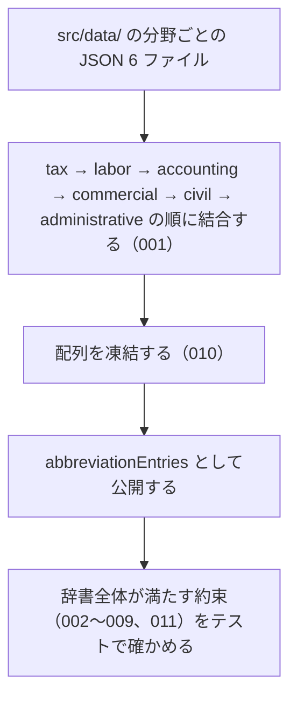

# 機能: abbreviationEntries（全分野の略称辞書のエントリを 1 つの配列で渡す）

- 機能 ID: ABBR
- 版: current
- 承認日: 2026-09-27 （PR #10）
- 起こした元: v0.6.0 の `src/index.ts`（`abbreviationEntries`）、`src/types.ts`（`AbbreviationEntry`）、`src/data/*.json`、`CONTRIBUTING.md`、`src/index.test.ts`、`src/search.test.ts`
- 関連する Issue: なし（`src/search.test.ts` の describe 名にある「Issue #3」は houki-nta-mcp #3。CHANGELOG の 0.4.0 を参照）

この文書は「この定数は何を持つか」を書きます。どう実装しているか（内部の変数名・インデックスの作り方）は書きません。

## アクター

- houki-hub family の MCP サーバー（houki-egov-mcp、houki-nta-mcp など）。`abbreviationEntries` を import し、辞書の全エントリを走査して自分の管轄のエントリを取り出したり、独自の索引を作ったりする
- このパッケージの他の公開関数（`resolveAbbreviation`・`listByDomain`・`searchByName`・`lookupByLawId`・`validateAllEntries` など）。どれもこの配列を対象に動く
- 辞書にエントリを足す人。`src/data/<domain>.json` を編集し、テストでこの配列が約束を満たすことを確かめる

## 値

`readonly AbbreviationEntry[]`。1 要素が 1 つの法令・通達などを表す。関数ではないので引数は無い。

### 各エントリのフィールド

| フィールド        | 必須 | 内容                                                                                                                                                                                                                                    |
| ----------------- | ---- | --------------------------------------------------------------------------------------------------------------------------------------------------------------------------------------------------------------------------------------- |
| `abbr`            | 必須 | 略称・通称。例: `消法` / `民` / `消基通`。辞書全体で重複しない                                                                                                                                                                          |
| `formal`          | 必須 | 正式名称。例: `消費税法` / `民法` / `消費税法基本通達`                                                                                                                                                                                  |
| `law_id`          | 必須 | e-Gov の法令 ID。e-Gov で確かめたものだけ入る。確かめていないもの、e-Gov に無いもの（通達など）は `null`。例: `363AC0000000108` / `321CONSTITUTION`                                                                                     |
| `law_num`         | 任意 | 法令番号（漢数字）。例: `昭和六十三年法律第百八号`                                                                                                                                                                                      |
| `law_type`        | 任意 | e-Gov の法令種別。`Act` / `CabinetOrder` / `ImperialOrdinance` / `MinisterialOrdinance` / `Rule` のどれか。法令系のエントリにだけ付く。型では非推奨（`category` へ寄せる予定）                                                          |
| `domain`          | 必須 | 分野。`DOMAINS` の値（`tax` / `labor` / `accounting` / `commercial` / `civil` / `administrative`）のどれか                                                                                                                              |
| `category`        | 必須 | 文書の種類。`CATEGORIES` の値（`constitution` / `law` / `cabinet-order` / `imperial-ordinance` / `ministerial-ordinance` / `rule` / `kihon-tsutatsu` / `kobetsu-tsutatsu` / `qa-jirei` / `tax-answer` / `hanrei` / `saiketsu`）のどれか |
| `source_mcp_hint` | 必須 | 本文を持つ MCP の名前。`SOURCE_MCP_HINTS` の値（`houki-egov` / `houki-nta` / `houki-mhlw` / `houki-jaish` / `houki-court` / `houki-saiketsu`）のどれか                                                                                  |
| `aliases`         | 任意 | 別名の配列。通称・関連制度名・正式名称の別表記など。例: 消費税法の `インボイス` / `軽減税率`                                                                                                                                            |
| `note`            | 任意 | 備考の文                                                                                                                                                                                                                                |

エントリは取得日時などの運用上の状態を持たない（鮮度の判定は `judgeStaleness` の担当）。

### 並び

分野ごとの JSON ファイルを `tax.json` → `labor.json` → `accounting.json` → `commercial.json` → `civil.json` → `administrative.json` の順に結合し、各ファイルの中はファイルに書かれた順のまま並ぶ。先頭は `所法`（所得税法）、末尾は `デジ庁設置法`。各ファイルのエントリの `domain` はファイル名と同じ値になっている（v0.6.0 で全件）。

### v0.6.0 の実数

以下は v0.6.0 の辞書を node で数えた値です。テストで固定している値ではありません（未決 7）。

| 数え方                  | 件数                                                                                                                                                |
| ----------------------- | --------------------------------------------------------------------------------------------------------------------------------------------------- |
| 総数                    | 174                                                                                                                                                 |
| 分野別                  | `tax` 35 / `labor` 28 / `accounting` 9 / `commercial` 31 / `civil` 23 / `administrative` 48                                                         |
| カテゴリ別              | `law` 138 / `ministerial-ordinance` 16 / `cabinet-order` 8 / `kihon-tsutatsu` 8 / `rule` 2 / `kobetsu-tsutatsu` 1 / `constitution` 1。他の 5 種は 0 |
| 管轄別                  | `houki-egov` 165 / `houki-nta` 9。他の 4 種は 0                                                                                                     |
| `law_id` が入っている   | 9（`所法` / `法法` / `消法` / `労基法` / `育介法` / `会社` / `商` / `民` / `憲`）。残り 165 は `null`                                               |
| `law_num` が入っている  | 9（`law_id` が入っている 9 件と同じ）                                                                                                               |
| `law_type` が入っている | 164（入っていないのは houki-nta 管轄の 9 件と `憲`）                                                                                                |
| `aliases` が入っている  | 94                                                                                                                                                  |
| `note` が入っている     | 41                                                                                                                                                  |

houki-nta 管轄の 9 件は `消基通` / `所基通` / `法基通` / `相基通` / `通基通` / `徴基通` / `措通` / `印基通`（以上 `kihon-tsutatsu`）と `電帳法取通`（`kobetsu-tsutatsu`）。9 件とも `domain: "tax"`、`law_id: null`。

## 処理の流れ

パッケージを読み込んだときに、この配列ができるまでを示します。図の中の番号は「できること」の仕様 ID の末尾 3 桁です。

## できること

### SPEC-ABBR-ABBREVIATION-ENTRIES-001 6 分野すべてのエントリを 1 つの配列に持つ

`DOMAINS` の 6 分野（`tax` / `labor` / `accounting` / `commercial` / `civil` / `administrative`）のそれぞれについて、`domain` がその値のエントリを 1 件以上持つ。総数は 100 件を超える。

例: v0.6.0 では総数 174、最も少ない `accounting` でも 9 件。

### SPEC-ABBR-ABBREVIATION-ENTRIES-002 全エントリが必須フィールドを持ち、値は定義された一覧の中にある

どのエントリも `abbr` と `formal` が空でない文字列で、`domain` は `DOMAINS`、`category` は `CATEGORIES`、`source_mcp_hint` は `SOURCE_MCP_HINTS` のどれかの値を持つ。

### SPEC-ABBR-ABBREVIATION-ENTRIES-003 law_id が入っているときは e-Gov の法令 ID の形をしている

`law_id` が `null` でないエントリは、どれも `isValidLawId` が `true` を返す形をしている。

例: `363AC0000000108`（消費税法）、`321CONSTITUTION`（日本国憲法）。

### SPEC-ABBR-ABBREVIATION-ENTRIES-004 law_type が入っているときは e-Gov の法令種別のどれかである

`law_type` を持つエントリは、どれも `Act` / `CabinetOrder` / `ImperialOrdinance` / `MinisterialOrdinance` / `Rule` のどれかの値を持つ。

### SPEC-ABBR-ABBREVIATION-ENTRIES-005 abbr は全分野を通して重複しない

`abbr` の値は、6 つの JSON ファイルをまたいでも 2 件以上のエントリに現れない。

### SPEC-ABBR-ABBREVIATION-ENTRIES-006 law_type と category が対応している

`law_type` を持つエントリの `category` は、`law_type` に対応する次の値になっている。

| `law_type`             | `category`              |
| ---------------------- | ----------------------- |
| `Act`                  | `law`                   |
| `CabinetOrder`         | `cabinet-order`         |
| `ImperialOrdinance`    | `imperial-ordinance`    |
| `MinisterialOrdinance` | `ministerial-ordinance` |
| `Rule`                 | `rule`                  |

### SPEC-ABBR-ABBREVIATION-ENTRIES-007 日本国憲法のエントリを持つ

`category` が `constitution` のエントリがあり、その `formal` は `日本国憲法`、`law_id` は `321CONSTITUTION`。

例: `{ abbr: "憲", formal: "日本国憲法", law_id: "321CONSTITUTION", law_num: "昭和二十一年憲法", domain: "administrative", category: "constitution", source_mcp_hint: "houki-egov", aliases: ["憲法", "日本国憲法"] }`。

### SPEC-ABBR-ABBREVIATION-ENTRIES-008 houki-egov 管轄のエントリが houki-nta 管轄より多く、100 件を超える

`source_mcp_hint` が `houki-egov` のエントリの件数は、`houki-nta` のエントリの件数より多く、100 件を超える。

例: v0.6.0 では `houki-egov` 165 件、`houki-nta` 9 件。

### SPEC-ABBR-ABBREVIATION-ENTRIES-009 houki-nta 管轄のエントリは通達系のカテゴリだけである

`source_mcp_hint` が `houki-nta` のエントリが 1 件以上あり、その `category` はどれも `kihon-tsutatsu` / `kobetsu-tsutatsu` / `qa-jirei` / `tax-answer` のどれか。

例: `消基通` は `kihon-tsutatsu`、`電帳法取通` は `kobetsu-tsutatsu`。

### SPEC-ABBR-ABBREVIATION-ENTRIES-010 配列は凍結されていて要素を足せない

`abbreviationEntries` は `Object.isFrozen` が `true` を返す配列で、要素の追加・削除・差し替えはできない。

例: `abbreviationEntries.push({})` は `TypeError: Cannot add property 174, object is not extensible` を投げる。

要素（各エントリのオブジェクト）は凍結されていない（未決 1）。

### SPEC-ABBR-ABBREVIATION-ENTRIES-011 よく使われる通称・制度名を別名に持つ

次のエントリは、`aliases` に次の値を含む。

| `abbr`           | `aliases` に含む値                       |
| ---------------- | ---------------------------------------- |
| `消法`           | `インボイス` / `適格請求書` / `軽減税率` |
| `所法`           | `ふるさと納税` / `寄附金控除`            |
| `電帳法`         | `電子帳簿保存` / `電帳`                  |
| `マイナンバー法` | `マイナ` / `個人番号`                    |

これにより、略称・正式名称を知らずに通称で引いても、それぞれの法律のエントリに行き着く（引き方は `resolveAbbreviation` と `searchByName` の担当）。

## できないこと

- 名前からエントリを 1 件引くこと（`resolveAbbreviation`）
- 分野・カテゴリ・管轄で絞った一覧を返すこと（`listByDomain` / `listByCategory` / `listBySourceMcpHint`）
- 件数を集計すること（`getAbbreviationStats`）
- 部分一致・あいまい一致で探すこと（`searchByName` / `findSimilar` / `suggestCorrection`）
- `law_id` や法令番号から引くこと（`lookupByLawId` / `lookupByLawNum`）
- 辞書の整合性を検査した結果を返すこと（`validateAllEntries`）
- 実行中にエントリを足す・消す・差し替えること（配列は凍結されている。エントリは `src/data/<domain>.json` を編集して次の版で出す）
- `law_id` が e-Gov に実在し、`formal` / `law_num` が e-Gov の値と一致することを保証すること。`scripts/verify-law-ids.mjs` が月次で e-Gov と突き合わせるが、開発用のスクリプトで、パッケージには含まれない（`package.json` の `files` は `dist` だけ）。`scripts/migrate.mjs`（houki-hub-mcp からの取り込み）と `scripts/copy-assets.mjs`（ビルド時に JSON を `dist/data/` へ写す）も同じく公開 API ではない
- 分野ごとの JSON ファイルを個別に import させること（`package.json` の `exports` は `.` だけ）
- 取得日時などの鮮度の情報を持つこと（各 MCP のローカル DB が持ち、判定は `judgeStaleness`）
- 通達・法令の本文を持つこと（本文は `source_mcp_hint` が示す MCP から取る）

## 未決

初版起こしで見つけた、意図か不具合かを人が決める項目です。決まったら「できること」に ID を振るか、`specs/changes/` の差分にします。

意図か不具合かの判断が要る項目は houki-abbreviations の Issue に移し、ここには題と Issue の番号だけを残します。今の振る舞いのままでよくテストが無いだけの項目は、受入テストを書いてから「できること」に ID を振ります。

1. **エントリのオブジェクトが凍結されていない。** 凍結されているのは配列だけで、各エントリとその `aliases` の配列は書き換えられる（`Object.isFrozen(abbreviationEntries[0])` は `false`）。書き換えるとパッケージ内の他の関数の結果も変わる。例: `abbreviationEntries[0].formal = "X"` のあと、`resolveAbbreviation("所法").formal` は `"X"` を返し、`resolveAbbreviation("所得税法")` も `formal: "X"` のエントリを返す。型は `readonly AbbreviationEntry[]` で、要素のフィールドは `readonly` ではない。利用側の書き換えを防ぐ意図なのか、配列だけを守る意図なのかを決める。
2. **略称・正式名称・別名が別のエントリの間で重複しないこと。** テストが確かめているのは `abbr` の重複だけ（SPEC-ABBR-ABBREVIATION-ENTRIES-005）。v0.6.0 では `abbr` / `formal` / `aliases` を合わせても、`normalizeJpText` を通した後でも、別のエントリの間の重複は 0 件。ただし重複が入ったとき、`resolveAbbreviation` は通常の照合では後に並ぶエントリを、`normalize: true` の照合では先に並ぶエントリを返すことが `src/index.ts` のコメントから読み取れ、2 つの照合の結果が食い違う。辞書の約束として重複を禁じるかを決める。
3. **並びの順。** 分野の JSON を `tax` → `labor` → `accounting` → `commercial` → `civil` → `administrative` の順に結合し、ファイル内の順を保つ。README は `searchByName` の返す順を「`abbreviationEntries` の並び」と書いており、利用者から見える順だが、並びを確かめるテストが無い。ID を振るのは受入テストを書いてから。
4. **`law_id` フィールドが全エントリにあること。** `law_id` は型では必須（`string | null`）で、v0.6.0 では 174 件すべてに `law_id` のキーがある（`undefined` は 0 件）。JSON は型の宣言で読み込むだけで、実行時に形を確かめていないうえ、SPEC-ABBR-ABBREVIATION-ENTRIES-002 のテストは `law_id` を確かめない。ID を振るのは受入テストを書いてから。
5. **各エントリの `domain` が JSON のファイル名と同じであること。** CONTRIBUTING.md は `src/data/{domain}.json` に足すと書いており、v0.6.0 では全件一致するが、テストはファイル名との一致を確かめない（`domain` が `DOMAINS` の値かどうかだけ）。ID を振るのは受入テストを書いてから。
6. **管轄とカテゴリ・`law_id` の組み合わせ。** v0.6.0 では houki-nta 管轄の 9 件はすべて `domain: "tax"`・`law_id: null`、houki-egov 管轄の 165 件はすべて法令系のカテゴリ（`constitution` / `law` / `cabinet-order` / `ministerial-ordinance` / `rule`）で、`law_num` が入っているのは `law_id` が入っている 9 件だけ。テストが確かめているのは houki-nta 管轄のカテゴリ（SPEC-ABBR-ABBREVIATION-ENTRIES-009）だけで、残りの組み合わせはテストが無い。ID を振るのは受入テストを書いてから。
7. **件数を約束にするか。** テストが固定しているのは総数と houki-egov 管轄の件数が 100 件を超えることだけで、総数 174 などの実数は固定していない。エントリを足すたびに変わる値なので約束にしないのか、版ごとに固定するのかを決める。
8. **別名に正式名称と同じ値を入れているエントリ。** 33 件（`消基通` / `民` / `憲` など）の `aliases` に `formal` と同じ文字列が入っている。例: `消基通` の `aliases` は `["消費税法基本通達"]` で、`formal` と同じ。`getAllNames` は重複を除くので結果は変わらないが、辞書の書き方としてこれを許すかを決める。
9. **ドキュメントの記述が今の辞書と合わない。** CONTRIBUTING.md の category の節は「v0.1.x では `constitution` ～ `rule` のみ実エントリあり」と書き、`src/types.ts` の `category` の説明も「v0.1.0 では法律 / 政令 / 省令 / 規則 / 憲法のみ実エントリあり」と書いているが、v0.6.0 には `kihon-tsutatsu` 8 件と `kobetsu-tsutatsu` 1 件がある。版の注記として残すのか、今の状態に書き直すのかを決める。
