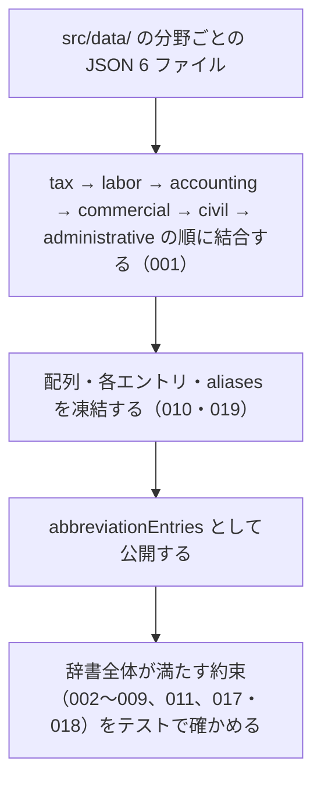

# 機能: abbreviationEntries（全分野の略称辞書のエントリを 1 つの配列で渡す）

- 機能 ID: ABBR
- 版: current
- 承認日: 2026-09-27（PR #10）。差分 `20260927-undecided-to-issues` は 2026-09-27（PR #26）。差分 `20260927-untested-behaviors` は 2026-09-27（PR #27）。差分 `20261001-dictionary-rules` は 2026-09-30（PR #32）。差分 `20261001-freeze` は 2026-09-30（PR #33）
- 起こした元: v0.6.0 の `src/index.ts`（`abbreviationEntries`）、`src/types.ts`（`AbbreviationEntry`）、`src/data/*.json`、`CONTRIBUTING.md`、`src/index.test.ts`、`src/search.test.ts`
- 関連する Issue: なし（`src/search.test.ts` の describe 名にある「Issue #3」は houki-nta-mcp #3。CHANGELOG の 0.4.0 を参照）

この文書は「この定数は何を持つか」を書きます。どう実装しているか（内部の変数名・インデックスの作り方）は書きません。

## アクター

- houki-hub family の MCP サーバー（houki-egov-mcp、houki-nta-mcp など）。`abbreviationEntries` を import し、辞書の全エントリを走査して自分の管轄のエントリを取り出したり、独自の索引を作ったりする
- このパッケージの他の公開関数（`resolveAbbreviation`・`listByDomain`・`searchByName`・`lookupByLawId`・`validateAllEntries` など）。どれもこの配列を対象に動く
- 辞書にエントリを足す人。`src/data/<domain>.json` を編集し、テストでこの配列が約束を満たすことを確かめる

## 値

`readonly AbbreviationEntry[]`。1 要素が 1 つの法令・通達などを表す。関数ではないので引数は無い。

### 各エントリのフィールド

| フィールド        | 必須 | 内容                                                                                                                                                                                                                                                                               |
| ----------------- | ---- | ---------------------------------------------------------------------------------------------------------------------------------------------------------------------------------------------------------------------------------------------------------------------------------- |
| `abbr`            | 必須 | 略称・通称。例: `消法` / `民` / `消基通`。辞書全体で重複しない                                                                                                                                                                                                                     |
| `formal`          | 必須 | 正式名称。例: `消費税法` / `民法` / `消費税法基本通達`                                                                                                                                                                                                                             |
| `law_id`          | 必須 | e-Gov の法令 ID。e-Gov で確かめたものだけ入る。確かめていないもの、e-Gov に無いもの（通達など）は `null`。例: `363AC0000000108` / `321CONSTITUTION`                                                                                                                                |
| `law_num`         | 任意 | 法令番号（漢数字）。例: `昭和六十三年法律第百八号`                                                                                                                                                                                                                                 |
| `law_type`        | 任意 | e-Gov の法令種別。`Act` / `CabinetOrder` / `ImperialOrdinance` / `MinisterialOrdinance` / `Rule` のどれか。法令系のエントリにだけ付く。型では非推奨（`category` へ寄せる予定）                                                                                                     |
| `domain`          | 必須 | 分野。`DOMAINS` の値（`tax` / `labor` / `accounting` / `commercial` / `civil` / `administrative`）のどれか                                                                                                                                                                         |
| `category`        | 必須 | 文書の種類。`CATEGORIES` の値（`constitution` / `law` / `cabinet-order` / `imperial-ordinance` / `ministerial-ordinance` / `rule` / `kokuji` / `kihon-tsutatsu` / `kobetsu-tsutatsu` / `qa-jirei` / `tax-answer` / `hanrei` / `saiketsu`）のどれか。`kokuji`（告示）は v0.7.0 から |
| `source_mcp_hint` | 必須 | 本文を持つ MCP の名前。`SOURCE_MCP_HINTS` の値（`houki-egov` / `houki-nta` / `houki-mhlw` / `houki-jaish` / `houki-court` / `houki-saiketsu`）のどれか                                                                                                                             |
| `aliases`         | 任意 | 別名の配列。通称・関連制度名・正式名称の別表記など。例: 消費税法の `インボイス` / `軽減税率`。自分の `abbr` / `formal` と同じ値は入れない（018）。別のエントリの名前とも重ならない（017）                                                                                          |
| `note`            | 任意 | 備考の文                                                                                                                                                                                                                                                                           |

エントリは取得日時などの運用上の状態を持たない（鮮度の判定は `judgeStaleness` の担当）。

### 並び

分野ごとの JSON ファイルを `tax.json` → `labor.json` → `accounting.json` → `commercial.json` → `civil.json` → `administrative.json` の順に結合し、各ファイルの中はファイルに書かれた順のまま並ぶ。先頭は `所法`（所得税法）、末尾は `デジ庁設置法`。各ファイルのエントリの `domain` はファイル名と同じ値になっている（v0.6.0 で全件）。

### v0.7.0 の実数

以下は v0.7.0 の辞書を node で数えた値です。テストで固定している値ではありません（件数は約束にしない。SPEC-ABBR-GET-ABBREVIATION-STATS-005・006 は 0 件のキーだけを約束する）。

| 数え方                  | 件数                                                                                                                                                                   |
| ----------------------- | ---------------------------------------------------------------------------------------------------------------------------------------------------------------------- |
| 総数                    | 174                                                                                                                                                                    |
| 分野別                  | `tax` 35 / `labor` 28 / `accounting` 9 / `commercial` 31 / `civil` 23 / `administrative` 48                                                                            |
| カテゴリ別              | `law` 138 / `ministerial-ordinance` 16 / `cabinet-order` 8 / `kihon-tsutatsu` 8 / `rule` 2 / `kobetsu-tsutatsu` 1 / `constitution` 1。他の 6 種（`kokuji` を含む）は 0 |
| 管轄別                  | `houki-egov` 165 / `houki-nta` 9。他の 4 種は 0                                                                                                                        |
| `law_id` が入っている   | 9（`所法` / `法法` / `消法` / `労基法` / `育介法` / `会社` / `商` / `民` / `憲`）。残り 165 は `null`                                                                  |
| `law_num` が入っている  | 9（`law_id` が入っている 9 件と同じ）                                                                                                                                  |
| `law_type` が入っている | 164（入っていないのは houki-nta 管轄の 9 件と `憲`）                                                                                                                   |
| `aliases` が入っている  | 65（v0.6.1 の 94 から、自分の `formal` と同じ値だけを持っていた 29 件が `aliases` を持たなくなった）                                                                   |
| `note` が入っている     | 41                                                                                                                                                                     |

houki-nta 管轄の 9 件は `消基通` / `所基通` / `法基通` / `相基通` / `通基通` / `徴基通` / `措通` / `印基通`（以上 `kihon-tsutatsu`）と `電帳法取通`（`kobetsu-tsutatsu`）。9 件とも `domain: "tax"`、`law_id: null`。

## 処理の流れ

パッケージを読み込んだときに、この配列ができるまでを示します。図の中の番号は「できること」の仕様 ID の末尾 3 桁です。

```mermaid
flowchart TD
  A["src/data/ の分野ごとの JSON 6 ファイル"] --> B["tax → labor → accounting → commercial → civil → administrative の順に結合する（001）"]
  B --> C["配列・各エントリ・aliases を凍結する（010・019）"]
  C --> D["abbreviationEntries として公開する"]
  D --> E["辞書全体が満たす約束（002〜009、011、017・018）をテストで確かめる"]
```

## できること

### SPEC-ABBR-ABBREVIATION-ENTRIES-001 6 分野すべてのエントリを 1 つの配列に持つ

`DOMAINS` の 6 分野（`tax` / `labor` / `accounting` / `commercial` / `civil` / `administrative`）のそれぞれについて、`domain` がその値のエントリを 1 件以上持つ。総数は 100 件を超える。

例: v0.6.0 では総数 174、最も少ない `accounting` でも 9 件。

### SPEC-ABBR-ABBREVIATION-ENTRIES-002 全エントリが必須フィールドを持ち、値は定義された一覧の中にある

どのエントリも `abbr` と `formal` が空でない文字列で、`domain` は `DOMAINS`、`category` は `CATEGORIES`、`source_mcp_hint` は `SOURCE_MCP_HINTS` のどれかの値を持つ。

### SPEC-ABBR-ABBREVIATION-ENTRIES-003 law_id が入っているときは e-Gov の法令 ID の形をしている

`law_id` が `null` でないエントリは、どれも `isValidLawId` が `true` を返す形をしている。

例: `363AC0000000108`（消費税法）、`321CONSTITUTION`（日本国憲法）。

### SPEC-ABBR-ABBREVIATION-ENTRIES-004 law_type が入っているときは e-Gov の法令種別のどれかである

`law_type` を持つエントリは、どれも `Act` / `CabinetOrder` / `ImperialOrdinance` / `MinisterialOrdinance` / `Rule` のどれかの値を持つ。

### SPEC-ABBR-ABBREVIATION-ENTRIES-005 abbr は全分野を通して重複しない

`abbr` の値は、6 つの JSON ファイルをまたいでも 2 件以上のエントリに現れない。

### SPEC-ABBR-ABBREVIATION-ENTRIES-006 law_type と category が対応している

`law_type` を持つエントリの `category` は、`law_type` に対応する次の値になっている。

| `law_type`             | `category`              |
| ---------------------- | ----------------------- |
| `Act`                  | `law`                   |
| `CabinetOrder`         | `cabinet-order`         |
| `ImperialOrdinance`    | `imperial-ordinance`    |
| `MinisterialOrdinance` | `ministerial-ordinance` |
| `Rule`                 | `rule`                  |

### SPEC-ABBR-ABBREVIATION-ENTRIES-007 日本国憲法のエントリを持つ

`category` が `constitution` のエントリがあり、その `formal` は `日本国憲法`、`law_id` は `321CONSTITUTION`。

例: `{ abbr: "憲", formal: "日本国憲法", law_id: "321CONSTITUTION", law_num: "昭和二十一年憲法", domain: "administrative", category: "constitution", source_mcp_hint: "houki-egov", aliases: ["憲法"] }`（v0.6.1 の `aliases` にあった `日本国憲法` は `formal` と同じ値なので、SPEC-ABBR-ABBREVIATION-ENTRIES-018 により外す）。

### SPEC-ABBR-ABBREVIATION-ENTRIES-008 houki-egov 管轄のエントリが houki-nta 管轄より多く、100 件を超える

`source_mcp_hint` が `houki-egov` のエントリの件数は、`houki-nta` のエントリの件数より多く、100 件を超える。

例: v0.6.0 では `houki-egov` 165 件、`houki-nta` 9 件。

### SPEC-ABBR-ABBREVIATION-ENTRIES-009 houki-nta 管轄のエントリは通達・告示系のカテゴリだけである

`source_mcp_hint` が `houki-nta` のエントリが 1 件以上あり、その `category` はどれも `kihon-tsutatsu` / `kobetsu-tsutatsu` / `kokuji` / `qa-jirei` / `tax-answer` のどれか。

例: `消基通` は `kihon-tsutatsu`、`電帳法取通` は `kobetsu-tsutatsu`。v0.6.1 の辞書に `kokuji` のエントリは無い。

### SPEC-ABBR-ABBREVIATION-ENTRIES-010 配列は凍結されていて要素を足せない

`abbreviationEntries` は `Object.isFrozen` が `true` を返す配列で、要素の追加・削除・差し替えはできない。

例: `abbreviationEntries.push({})` は `TypeError: Cannot add property 174, object is not extensible` を投げる。`abbreviationEntries[0] = {}` と `abbreviationEntries.length = 0` も `TypeError`。

要素（各エントリのオブジェクト）と `aliases` の配列も凍結されている（SPEC-ABBR-ABBREVIATION-ENTRIES-019）。

### SPEC-ABBR-ABBREVIATION-ENTRIES-011 よく使われる通称・制度名を別名に持つ

次のエントリは、`aliases` に次の値を含む。

| `abbr`           | `aliases` に含む値                       |
| ---------------- | ---------------------------------------- |
| `消法`           | `インボイス` / `適格請求書` / `軽減税率` |
| `所法`           | `ふるさと納税` / `寄附金控除`            |
| `電帳法`         | `電子帳簿保存` / `電帳`                  |
| `マイナンバー法` | `マイナ` / `個人番号`                    |

これにより、略称・正式名称を知らずに通称で引いても、それぞれの法律のエントリに行き着く（引き方は `resolveAbbreviation` と `searchByName` の担当）。

### SPEC-ABBR-ABBREVIATION-ENTRIES-012 分野の JSON ファイルの順に結合し、ファイルの中の順を保って並ぶ

`abbreviationEntries` は、`src/data/tax.json` → `labor.json` → `accounting.json` → `commercial.json` → `civil.json` → `administrative.json` の順に各ファイルのエントリをつなげた並びになる。各ファイルの中のエントリは、ファイルに書かれた順のまま並ぶ。`searchByName` などが返す順は、この並びに従う。

例: v0.6.0 では先頭が `所法`（`tax.json` の先頭）、`labor` の最初のエントリ `労基法` は 36 番目（添字 35）、末尾が `デジ庁設置法`（`administrative.json` の末尾）。`searchByName("基通")` は `消基通` / `所基通` / `法基通` / `相基通` / `通基通` / `徴基通` / `印基通` を `tax.json` に書かれた順で返す。

### SPEC-ABBR-ABBREVIATION-ENTRIES-013 全エントリが law_id のキーを持ち、値は文字列か null である

どのエントリも `law_id` のキーを持ち、その値は文字列か `null` のどちらか。`undefined` のエントリやキーの無いエントリは無い。

例: `所法` の `law_id` は `"340AC0000000033"`、`消基通` の `law_id` は `null`。

### SPEC-ABBR-ABBREVIATION-ENTRIES-014 各エントリの domain は、そのエントリが書かれた JSON ファイルの名前と同じである

`src/data/<domain>.json` に書かれたエントリの `domain` は、どれもファイル名の `<domain>` と同じ値を持つ。

例: `tax.json` の `電帳法取通` は `domain: "tax"`、`administrative.json` の `憲` は `domain: "administrative"`。

### SPEC-ABBR-ABBREVIATION-ENTRIES-015 houki-nta 管轄のエントリは law_id が null である

`source_mcp_hint` が `houki-nta` のエントリは、どれも `law_id` が `null`。通達などは e-Gov の法令 ID を持たない。

例: `消基通`・`措通`・`電帳法取通` の `law_id` はどれも `null`。

### SPEC-ABBR-ABBREVIATION-ENTRIES-016 houki-egov 管轄のエントリは法令系のカテゴリだけである

`source_mcp_hint` が `houki-egov` のエントリの `category` は、どれも `constitution` / `law` / `cabinet-order` / `imperial-ordinance` / `ministerial-ordinance` / `rule` のどれか。

例: `憲` は `constitution`、`所法` は `law`。v0.6.0 では `imperial-ordinance` のエントリは無い。

### SPEC-ABBR-ABBREVIATION-ENTRIES-017 名前は別のエントリの間で重ならない

どのエントリの `abbr`・`formal`・`aliases` の値も、`normalizeJpText` を通した後で比べて、別のエントリの `abbr`・`formal`・`aliases` のどの値とも同じにならない。名前から 1 件を返す関数（`resolveAbbreviation` / `getAllNames` / `findSimilar` の `distance: 0`）が、どの名前でも 1 件に決まる。`validateAllEntries` はこの約束の違反を `duplicate_name`（`abbr` どうしは `duplicate_abbr`）のエラーにする。

例: v0.6.1 の辞書 174 件の名前 482 個（重なりを除いて 416 個）は、エントリをまたいで重なるものが 0 件（`normalizeJpText` を通した後も 0 件）。`aliases: ["消費税法"]` を持つ別のエントリを足すと違反になる（`消費税法` は `消法` の `formal`）。

### SPEC-ABBR-ABBREVIATION-ENTRIES-018 aliases に自分の abbr・formal と同じ値を入れない

どのエントリの `aliases` にも、そのエントリの `abbr` や `formal` と同じ値は入れない。`abbr` と `formal` が同じ値であることは許す（`酒税法` など 33 件）。`validateAllEntries` はこの約束の違反を `alias_equals_own_name` のエラーにする。

例: v0.6.1 の `消基通` は `formal: "消費税法基本通達"` で `aliases: ["消費税法基本通達"]` だったが、0.7.0 では `aliases` を持たない。v0.6.1 で `aliases` に自分の `formal` を持つエントリは 33 件（`消基通` `所基通` `法基通` `相基通` `通基通` `徴基通` `措通` `印基通` `最賃法` `社労士法` `会社` `会社規` `商` `商登法` `金商法` `不競法` `消契法` `民` `民訴` `破` `不登` `住民台帳法` `人訴` `憲` `国賠法` `刑` `都計法` `司書法` `行書法` `大防法` `水濁法` `電通事業法` `デジ庁設置法`）で、実装 PR で直す。

### SPEC-ABBR-ABBREVIATION-ENTRIES-019 各エントリと aliases は凍結されていて、代入は TypeError になる

`abbreviationEntries` の各要素（エントリのオブジェクト）と、その `aliases` の配列は、`Object.isFrozen` が `true` を返す。フィールドへの代入・追加・削除と `aliases` への追加は、strict mode（ES モジュール、TypeScript の出力）では `TypeError` を投げ、値は変わらない。名前から引く関数（`resolveAbbreviation` / `lookupByLawId` / `lookupByLawNum`）と一覧を返す関数（`listByDomain` / `listByCategory` / `listBySourceMcpHint` / `searchByName`、`findSimilar` の `entry`、`extractLawNames` の `entry`）が返すエントリは、この配列の要素そのもの（同じオブジェクト）なので、同じく凍結されている。

例: `Object.isFrozen(abbreviationEntries[0])` と `Object.isFrozen(resolveAbbreviation('消法'))` と `Object.isFrozen(resolveAbbreviation('消法').aliases)` は、どれも `true`。`abbreviationEntries[0].formal = 'X'` は `TypeError` を投げ、その後の `resolveAbbreviation('所法').formal` は `'所得税法'` のまま（v0.6.1 では代入が通り、`'X'` になっていた）。`resolveAbbreviation('消法').aliases.push('x')` は `TypeError`。`delete resolveAbbreviation('消法').note` も `TypeError`。`listByDomain('tax')` が返す配列そのものは呼ぶたびに新しく、凍結されていない（SPEC-ABBR-LIST-BY-DOMAIN-004）。

## できないこと

- 名前からエントリを 1 件引くこと（`resolveAbbreviation`）
- 分野・カテゴリ・管轄で絞った一覧を返すこと（`listByDomain` / `listByCategory` / `listBySourceMcpHint`）
- 件数を集計すること（`getAbbreviationStats`）
- 部分一致・あいまい一致で探すこと（`searchByName` / `findSimilar` / `suggestCorrection`）
- `law_id` や法令番号から引くこと（`lookupByLawId` / `lookupByLawNum`）
- 辞書の整合性を検査した結果を返すこと（`validateAllEntries`）
- 実行中にエントリを足す・消す・差し替えること、エントリのフィールドを書き換えること（配列・各エントリ・`aliases` は凍結されている。エントリは `src/data/<domain>.json` を編集して次の版で出す）
- `law_id` が e-Gov に実在し、`formal` / `law_num` が e-Gov の値と一致することを保証すること。`scripts/verify-law-ids.mjs` が月次で e-Gov と突き合わせるが、開発用のスクリプトで、パッケージには含まれない（`package.json` の `files` は `dist` だけ）。`scripts/migrate.mjs`（houki-hub-mcp からの取り込み）と `scripts/copy-assets.mjs`（ビルド時に JSON を `dist/data/` へ写す）も同じく公開 API ではない
- 分野ごとの JSON ファイルを個別に import させること（`package.json` の `exports` は `.` だけ）
- 取得日時などの鮮度の情報を持つこと（各 MCP のローカル DB が持ち、判定は `judgeStaleness`）
- 通達・法令の本文を持つこと（本文は `source_mcp_hint` が示す MCP から取る）

## 未決

初版起こしで見つけた、意図か不具合かを人が決める項目です。決まったら「できること」に ID を振るか、`specs/changes/` の差分にします。

意図か不具合かの判断が要る項目は houki-abbreviations の Issue に移し、ここには題と Issue の番号だけを残します。今の振る舞いのままでよくテストが無いだけの項目は、受入テストを書いてから「できること」に ID を振ります。

1. **エントリのオブジェクトが凍結されていない。** → SPEC-ABBR-ABBREVIATION-ENTRIES-019
2. **略称・正式名称・別名が別のエントリの間で重複しないこと。** → SPEC-ABBR-ABBREVIATION-ENTRIES-017
3. **並びの順。** → SPEC-ABBR-ABBREVIATION-ENTRIES-012
4. **`law_id` フィールドが全エントリにあること。** → SPEC-ABBR-ABBREVIATION-ENTRIES-013
5. **各エントリの `domain` が JSON のファイル名と同じであること。** → SPEC-ABBR-ABBREVIATION-ENTRIES-014
6. **管轄とカテゴリ・`law_id` の組み合わせ。** → SPEC-ABBR-ABBREVIATION-ENTRIES-015、SPEC-ABBR-ABBREVIATION-ENTRIES-016（`law_num` を持つのが `law_id` を持つエントリだけであること、houki-nta 管轄の `domain` は約束にしない）
7. **件数を約束にするか。** → SPEC-ABBR-GET-ABBREVIATION-STATS-005、SPEC-ABBR-GET-ABBREVIATION-STATS-006（実数は約束にしない）
8. **別名に正式名称と同じ値を入れているエントリ。** → SPEC-ABBR-ABBREVIATION-ENTRIES-018
9. **ドキュメントの記述が今の辞書と合わない。** → houki-abbreviations #17
