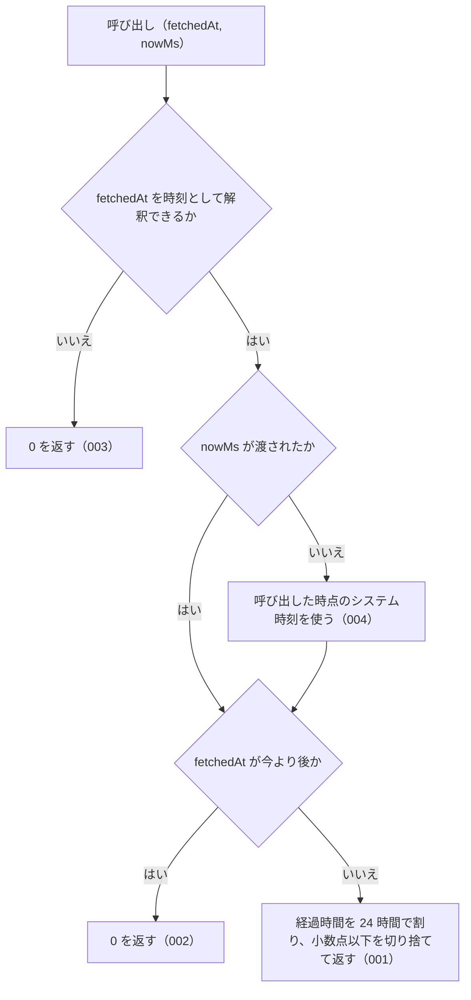

# 機能: computeDaysSince（取得時刻から今までの経過日数を返す）

- 機能 ID: ABBR
- 版: current
- 承認日: 2026-09-27 （PR #10）
- 起こした元: v0.6.0 の `src/freshness.ts`（`computeDaysSince`）、`src/freshness.test.ts`
- 関連する Issue: houki-abbreviations #3（JSDoc の強化）。共通化の発端は houki-nta-mcp #15

この文書は「この関数は何をするか」を書きます。どう実装しているか（内部の変数名・計算の手順）は書きません。

## アクター

- houki-hub family の MCP サーバー（houki-nta-mcp など）。自分のローカル DB やキャッシュに持っている取得時刻 `fetched_at` を渡して経過日数を受け取り、`judgeStaleness` に渡して鮮度を判定する

## 入力

| 引数        | 必須 | 内容                                                                                                                                  |
| ----------- | ---- | ------------------------------------------------------------------------------------------------------------------------------------- |
| `fetchedAt` | 必須 | 取得時刻。ISO 8601 形式の文字列。例: `2026-04-01T00:00:00Z`                                                                           |
| `nowMs`     | 任意 | 「今」とする時刻（1970-01-01T00:00:00Z からのミリ秒）。省略すると呼び出した時点のシステム時刻を使う。テストで時刻を固定するときに渡す |

## 戻り値

`number`。`fetchedAt` から `nowMs` までの経過日数（0 以上の整数）。

## 処理の流れ

図の中の番号は「できること」の仕様 ID の末尾 3 桁です。

## できること

### SPEC-ABBR-COMPUTE-DAYS-SINCE-001 経過日数を 1 日未満切り捨ての整数で返す

`fetchedAt` から `nowMs` までの経過時間を 24 時間単位で数え、小数点以下を切り捨てた整数を返す。同じ時刻なら 0、24 時間未満の差も 0 になる。

例（`nowMs` は `2026-05-08T00:00:00Z`）: `fetchedAt: "2026-05-08T00:00:00Z"` → `0`、`"2026-05-07T00:00:00Z"` → `1`、`"2026-04-24T00:00:00Z"` → `14`、`"2026-05-07T12:00:00Z"`（12 時間前）→ `0`。

### SPEC-ABBR-COMPUTE-DAYS-SINCE-002 今より後の取得時刻には 0 を返す

`fetchedAt` が `nowMs` より後のときは、負の値ではなく `0` を返す。

例: `fetchedAt: "2026-06-01T00:00:00Z"`、`nowMs` が `2026-05-08T00:00:00Z` → `0`。

### SPEC-ABBR-COMPUTE-DAYS-SINCE-003 時刻として解釈できない文字列には 0 を返す

`fetchedAt` が時刻として解釈できない文字列のときは、例外を投げずに `0` を返す。この 0 を正常な値と区別して扱うかは呼び出し側が決める。

例: `fetchedAt: "not-a-date"` → `0`、`fetchedAt: ""` → `0`。

### SPEC-ABBR-COMPUTE-DAYS-SINCE-004 nowMs を省略すると呼び出した時点のシステム時刻を使う

`nowMs` を渡さないときは、呼び出した時点のシステム時刻を「今」として経過日数を数える。

例: 呼び出す 5 分後の時刻を `fetchedAt` に渡し、`nowMs` を省略すると `0`。

## できないこと

- 経過日数から鮮度（`fresh` / `stale` / `outdated`）を判定すること（`judgeStaleness`）
- `fetched_at` を DB やキャッシュから読むこと（各 MCP サーバーが持つ）
- 解釈できない文字列や今より後の時刻を、呼び出し側に別の値やエラーで知らせること（どちらも `0` になる）
- 時・分の単位で経過時間を返すこと

## 未決

初版起こしで見つけた、意図か不具合かを人が決める項目です。決まったら「できること」に ID を振るか、`specs/changes/` の差分にします。

意図か不具合かの判断が要る項目は houki-abbreviations の Issue に移し、ここには題と Issue の番号だけを残します。今の振る舞いのままでよくテストが無いだけの項目は、受入テストを書いてから「できること」に ID を振ります。

1. **ISO 8601 以外の書き方も受け付ける。** → houki-abbreviations #18
2. **時差の書かれていない時刻は、実行環境のタイムゾーンで結果が変わる。** → houki-abbreviations #18
3. **存在しない日付が繰り上がって数えられる。** → houki-abbreviations #18
4. **解釈できない文字列や今より後の時刻を `judgeStaleness` に渡すと `fresh` になる。** → houki-abbreviations #18
5. **`nowMs` に `NaN` を渡すと `NaN` を返す。** → houki-abbreviations #18
