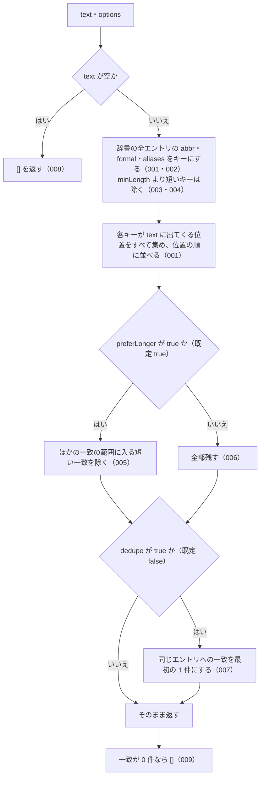

# 機能: extractLawNames（テキストの中から辞書にある法令名・略称・別名を位置付きで抜き出す）

- 機能 ID: ABBR
- 版: current
- 承認日: 2026-09-27 （PR #26）
- 起こした元: v0.6.0 の `src/validate.ts`（`extractLawNames`、型 `ExtractOptions` / `LawNameMatch`）、`src/index.ts`（`extractLawNames`）、`src/validate.test.ts`
- 関連する Issue: なし

この文書は「この関数は何をするか」を書きます。どう実装しているか（内部の変数名・インデックスの作り方）は書きません。

## アクター

- houki-abbreviations を import する側（MCP サーバー、LLM の出力を確かめるアプリ）。LLM が書いた文章などを渡して、その中に同梱の辞書にある法令名がどこにいくつ出てくるかを受け取る。受け取ったエントリの `source_mcp_hint` から、本文を取りに行く MCP を決めるのに使う

## 入力

| 引数      | 必須 | 内容                                                                             |
| --------- | ---- | -------------------------------------------------------------------------------- |
| `text`    | 必須 | 探す対象の文字列。例: `消費税法と法人税法の改正について。インボイス制度も対象。` |
| `options` | 任意 | `ExtractOptions`。下の表                                                         |

`ExtractOptions` のフィールド（どれも任意）。

| フィールド     | 型        | 既定値  | 内容                                                                                                   |
| -------------- | --------- | ------- | ------------------------------------------------------------------------------------------------------ |
| `minLength`    | `number`  | `2`     | これより短いキー（略称・正式名称・別名）は探さない。既定では `民` `商` のような 1 文字の略称を探さない |
| `preferLonger` | `boolean` | `true`  | `true` なら、ほかの一致の範囲の中にすっぽり入る、より短い一致を除く                                    |
| `dedupe`       | `boolean` | `false` | `true` なら、同じエントリ（同じ `abbr`）への一致を位置が最も前の 1 件だけにする                        |

探すキーは、同梱の辞書（v0.6.0 では 174 件）の各エントリの `abbr`・`formal`・`aliases` の全部です。v0.6.0 の辞書で 1 文字のキーは `商` `民` `破` `憲` `刑`（`abbr`）と `裁`（`裁判所法` の別名）の 6 つです。

## 戻り値

`LawNameMatch[]`。`position` の小さい順。同じ `position` なら `length` の大きい順。一致が無ければ `[]`。

| フィールド   | 型                  | 内容                                                                          |
| ------------ | ------------------- | ----------------------------------------------------------------------------- |
| `entry`      | `AbbreviationEntry` | 一致したキーを持つ辞書のエントリ                                              |
| `matchedKey` | `string`            | 一致したキー。そのエントリの `abbr`・`formal`・`aliases` のどれかの値そのまま |
| `position`   | `number`            | `text` の中の一致の開始位置（先頭が 0。UTF-16 の文字単位）                    |
| `length`     | `number`            | `matchedKey` の長さ                                                           |

## 処理の流れ

図の中の番号は「できること」の仕様 ID の末尾 3 桁です。

## できること

### SPEC-ABBR-EXTRACT-LAW-NAMES-001 テキスト中の法令名を位置の順に返す

辞書のエントリの `abbr` と `formal` が `text` に出てくれば、その一致を `LawNameMatch` にして `position` の小さい順に返す。部分一致で探す（語の区切りは見ない）。同じキーが 2 回出てくれば 2 件返す。

例: `消費税法と法人税法の改正` → 2 件。1 件目は `matchedKey: "消費税法"`、`position: 0`（エントリは `消法`）、2 件目は `matchedKey: "法人税法"`、`position: 5`（エントリは `法法`）。

### SPEC-ABBR-EXTRACT-LAW-NAMES-002 別名でも抜き出す

エントリの `aliases` の値も同じように探し、一致すればそのエントリを返す。

例: `インボイス制度の対象` → 1 件目は `matchedKey: "インボイス制度"` で、`entry.abbr` は `消法`。

### SPEC-ABBR-EXTRACT-LAW-NAMES-003 既定では 1 文字のキーを探さない

`minLength` を指定しなければ、長さ 2 未満のキーは探さない。

例: `民法の解釈` → 1 文字の略称 `民` の一致は無く、`民法`（2 文字）の一致はある。

### SPEC-ABBR-EXTRACT-LAW-NAMES-004 minLength: 1 なら 1 文字のキーも探す

`minLength: 1` を渡すと、1 文字のキーも探す。

例: `民の規定について`、`{ minLength: 1 }` → `matchedKey: "民"` の一致がある。

### SPEC-ABBR-EXTRACT-LAW-NAMES-005 preferLonger: true なら長い一致に入る短い一致を除く

`preferLonger` が `true` のとき、ある一致の範囲（`position` から `position + length` まで）が、ほかの、より長い一致の範囲にすっぽり入るなら、その短い一致を返さない。

例: `民法の解釈`、`{ minLength: 1, preferLonger: true }` → `民`（位置 0、長さ 1）は `民法`（位置 0、長さ 2）の範囲に入るので返さず、`民法` の一致は返す。

### SPEC-ABBR-EXTRACT-LAW-NAMES-006 preferLonger: false なら重なる一致も全部返す

`preferLonger: false` を渡すと、ほかの一致の範囲に入る一致も除かずに返す。

例: `民法の解釈`、`{ minLength: 1, preferLonger: false }` → `民` と `民法` の両方の一致がある。

### SPEC-ABBR-EXTRACT-LAW-NAMES-007 dedupe: true なら同じエントリへの一致を 1 件にする

`dedupe: true` を渡すと、同じエントリ（同じ `abbr`）への一致は、並べた順で最初の 1 件だけを返す。

例: `消費税法と消費税法`、`{ dedupe: true }` → 1 件。

### SPEC-ABBR-EXTRACT-LAW-NAMES-008 空のテキストには空の配列を返す

`text` が `''` なら、辞書を探さずに `[]` を返す。

### SPEC-ABBR-EXTRACT-LAW-NAMES-009 辞書の名前が出てこなければ空の配列を返す

`text` に辞書のどのキーも出てこなければ `[]` を返す。エラーにはしない。

例: `こんにちは世界` → `[]`。

## できないこと

- 文脈を見て法令名かどうかを判断すること（`民法人の認可` の中の `民法` も一致として返す）
- 語の区切りを見ること（キーが別の語の一部でも一致にする）
- 全角・半角の表記ゆれを吸収すること（未決 3）
- 辞書に無い法令名を見つけること（`○○法` の形から推し量ることはしない）
- 条番号（`第30条` など）を抜き出すこと
- 利用者が用意したエントリの配列で探すこと（公開する `extractLawNames` は同梱の辞書だけを使う）
- 抜き出した法令名が引用として正しいかを確かめること

## 未決

初版起こしで見つけた、意図か不具合かを人が決める項目です。決まったら「できること」に ID を振るか、`specs/changes/` の差分にします。

意図か不具合かの判断が要る項目は houki-abbreviations の Issue に移し、ここには題と Issue の番号だけを残します。今の振る舞いのままでよくテストが無いだけの項目は、受入テストを書いてから「できること」に ID を振ります。

1. **同じ一致を 2 件返す。** → houki-abbreviations #15
2. **2 つの法令名にまたがる短い一致を返す。** → houki-abbreviations #19
3. **全角・半角の表記ゆれを吸収しない。** → houki-abbreviations #19
4. **`preferLonger` の既定値が `true` であること。** テストは `preferLonger: true` を明示して確かめていて、省略したときに `true` として動くことは確かめていない。ID を振るのは受入テストを書いてから。
5. **`minLength` に 1 未満を渡したとき。** `minLength: 0` や `minLength: -5` は 1 として扱う（`民の規定` → `民` の一致を返す）。テストが無い。ID を振るのは受入テストを書いてから。
6. **同じ位置・同じ長さで別のエントリに一致したとき。** 両方を返す（片方がもう片方の範囲に「より長く」入るわけではないため `preferLonger` でも除かない）。v0.6.0 の同梱辞書には、別のエントリどうしで同じキーは無い。テストが無い。ID を振るのは受入テストを書いてから。
7. **`dedupe: true` で残す 1 件。** 並べた順（位置の小さい順、同じ位置なら長い順）で最初の 1 件を残す。例: `消法と消費税法`、`{ dedupe: true }` → `matchedKey: "消法"`、`position: 0` の 1 件。どれを残すかのテストが無い（件数だけを確かめている）。ID を振るのは受入テストを書いてから。
8. **`text` が文字列でないとき。** `null` と `undefined` は `[]` を返す（例外を投げない）。テストが無い。ID を振るのは受入テストを書いてから。
