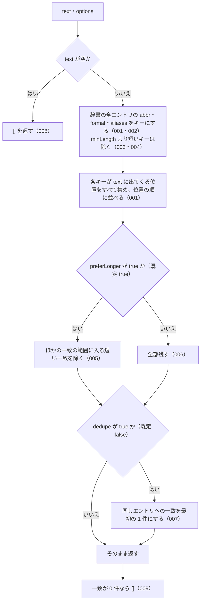

# 機能: extractLawNames（テキストの中から辞書にある法令名・略称・別名を位置付きで抜き出す）

- 機能 ID: ABBR
- 版: current
- 承認日: 2026-09-27 （PR #26）。差分 `20260927-untested-behaviors` は 2026-09-27（PR #28）。差分 `20261001-normalize` は 2026-10-01（PR #30）。差分 `20261001-dictionary-rules` は 2026-10-01（PR #32）
- 起こした元: v0.6.0 の `src/validate.ts`（`extractLawNames`、型 `ExtractOptions` / `LawNameMatch`）、`src/index.ts`（`extractLawNames`）、`src/validate.test.ts`
- 関連する Issue: なし

この文書は「この関数は何をするか」を書きます。どう実装しているか（内部の変数名・インデックスの作り方）は書きません。

## アクター

- houki-abbreviations を import する側（MCP サーバー、LLM の出力を確かめるアプリ）。LLM が書いた文章などを渡して、その中に同梱の辞書にある法令名がどこにいくつ出てくるかを受け取る。受け取ったエントリの `source_mcp_hint` から、本文を取りに行く MCP を決めるのに使う

## 入力

| 引数      | 必須 | 内容                                                                             |
| --------- | ---- | -------------------------------------------------------------------------------- |
| `text`    | 必須 | 探す対象の文字列。例: `消費税法と法人税法の改正について。インボイス制度も対象。` |
| `options` | 任意 | `ExtractOptions`。下の表                                                         |

`ExtractOptions` のフィールド（どれも任意）。

| フィールド     | 型        | 既定値  | 内容                                                                                                                                                       |
| -------------- | --------- | ------- | ---------------------------------------------------------------------------------------------------------------------------------------------------------- |
| `minLength`    | `number`  | `2`     | これより短いキー（略称・正式名称・別名）は探さない。既定では `民` `商` のような 1 文字の略称を探さない                                                     |
| `preferLonger` | `boolean` | `true`  | `true` なら、ほかの、より長い一致と範囲が重なる短い一致を除く                                                                                              |
| `dedupe`       | `boolean` | `false` | `true` なら、同じエントリ（同じ `abbr`）への一致を位置が最も前の 1 件だけにする                                                                            |
| `normalize`    | `boolean` | `false` | `true` なら、`text` と辞書のキーの両方を `normalizeJpText` に通してから探す（全角英数字・ダッシュ類・全角チルダ・全角スペースを半角にする）。`position` と `length` は元の `text` の位置と長さで返す |

探すキーは、同梱の辞書の各エントリの `abbr`・`formal`・`aliases` の全部です。v0.6.1 の辞書で 1 文字のキーは `商` `民` `破` `憲` `刑`（`abbr`）と `裁`（`裁判所法` の別名）の 6 つです。`normalize` は `resolveAbbreviation` の `options.normalize` と同じ意味で、既定も同じ `false`。houki-egov-mcp・houki-nta-mcp は入口で `normalize: true` を渡す。

## 戻り値

`LawNameMatch[]`。`position` の小さい順。同じ `position` なら `length` の大きい順。一致が無ければ `[]`。

| フィールド   | 型                  | 内容                                                                          |
| ------------ | ------------------- | ----------------------------------------------------------------------------- |
| `entry`      | `AbbreviationEntry` | 一致したキーを持つ辞書のエントリ                                              |
| `matchedKey` | `string`            | 一致したキー。そのエントリの `abbr`・`formal`・`aliases` のどれかの値そのまま |
| `position`   | `number`            | `text` の中の一致の開始位置（先頭が 0。UTF-16 の文字単位）                    |
| `length`     | `number`            | `matchedKey` の長さ                                                           |

## 処理の流れ

図の中の番号は「できること」の仕様 ID の末尾 3 桁です。

```mermaid
flowchart TD
  A["text・options"] --> B{"text が空か"}
  B -- はい --> E1["[] を返す（008）"]
  B -- いいえ --> C["辞書の全エントリの abbr・formal・aliases をキーにする（001・002）<br/>minLength より短いキーは除く（003・004）"]
  C --> D["各キーが text に出てくる位置をすべて集め、位置の順に並べる（001）"]
  D --> F{"preferLonger が true か（既定 true）"}
  F -- はい --> G["ほかの一致の範囲に入る短い一致を除く（005）"]
  F -- いいえ --> H["全部残す（006）"]
  G --> I{"dedupe が true か（既定 false）"}
  H --> I
  I -- はい --> J["同じエントリへの一致を最初の 1 件にする（007）"]
  I -- いいえ --> K["そのまま返す"]
  J --> K
  K --> L["一致が 0 件なら []（009）"]
```

## できること

### SPEC-ABBR-EXTRACT-LAW-NAMES-001 テキスト中の法令名を位置の順に返す

辞書のエントリの `abbr` と `formal` が `text` に出てくれば、その一致を `LawNameMatch` にして `position` の小さい順に返す。部分一致で探す（語の区切りは見ない）。同じキーが 2 回出てくれば 2 件返す。

例: `消費税法と法人税法の改正` → 2 件。1 件目は `matchedKey: "消費税法"`、`position: 0`（エントリは `消法`）、2 件目は `matchedKey: "法人税法"`、`position: 5`（エントリは `法法`）。

### SPEC-ABBR-EXTRACT-LAW-NAMES-002 別名でも抜き出す

エントリの `aliases` の値も同じように探し、一致すればそのエントリを返す。

例: `インボイス制度の対象` → 1 件目は `matchedKey: "インボイス制度"` で、`entry.abbr` は `消法`。

### SPEC-ABBR-EXTRACT-LAW-NAMES-003 既定では 1 文字のキーを探さない

`minLength` を指定しなければ、長さ 2 未満のキーは探さない。

例: `民法の解釈` → 1 文字の略称 `民` の一致は無く、`民法`（2 文字）の一致はある。

### SPEC-ABBR-EXTRACT-LAW-NAMES-004 minLength: 1 なら 1 文字のキーも探す

`minLength: 1` を渡すと、1 文字のキーも探す。

例: `民の規定について`、`{ minLength: 1 }` → `matchedKey: "民"` の一致がある。

### SPEC-ABBR-EXTRACT-LAW-NAMES-005 preferLonger: true なら長い一致と重なる短い一致を除く

`preferLonger` が `true` のとき、ある一致の範囲（`position` から `position + length` まで）が、ほかの、より長い一致の範囲と 1 文字でも重なるなら、その短い一致を返さない。長い一致の中にすっぽり入る場合も、長い一致の端にまたがる場合も同じ。長さが同じ一致どうしは、重なっていてもどちらも返す。

例: `民法の解釈`、`{ minLength: 1, preferLonger: true }` → `民`（位置 0、長さ 1）は `民法`（位置 0、長さ 2）の範囲に入るので返さず、`民法` の一致は返す。`消費税法法人税法`（`preferLonger` は既定の `true`）→ `消費税法`（位置 0、長さ 4）と `法人税法`（位置 4、長さ 4）の 2 件。`法法`（位置 3、長さ 2）は両方の長い一致と重なるので返さない（v0.6.1 では `法法` も返していた）。

### SPEC-ABBR-EXTRACT-LAW-NAMES-006 preferLonger: false なら重なる一致も全部返す

`preferLonger: false` を渡すと、ほかの一致の範囲に入る一致も除かずに返す。

例: `民法の解釈`、`{ minLength: 1, preferLonger: false }` → `民` と `民法` の両方の一致がある。

### SPEC-ABBR-EXTRACT-LAW-NAMES-007 dedupe: true なら同じエントリへの一致を 1 件にする

`dedupe: true` を渡すと、同じエントリ（同じ `abbr`）への一致は、並べた順で最初の 1 件だけを返す。

例: `消費税法と消費税法`、`{ dedupe: true }` → 1 件。

### SPEC-ABBR-EXTRACT-LAW-NAMES-008 空のテキストには空の配列を返す

`text` が `''` なら、辞書を探さずに `[]` を返す。

### SPEC-ABBR-EXTRACT-LAW-NAMES-009 辞書の名前が出てこなければ空の配列を返す

`text` に辞書のどのキーも出てこなければ `[]` を返す。エラーにはしない。

例: `こんにちは世界` → `[]`。

### SPEC-ABBR-EXTRACT-LAW-NAMES-010 preferLonger を指定しなければ true として扱う

`options` に `preferLonger` を入れなければ、`preferLonger: true` と同じく、ほかの、より長い一致と範囲が重なる短い一致を返さない。

例: `民法の解釈`、`{ minLength: 1 }`（`preferLonger` なし）→ `民`（位置 0、長さ 1）の一致は無く、`民法`（位置 0、長さ 2）の一致はある。同じ入力に `preferLonger: false` を足すと `民` の一致も返る。`消費税法法人税法`（`options` なし）→ `消費税法` と `法人税法` の 2 件で、`法法` は返さない。

### SPEC-ABBR-EXTRACT-LAW-NAMES-011 minLength が 1 未満なら 1 として扱う

`minLength` に 0 や負の数を渡すと、`minLength: 1` と同じく 1 文字のキーも探す。

例: `民の規定`、`{ minLength: 0 }` → `matchedKey: "民"`、`position: 0` の一致がある。`{ minLength: -5 }` でも同じ。`minLength` を指定しなければ、同じ `民の規定` は `[]`。

### SPEC-ABBR-EXTRACT-LAW-NAMES-012 同じ位置・同じ長さで別のエントリに一致したら両方を返す

2 件の別のエントリが同じキーを持ち、そのキーが `text` に出てくれば、同じ `position`・同じ `length` の一致を、エントリごとに 1 件ずつ返す。どちらもほかの一致より短くはないので、`preferLonger: true` でも除かない。`abbr` が違うので、`dedupe: true` でも 1 件にしない。

v0.6.0 の同梱辞書には、別のエントリどうしで同じキーが無い。この振る舞いは `src/validate.ts` の `extractLawNames(entries, text, options)` にエントリの配列を渡して確かめる。

例: エントリ `{ abbr: "甲", formal: "甲法" }` と `{ abbr: "乙", formal: "乙法", aliases: ["甲法"] }` の 2 件、`甲法の規定` → 2 件。どちらも `matchedKey: "甲法"`、`position: 0`、`length: 2` で、1 件目の `entry.abbr` は `甲`、2 件目は `乙`。`{ dedupe: true }` を渡しても同じ 2 件。

### SPEC-ABBR-EXTRACT-LAW-NAMES-013 dedupe: true では並べた順で最初の一致を残す

`dedupe: true` のとき、同じエントリへの一致のうち、戻り値の並び（`position` の小さい順、同じ `position` なら `length` の大きい順）で最初の 1 件を残す。長いキーの一致が後ろにあっても、前の短いキーの一致を残す。

例: `消法と消費税法`、`{ dedupe: true }` → 1 件。`matchedKey: "消法"`、`position: 0`（エントリは `消法`）。`消費税法`（位置 3）の一致は返さない。

### SPEC-ABBR-EXTRACT-LAW-NAMES-014 text が null か undefined なら空の配列を返す

`text` に `null` か `undefined` を渡すと、辞書を探さずに `[]` を返す。

例: `extractLawNames(null)` と `extractLawNames(undefined)` は、どちらも `[]`。

### SPEC-ABBR-EXTRACT-LAW-NAMES-015 preferLonger: true でも長さが同じ一致は重なっていても両方返す

重なる 2 つの一致の長さが同じときは、どちらが正しいか決められないので、`preferLonger: true` でも両方を返す。

例: `所得税法人税法` → `所得税法`（位置 0、長さ 4。エントリは `所法`）と `法人税法`（位置 3、長さ 4。エントリは `法法`）の 2 件。位置 3 の `法` を両方の一致が共有するが、長さが同じなのでどちらも残す。

### SPEC-ABBR-EXTRACT-LAW-NAMES-016 normalize: true では全角英数字・ダッシュ類を半角にしてから探す

`options.normalize` が `true` のとき、`text` と辞書のキーの両方を `normalizeJpText` と同じ規則で半角にしてから探す。`matchedKey` は辞書に書かれた表記のまま返す。

例: `ＰＬ法の規定`、`{ normalize: true }` → 1 件。`matchedKey: "PL法"`、`entry.formal: "製造物責任法"`、`position: 0`、`length: 3`。

### SPEC-ABBR-EXTRACT-LAW-NAMES-017 normalize: true でも position と length は元の text の位置と長さで返す

`normalize: true` で半角にして探したときも、`position` は元の `text` での一致の開始位置、`length` は元の `text` での一致の文字数（UTF-16 の文字単位）で返す。`normalizeJpText` の変換はどれも 1 文字を 1 文字に置き換えるので、`length` は `matchedKey` の長さと同じになる。`text` の先頭の空白は位置に数える（探すときに取り除かない）。

例: `　ＰＬ法の規定`（先頭が全角スペース）、`{ normalize: true }` → `position: 1`、`length: 3`。`text.slice(1, 4)` は `'ＰＬ法'`。`消費税法の改正と法人税法`、`{ normalize: true }` → `消費税法`（位置 0）と `法人税法`（位置 8）で、`normalize` を省いたときと同じ位置。

### SPEC-ABBR-EXTRACT-LAW-NAMES-018 normalize を省くか false にすると全角と半角を別の文字として探す

`options` を渡さないとき、`{}`、`{ normalize: false }` のどれでも、全角と半角の違いは吸収しない。v0.6.1 までの `extractLawNames(text, options)` と同じ結果を返す。

例: `ＰＬ法の規定`（`options` なし）、`{ normalize: false }` はどちらも `[]`。`PL法の規定` は `options` の有無によらず `matchedKey: "PL法"` の 1 件。

### SPEC-ABBR-EXTRACT-LAW-NAMES-019 同じエントリの同じ位置・同じ長さの一致は 1 件にする

1 つのエントリの 2 つ以上のキー（`abbr` と `formal` が同じ値、など）が `text` の同じ位置に同じ長さで一致したときは、1 件だけを返す。`matchedKey` は `abbr`・`formal`・`aliases` の順で先のキー。`dedupe` の指定によらない。別のエントリどうしの同じ位置・同じ長さの一致は、SPEC-ABBR-EXTRACT-LAW-NAMES-012 のとおり両方返す。

例: `酒税法`（`abbr` と `formal` がどちらも `酒税法`）→ 1 件。`matchedKey: "酒税法"`、`position: 0`、`length: 3`（v0.6.1 では同じ一致を 2 件返していた）。`公認会計士法の規定` → `公認会計士法` の 1 件。`民法の解釈` → `民法` の 1 件。

## できないこと

- 文脈を見て法令名かどうかを判断すること（`民法人の認可` の中の `民法` も一致として返す）
- 語の区切りを見ること（キーが別の語の一部でも一致にする）
- 辞書に無い法令名を見つけること（`○○法` の形から推し量ることはしない）
- 条番号（`第30条` など）を抜き出すこと
- 利用者が用意したエントリの配列で探すこと（公開する `extractLawNames` は同梱の辞書だけを使う）
- 抜き出した法令名が引用として正しいかを確かめること

## 未決

初版起こしで見つけた、意図か不具合かを人が決める項目です。決まったら「できること」に ID を振るか、`specs/changes/` の差分にします。

意図か不具合かの判断が要る項目は houki-abbreviations の Issue に移し、ここには題と Issue の番号だけを残します。今の振る舞いのままでよくテストが無いだけの項目は、受入テストを書いてから「できること」に ID を振ります。

1. **同じ一致を 2 件返す。** → SPEC-ABBR-EXTRACT-LAW-NAMES-019
2. **2 つの法令名にまたがる短い一致を返す。** → SPEC-ABBR-EXTRACT-LAW-NAMES-005、SPEC-ABBR-EXTRACT-LAW-NAMES-015
3. **全角・半角の表記ゆれを吸収しない。** → SPEC-ABBR-EXTRACT-LAW-NAMES-016、SPEC-ABBR-EXTRACT-LAW-NAMES-017、SPEC-ABBR-EXTRACT-LAW-NAMES-018
4. **`preferLonger` の既定値が `true` であること。** → SPEC-ABBR-EXTRACT-LAW-NAMES-010
5. **`minLength` に 1 未満を渡したとき。** → SPEC-ABBR-EXTRACT-LAW-NAMES-011
6. **同じ位置・同じ長さで別のエントリに一致したとき。** → SPEC-ABBR-EXTRACT-LAW-NAMES-012
7. **`dedupe: true` で残す 1 件。** → SPEC-ABBR-EXTRACT-LAW-NAMES-013
8. **`text` が文字列でないとき。** → SPEC-ABBR-EXTRACT-LAW-NAMES-014
