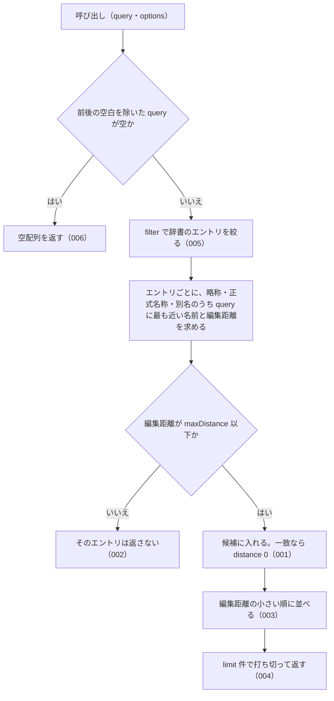

# 機能: findSimilar（編集距離が近い名前を持つエントリを探す）

- 機能 ID: ABBR
- 版: current
- 承認日: 2026-09-27 （PR #26）。差分 `20260927-untested-behaviors` は YYYY-MM-DD（PR #N）
- 起こした元: v0.6.0 の `src/search.ts`（`findSimilar`・`FuzzyOptions`・`FuzzyMatch`）、`src/index.ts`（`findSimilar`）、`src/search.test.ts`
- 関連する Issue: なし（v0.4.0 の Track 1 で追加）

この文書は「この関数は何をするか」を書きます。どう実装しているか（内部の変数名・インデックスの作り方）は書きません。

## アクター

- houki-abbreviations を import する利用者（houki-nta-mcp・houki-egov-mcp などの MCP サーバー、または独自のコード）。`労働基準法施行例` のように 1〜2 文字誤った名前を渡して、近い名前を持つ辞書のエントリと、その近さ（編集距離）を受け取る

## 入力

| 引数                  | 必須 | 内容                                                                                                                                      |
| --------------------- | ---- | ----------------------------------------------------------------------------------------------------------------------------------------- |
| `query`               | 必須 | 探す名前。例: `労働基準法` / `消費税法施行令例`。前後の空白は無視する                                                                     |
| `options.maxDistance` | 任意 | 返すエントリの編集距離の上限。既定 2                                                                                                      |
| `options.limit`       | 任意 | 返す件数の上限。既定 5。1 未満は 1 として扱う                                                                                             |
| `options.sortByScore` | 任意 | 編集距離の小さい順に並べるか。既定 `true`                                                                                                 |
| `options.filter`      | 任意 | 絞り込み。型は `SearchFilter`（`searchByName` と同じ）。キーは `domain` / `category` / `source_mcp_hint` で、それぞれ単一の値か配列を取る |
| `options.normalize`   | 任意 | 全角英数字・全角ハイフン・全角チルダ・全角スペースを半角にしてから比べるか。既定 `true`                                                   |

型は `FuzzyOptions`。辞書は関数が持っている（v0.6.0 で 174 件）。エントリの配列を渡す引数は無い。

## 戻り値

`FuzzyMatch` の配列。1 件も無ければ空配列。1 つのエントリは 1 回だけ入る。

| フィールド   | 内容                                                                                                 |
| ------------ | ---------------------------------------------------------------------------------------------------- |
| `entry`      | 辞書のエントリ（`AbbreviationEntry`）                                                                |
| `matchedKey` | そのエントリの略称・正式名称・別名のうち、`query` との編集距離が最も小さかった名前。辞書の表記のまま |
| `distance`   | `query` と `matchedKey` の編集距離（`levenshtein` の値）。0 は一致                                   |

## 処理の流れ

呼び出しを受けてから配列を返すまでに、何をどの順で確かめるかを示します。図の中の番号は「できること」の仕様 ID の末尾 3 桁です。

## できること

### SPEC-ABBR-FIND-SIMILAR-001 名前が一致するエントリは distance 0 で先頭に返す

`query` がエントリの略称・正式名称・別名のどれかと一致するとき、そのエントリを `distance: 0` で返す。既定の並び順では先頭に来る。

例: `findSimilar('労働基準法')` の先頭は `entry.abbr: "労基法"`、`entry.formal: "労働基準法"`、`matchedKey: "労働基準法"`、`distance: 0`。続いて `労契法`（`労働契約法`、2）・`労組法`（`労働組合法`、2）・`建基法`（`建築基準法`、2）。

### SPEC-ABBR-FIND-SIMILAR-002 編集距離が maxDistance 以下のエントリだけを返す

エントリの略称・正式名称・別名のうち最も近いものとの編集距離が `maxDistance` 以下のエントリだけを返す。どのエントリも `maxDistance` を超えるときは空配列を返す。

例: `findSimilar('労働基準法施行例', { maxDistance: 2 })` は `労基則`（`matchedKey: "労働基準法施行規則"`、`distance: 2`）の 1 件を返す。`findSimilar('消費税法施行令例')` は `消令`（`消費税法施行令`、1）と `消規`（`消費税法施行規則`、2）を返す。`findSimilar('全く関係ない長い文字列ですよ', { maxDistance: 1 })` は `[]`。

### SPEC-ABBR-FIND-SIMILAR-003 既定では編集距離の小さい順に並べる

`sortByScore` を省くか `true` にすると、`distance` の小さい順に並べてから返す。

例: `findSimilar('労働基準法施行例', { maxDistance: 5 })` は `労基則`（2）・`労基法`（3）・`所令`（5）・`法令`（5）・`消令`（5）の順。

### SPEC-ABBR-FIND-SIMILAR-004 limit の件数で打ち切る

候補が `limit` を超えるときは、並べた後で `limit` 件に打ち切って返す。

例: `findSimilar('法', { maxDistance: 5, limit: 3 })` は 3 件を返す（`limit` を付けなければ 5 件、`limit: 1000` なら 165 件）。

### SPEC-ABBR-FIND-SIMILAR-005 filter で候補のエントリを絞る

`filter` を渡すと、その条件に当たるエントリだけを候補にする。キーの意味は `searchByName` と同じ（SPEC-ABBR-SEARCH-BY-NAME-005）。

例: `findSimilar('法', { maxDistance: 5, filter: { domain: 'tax' }, limit: 100 })` は 35 件を返し、すべて `entry.domain: "tax"`。

### SPEC-ABBR-FIND-SIMILAR-006 空の query には空配列を返す

`query` が空文字か、前後の空白を除くと空になるときは、辞書を調べずに空配列を返す。エラーにはしない。

例: `findSimilar('')` と `findSimilar('   ')` はどちらも `[]`。

### SPEC-ABBR-FIND-SIMILAR-007 既定では全角英数字を半角にしてから比べる

`normalize` を省くか `true` にすると、`query` と辞書の名前の両方の全角英数字を半角にしてから編集距離を求める。

例: `findSimilar('ＰＬ法')` の先頭は `entry.formal: "製造物責任法"`、`matchedKey: "PL法"`、`distance: 0`。

### SPEC-ABBR-FIND-SIMILAR-008 normalize が false のときは全角英数字をそのまま比べる

`normalize: false` のときは、全角英数字を半角にせずに編集距離を求める。

例: `findSimilar('ＰＬ法', { normalize: false })` は `所法`・`法法`・`消法`・`措法`・`相法`（どれも `distance: 2`）で、`製造物責任法` のエントリは入らない。

### SPEC-ABBR-FIND-SIMILAR-009 全角で引いても matchedKey は辞書の表記のまま返す

`normalize` で半角にして比べたときも、`matchedKey` には半角にした後の文字列ではなく、辞書に書かれている名前をそのまま入れる。

例: `findSimilar('ＰＬ法')` の先頭の `matchedKey` は、辞書の別名と同じ `PL法`。

### SPEC-ABBR-FIND-SIMILAR-010 sortByScore が false のときは辞書の並びのまま limit 件で打ち切る

`sortByScore: false` のときは、`distance` で並べ替えず、`abbreviationEntries` の並びのまま候補を `limit` 件で打ち切って返す。辞書の後ろにある距離の小さいエントリが打ち切りで入らないことがある。

例: `findSimilar('労働基準法施行例', { maxDistance: 5, sortByScore: false })` は `所令`・`法令`・`消令`・`相令`・`通令`（どれも `distance: 5`）の 5 件で、`distance: 2` の `労基則` は入らない。

### SPEC-ABBR-FIND-SIMILAR-011 distance が同じエントリは辞書の並びのまま並べる

`distance` の小さい順に並べるとき、`distance` が同じエントリどうしは `abbreviationEntries` での並びを保つ。

例: `findSimilar('労働基準法施行例', { maxDistance: 5, limit: 100 })` の `distance: 5` の 10 件は `所令`・`法令`・`消令`・`相令`・`通令`・`印令`・`地税令`・`労契法`・`労組法`・`建基法` の順で、v0.6.0 の `abbreviationEntries` での順と同じ。

### SPEC-ABBR-FIND-SIMILAR-012 limit を省くと 5 件で打ち切る

`limit` を省くと、候補が 5 件を超えるときに 5 件で打ち切る。

例: `findSimilar('法', { maxDistance: 5 })` は 5 件を返す（`limit: 1000` なら 165 件）。

### SPEC-ABBR-FIND-SIMILAR-013 1 未満の limit は 1 として扱う

`limit` が 1 未満のとき（0・負の値・0.5 など）は 1 として扱い、候補があれば 1 件を返す。

例: `findSimilar('法', { maxDistance: 5, limit: 0 })`・`{ …, limit: -1 }`・`{ …, limit: 0.5 }` は、どれも `所法`（`distance: 1`）の 1 件。

### SPEC-ABBR-FIND-SIMILAR-014 maxDistance を省くと 2 として扱う

`maxDistance` を省くと、編集距離が 2 以下のエントリだけを返す。

例: `findSimilar('労働基準法施行例', { limit: 100 })` は `労基則`（`distance: 2`）の 1 件で、`distance: 3` の `労基法` は入らない（`maxDistance: 3` なら `労基法` も入る）。

### SPEC-ABBR-FIND-SIMILAR-015 maxDistance が 0 のときは名前が一致するエントリだけを返す

`maxDistance: 0` のときは、略称・正式名称・別名のどれかが `query` と一致するエントリだけを、`distance: 0` で返す。

例: `findSimilar('消費税', { maxDistance: 0 })` は、別名 `消費税` に一致した `消法`（`matchedKey: "消費税"`、`distance: 0`）の 1 件。

### SPEC-ABBR-FIND-SIMILAR-016 maxDistance が負の値のときは空配列を返す

`maxDistance` が負の値のときは、名前が一致するエントリがあっても空配列を返す。エラーにはしない。

例: `findSimilar('消費税', { maxDistance: -1 })` と `findSimilar('消法', { maxDistance: -1 })` はどちらも `[]`。

### SPEC-ABBR-FIND-SIMILAR-017 1 つのエントリで距離が同じ名前が複数あるときは、略称・正式名称・別名の順で先の名前を matchedKey にする

エントリの名前のうち `query` との編集距離が最も小さいものが 2 つ以上あるときは、`abbr`・`formal`・`aliases`（辞書の順）の順で先に来る名前を `matchedKey` にする。

例: `findSimilar('消費', { maxDistance: 1 })` の `消法` は、略称 `消法` と別名 `消費税` がどちらも距離 1 で、`matchedKey: "消法"`。`findSimilar('消費税X', { maxDistance: 1 })` の `消法` は、正式名称 `消費税法` と別名 `消費税` がどちらも距離 1 で、`matchedKey: "消費税法"`。

## できないこと

- 名前の一部で探すこと（`searchByName`。`findSimilar` は名前全体どうしの編集距離を比べる）
- 略称と正式名称のように編集距離が大きい組を結び付けること（辞書の `aliases` に登録して `resolveAbbreviation` で引く）
- 英字の大文字・小文字の違いを同じとみなすこと（`findSimilar('pl法')` は `製造物責任法` を返さない）
- 正式名称だけを文字列で返すこと（`suggestCorrection`）

## 未決

初版起こしで見つけた、意図か不具合かを人が決める項目です。決まったら「できること」に ID を振るか、`specs/changes/` の差分にします。

意図か不具合かの判断が要る項目は houki-abbreviations の Issue に移し、ここには題と Issue の番号だけを残します。今の振る舞いのままでよくテストが無いだけの項目は、受入テストを書いてから「できること」に ID を振ります。

1. **ドキュメントの例と実際の結果が違う。** → houki-abbreviations #17
2. **短い query は意味の違う短い略称に当たる。** → houki-abbreviations #20
3. **全角・半角の吸収（`normalize`）。** → SPEC-ABBR-FIND-SIMILAR-007、SPEC-ABBR-FIND-SIMILAR-008、SPEC-ABBR-FIND-SIMILAR-009
4. **`sortByScore: false` と、距離が同じときの順。** → SPEC-ABBR-FIND-SIMILAR-010、SPEC-ABBR-FIND-SIMILAR-011
5. **`limit` の既定値と 1 未満の値。** → SPEC-ABBR-FIND-SIMILAR-012、SPEC-ABBR-FIND-SIMILAR-013
6. **`maxDistance` の既定値と 0 以下の値。** → SPEC-ABBR-FIND-SIMILAR-014、SPEC-ABBR-FIND-SIMILAR-015、SPEC-ABBR-FIND-SIMILAR-016
7. **`matchedKey` の選び方。** → SPEC-ABBR-FIND-SIMILAR-017
8. **`limit` に `NaN` を渡したときの扱いと上限。** → houki-abbreviations #22
