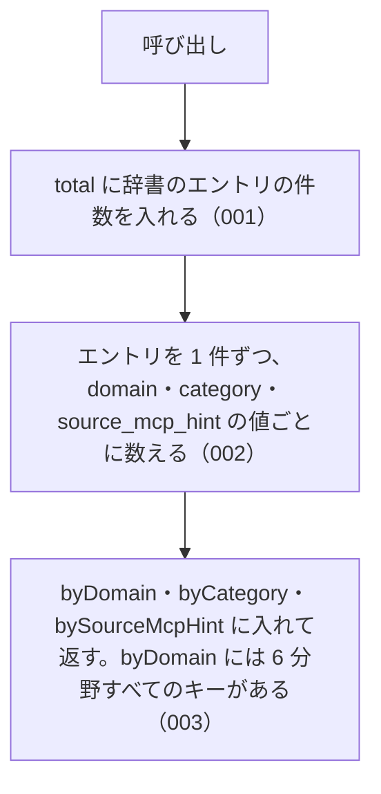

# 機能: getAbbreviationStats（辞書の件数を分野別・種別別・MCP 別に数えて返す）

- 機能 ID: ABBR
- 版: current
- 承認日: 2026-09-27 （PR #10）
- 起こした元: v0.6.0 の `src/index.ts`（`getAbbreviationStats`、`AbbreviationStats`）、`src/index.test.ts`
- 関連する Issue: なし

この文書は「この関数は何をするか」を書きます。どう実装しているか（内部の変数名・インデックスの作り方）は書きません。

## アクター

- houki-hub family の MCP サーバーと、このパッケージを import する利用者のコード。起動時のログや診断で、取り込んだ辞書の件数を確かめるために呼ぶ

## 入力

引数は無い。

## 戻り値

`AbbreviationStats`。次の 4 つのフィールドを持つオブジェクト。

| フィールド        | 型                       | 内容                                                                                 |
| ----------------- | ------------------------ | ------------------------------------------------------------------------------------ |
| `total`           | `number`                 | 辞書のエントリの件数                                                                 |
| `byDomain`        | `Record<string, number>` | キーは分野（`domain` の値）、値はその分野のエントリの件数                            |
| `byCategory`      | `Record<string, number>` | キーは種別（`category` の値）、値はその種別のエントリの件数                          |
| `bySourceMcpHint` | `Record<string, number>` | キーは本文を持つ MCP の名前（`source_mcp_hint` の値）、値はその MCP のエントリの件数 |

例: v0.6.0 では次の値を返す。

```json
{
  "total": 174,
  "byDomain": {
    "tax": 35,
    "labor": 28,
    "accounting": 9,
    "commercial": 31,
    "civil": 23,
    "administrative": 48
  },
  "byCategory": {
    "law": 138,
    "cabinet-order": 8,
    "ministerial-ordinance": 16,
    "kihon-tsutatsu": 8,
    "kobetsu-tsutatsu": 1,
    "rule": 2,
    "constitution": 1
  },
  "bySourceMcpHint": { "houki-egov": 165, "houki-nta": 9 }
}
```

## 処理の流れ

図の中の番号は「できること」の仕様 ID の末尾 3 桁です。



## できること

### SPEC-ABBR-GET-ABBREVIATION-STATS-001 total は辞書のエントリの件数

`total` に、辞書の全エントリ（`abbreviationEntries`）の件数を返す。v0.6.0 では 174。

### SPEC-ABBR-GET-ABBREVIATION-STATS-002 分野別・種別別・MCP 別の件数の合計は total と等しい

`byDomain` の値の合計、`byCategory` の値の合計、`bySourceMcpHint` の値の合計は、どれも `total` と等しい。1 件のエントリはそれぞれの内訳でちょうど 1 回ずつ数えられる。

例: v0.6.0 では `byDomain` の合計 35 + 28 + 9 + 31 + 23 + 48 = 174、`bySourceMcpHint` の合計 165 + 9 = 174。

### SPEC-ABBR-GET-ABBREVIATION-STATS-003 byDomain には 6 分野すべてが 1 件以上で入る

`byDomain` には `DOMAINS` の 6 つの値（`tax` / `labor` / `accounting` / `commercial` / `civil` / `administrative`）すべてがキーとしてあり、どの値も 1 以上。

## できないこと

- 分野などで絞り込んだ件数を返すこと（引数は無い。絞り込んだ一覧は `listByDomain` / `listByCategory` / `listBySourceMcpHint`）
- 辞書の版や更新日を返すこと
- 別名の件数や、名前（略称・正式名称・別名）の総数を返すこと
- 辞書の整合性を検査すること（`validateAllEntries`）

## 未決

初版起こしで見つけた、意図か不具合かを人が決める項目です。決まったら「できること」に ID を振るか、`specs/changes/` の差分にします。

意図か不具合かの判断が要る項目は houki-abbreviations の Issue に移し、ここには題と Issue の番号だけを残します。今の振る舞いのままでよくテストが無いだけの項目は、受入テストを書いてから「できること」に ID を振ります。

1. **件数が 0 の種別と MCP はキーが無い。** → houki-abbreviations #16
2. **`AbbreviationStats` のキーの型が `string`。** → houki-abbreviations #16
3. **返すオブジェクトは呼ぶたびに新しい。** 返したオブジェクトの `total` を書き換えても、次の呼び出しは 174 を返す。テストが無い。ID を振るのは受入テストを書いてから。
4. **キーの並び。** `byCategory` などのキーは、その値が辞書に最初に出てくる順に並ぶ（`byCategory` は `law` / `cabinet-order` / `ministerial-ordinance` / `kihon-tsutatsu` / `kobetsu-tsutatsu` / `rule` / `constitution`）。並びを約束するのか決まっていない。テストが無い。ID を振るのは受入テストを書いてから。
