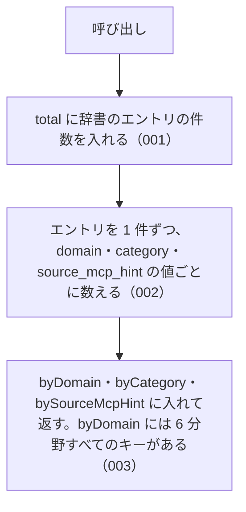

# 機能: getAbbreviationStats（辞書の件数を分野別・種別別・MCP 別に数えて返す）

- 版: current
- 起こした元: v0.6.0 の `src/index.ts`（`getAbbreviationStats`、`AbbreviationStats`）、`src/index.test.ts`
- 関連する Issue: なし

この文書は「この関数は何をするか」を書きます。どう実装しているか（内部の変数名・インデックスの作り方）は書きません。

## アクター

- houki-hub family の MCP サーバーと、このパッケージを import する利用者のコード。起動時のログや診断で、取り込んだ辞書の件数を確かめるために呼ぶ

## 入力

引数は無い。

## 戻り値

`AbbreviationStats`。次の 4 つのフィールドを持つオブジェクト。

| フィールド        | 型                              | 内容                                                                                               |
| ----------------- | ------------------------------- | -------------------------------------------------------------------------------------------------- |
| `total`           | `number`                        | 辞書のエントリの件数                                                                               |
| `byDomain`        | `Record<Domain, number>`        | キーは `DOMAINS` の全値（定数の順）、値はその分野のエントリの件数。辞書に無い分野は `0`            |
| `byCategory`      | `Record<Category, number>`      | キーは `CATEGORIES` の全値（定数の順）、値はその種別のエントリの件数。辞書に無い種別は `0`         |
| `bySourceMcpHint` | `Record<SourceMcpHint, number>` | キーは `SOURCE_MCP_HINTS` の全値（定数の順）、値はその MCP のエントリの件数。辞書に無い MCP は `0` |

件数の実数（総数 174 など）は仕様に固定しない。エントリを足すたびに変わる。

例: v0.6.1 の辞書では次の値を返す（`byCategory` の `kokuji` は `spec/20261001-dictionary-rules` で足す種別）。

```json
{
  "total": 174,
  "byDomain": {
    "tax": 35,
    "labor": 28,
    "accounting": 9,
    "commercial": 31,
    "civil": 23,
    "administrative": 48
  },
  "byCategory": {
    "constitution": 1,
    "law": 138,
    "cabinet-order": 8,
    "imperial-ordinance": 0,
    "ministerial-ordinance": 16,
    "rule": 2,
    "kokuji": 0,
    "kihon-tsutatsu": 8,
    "kobetsu-tsutatsu": 1,
    "qa-jirei": 0,
    "tax-answer": 0,
    "hanrei": 0,
    "saiketsu": 0
  },
  "bySourceMcpHint": {
    "houki-egov": 165,
    "houki-nta": 9,
    "houki-mhlw": 0,
    "houki-jaish": 0,
    "houki-court": 0,
    "houki-saiketsu": 0
  }
}
```

## 処理の流れ

図の中の番号は「できること」の仕様 ID の末尾 3 桁です。


```mermaid
flowchart TD
  A["呼び出し"] --> B["total に辞書のエントリの件数を入れる（001）"]
  B --> C["エントリを 1 件ずつ、domain・category・source_mcp_hint の値ごとに数える（002）"]
  C --> D["byDomain・byCategory・bySourceMcpHint に入れて返す。byDomain には 6 分野すべてのキーがある（003）"]
```

## できること

### SPEC-ABBR-GET-ABBREVIATION-STATS-001 total は辞書のエントリの件数

`total` に、辞書の全エントリ（`abbreviationEntries`）の件数を返す。v0.6.0 では 174。

### SPEC-ABBR-GET-ABBREVIATION-STATS-002 分野別・種別別・MCP 別の件数の合計は total と等しい

`byDomain` の値の合計、`byCategory` の値の合計、`bySourceMcpHint` の値の合計は、どれも `total` と等しい。1 件のエントリはそれぞれの内訳でちょうど 1 回ずつ数えられる。

例: v0.6.0 では `byDomain` の合計 35 + 28 + 9 + 31 + 23 + 48 = 174、`bySourceMcpHint` の合計 165 + 9 = 174。

### SPEC-ABBR-GET-ABBREVIATION-STATS-003 byDomain には 6 分野すべてが 1 件以上で入る

`byDomain` には `DOMAINS` の 6 つの値（`tax` / `labor` / `accounting` / `commercial` / `civil` / `administrative`）すべてがキーとしてあり、どの値も 1 以上。

### SPEC-ABBR-GET-ABBREVIATION-STATS-004 呼ぶたびに新しいオブジェクトを返す

呼ぶたびに新しいオブジェクトを返す。`byDomain`・`byCategory`・`bySourceMcpHint` も呼ぶたびに新しいオブジェクトになる。返したオブジェクトやその中の値を書き換えても、次の呼び出しの結果は変わらない。

例: `const s = getAbbreviationStats(); s.total = 0; s.byDomain.tax = 0; s.byCategory.law = 0` の後も、`getAbbreviationStats()` は `total: 174`、`byDomain.tax: 35`、`byCategory.law: 138` を返す。2 回呼んだ結果は別のオブジェクト（`!==`）で、`byDomain` なども別のオブジェクト。

### SPEC-ABBR-GET-ABBREVIATION-STATS-005 byDomain・byCategory・bySourceMcpHint は定数の全値をキーに、定数の順で持つ

`byDomain` のキーは `DOMAINS` の全値、`byCategory` のキーは `CATEGORIES` の全値、`bySourceMcpHint` のキーは `SOURCE_MCP_HINTS` の全値で、それ以外のキーは無い。`Object.keys` の順は定数の順と同じ。

例: `Object.keys(getAbbreviationStats().byCategory)` は `[...CATEGORIES]` と同じ配列。`Object.keys(getAbbreviationStats().bySourceMcpHint)` は `[...SOURCE_MCP_HINTS]` と同じ配列（v0.6.1 では `['houki-egov', 'houki-nta']` の 2 つだけだった）。

### SPEC-ABBR-GET-ABBREVIATION-STATS-006 辞書にエントリの無い値は 0 を返す

辞書に 1 件も無い分野・種別・MCP のキーの値は `0`。`undefined` にはしない。

例: `getAbbreviationStats().byCategory.hanrei` は `0`（v0.6.1 では `undefined`）。`getAbbreviationStats().bySourceMcpHint['houki-mhlw']` は `0`。`getAbbreviationStats().byCategory.law` は 1 以上。

## できないこと

- 分野などで絞り込んだ件数を返すこと（引数は無い。絞り込んだ一覧は `listByDomain` / `listByCategory` / `listBySourceMcpHint`）
- 辞書の版や更新日を返すこと
- 別名の件数や、名前（略称・正式名称・別名）の総数を返すこと
- 辞書の整合性を検査すること（`validateAllEntries`）

## 未決

初版起こしで見つけた、意図か不具合かを人が決める項目です。決まったら「できること」に ID を振るか、`specs/changes/` の差分にします。

意図か不具合かの判断が要る項目は houki-abbreviations の Issue に移し、ここには題と Issue の番号だけを残します。今の振る舞いのままでよくテストが無いだけの項目は、受入テストを書いてから「できること」に ID を振ります。

1. **件数が 0 の種別と MCP はキーが無い。** → SPEC-ABBR-GET-ABBREVIATION-STATS-005、SPEC-ABBR-GET-ABBREVIATION-STATS-006
2. **`AbbreviationStats` のキーの型が `string`。** → 「戻り値」の型（`Record<Domain, number>` / `Record<Category, number>` / `Record<SourceMcpHint, number>`）
3. **返すオブジェクトは呼ぶたびに新しい。** → SPEC-ABBR-GET-ABBREVIATION-STATS-004
4. **キーの並び。** → SPEC-ABBR-GET-ABBREVIATION-STATS-005
