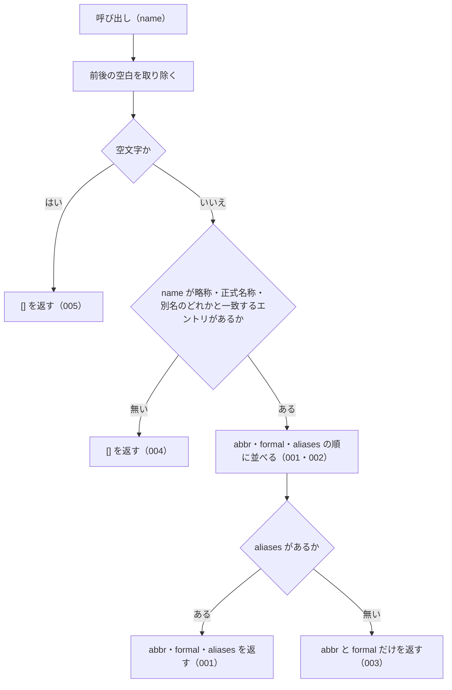

# 機能: getAllNames（略称・正式名称・別名のどれかから、そのエントリの名前をすべて返す）

- 機能 ID: ABBR
- 版: current
- 承認日:
- 起こした元: v0.6.0 の `src/lookup.ts`（`getAllNames`）、`src/index.ts`（`getAllNames`）、`src/lookup.test.ts`
- 関連する Issue: なし

この文書は「この関数は何をするか」を書きます。どう実装しているか（内部の変数名・インデックスの作り方）は書きません。

## アクター

- houki-abbreviations を import する利用者（houki-egov-mcp・houki-nta-mcp などの MCP サーバー、またはアプリケーション）。法令・通達の名前を 1 つ渡して、同じ法令・通達を指す名前（略称・正式名称・別名）の一覧を受け取る。LLM のプロンプトに「この法令はこれらの名前でも呼ばれる」と書くときに使う

## 入力

| 引数   | 必須 | 内容                                                                                                   |
| ------ | ---- | ------------------------------------------------------------------------------------------------------ |
| `name` | 必須 | 辞書の略称（`abbr`）・正式名称（`formal`）・別名（`aliases`）のどれか。例: `消法` / `消費税法` / `インボイス`。完全一致で引く |

## 戻り値

`string[]`。

- 見つかったとき: そのエントリの `abbr`、`formal`、`aliases` をこの順に並べた配列
- 見つからないとき、`name` が空文字・空白だけのとき: 空配列 `[]`（`null` ではない）

## 処理の流れ

図の中の番号は「できること」の仕様 ID の末尾 3 桁です。

## できること

### SPEC-ABBR-GET-ALL-NAMES-001 略称からそのエントリの名前を abbr・formal・aliases の順ですべて返す

`name` が辞書のエントリの `abbr` と一致するとき、そのエントリの `abbr`、`formal`、`aliases` をこの順に並べた配列を返す。`aliases` の中の順番は辞書のまま。

例: `getAllNames('消法')` は `['消法', '消費税法', '消費税', 'インボイス', 'インボイス制度', '適格請求書', '適格請求書等保存方式', '適格請求書発行事業者', '軽減税率', '軽減税率制度', '簡易課税', '簡易課税制度']`（v0.6.0 の辞書で 12 件）。

### SPEC-ABBR-GET-ALL-NAMES-002 正式名称や別名から引いても略称から引いたときと同じ配列を返す

`name` が `formal` または `aliases` のどれかと一致するときも、SPEC-ABBR-GET-ALL-NAMES-001 と同じ配列を返す。先頭は常に `abbr` で、渡した名前が先頭に来るわけではない。

例: `getAllNames('消費税法')` と `getAllNames('インボイス')` は、どちらも `getAllNames('消法')` と同じ配列。

### SPEC-ABBR-GET-ALL-NAMES-003 別名の無いエントリには abbr と formal だけを返す

エントリに `aliases` が無いときは、`abbr` と `formal` の 2 つだけを返す。

例: fixtures の `憲`（`aliases` 無し）では `['憲', '日本国憲法']`。v0.6.0 の辞書の `憲` には別名 `憲法` があるので、`getAllNames('憲')` は `['憲', '日本国憲法', '憲法']`。

### SPEC-ABBR-GET-ALL-NAMES-004 一致するエントリが無ければ空配列を返す

どのエントリの略称・正式名称・別名とも一致しないときは `[]` を返す。`null` は返さず、例外も投げない。

例: `getAllNames('存在しない')` は `[]`。

### SPEC-ABBR-GET-ALL-NAMES-005 空文字・空白だけの name には空配列を返す

`name` が空文字、または空白だけのときは、辞書を照合せずに `[]` を返す。

例: `getAllNames('')` と `getAllNames('   ')` はどちらも `[]`。

## できないこと

- 部分一致やあいまい一致で探すこと（完全一致だけ。部分一致は `searchByName`、似た名前の候補は `findSimilar` / `suggestCorrection`）
- 全角・半角の表記ゆれを吸収すること（`getAllNames('ＰＬ法')` は `[]`。未決 3）
- エントリそのもの（`law_id`・`domain` など）を返すこと（`resolveAbbreviation`）
- e-Gov の法令 ID や法令番号から名前を引くこと（`lookupByLawId` / `lookupByLawNum` でエントリを引いてから、その `abbr` を渡す）
- 1 回の呼び出しで複数の名前を引くこと

## 未決

初版起こしで見つけた、意図か不具合かを人が決める項目です。決まったら「できること」に ID を振るか、`specs/changes/` の差分にします。

意図か不具合かの判断が要る項目は houki-abbreviations の Issue に移し、ここには題と Issue の番号だけを残します。今の振る舞いのままでよくテストが無いだけの項目は、受入テストを書いてから「できること」に ID を振ります。

1. **同じ名前の重複を除く。** `abbr`・`formal`・`aliases` に同じ文字列があるときは、最初の 1 つだけを残す。v0.6.0 の辞書では 174 件中 66 件のエントリに重複がある（`abbr` と `formal` が同じ `酒税法` など 33 件を含む）。例: `getAllNames('酒税法')` は `['酒税法']`。テスト「順序は abbr → formal → aliases (重複除去後)」の fixtures（`労基法`）には重複が無く、重複を除くことを確かめていない。ID を振るのは受入テストを書いてから。
2. **前後の空白を無視する。** `getAllNames(' 消法 ')` は `getAllNames('消法')` と同じ配列を返す。テストが無い。ID を振るのは受入テストを書いてから。
3. **全角・半角の表記ゆれを吸収しない。** `resolveAbbreviation` には `{ normalize: true }` があり `resolveAbbreviation('ＰＬ法', { normalize: true })` は `製造物責任法` のエントリを返すが、`getAllNames` には同じ指定が無く `getAllNames('ＰＬ法')` は `[]` を返す（`getAllNames('PL法')` は `['製造物責任法', 'PL法']`）。2 つの関数で揃えるかを決める。
4. **複数のエントリが同じ名前を持つときにどれを返すか。** `getAllNames` は辞書の先頭から探して最初に一致したエントリを使う。`resolveAbbreviation` は同じ名前なら辞書の後ろのエントリを返す。v0.6.0 の辞書には、2 件以上のエントリに登録された名前が 0 件なので、今は結果が食い違わない。辞書が増えたときに食い違うので、どちらに揃えるか（または重なりを辞書の検証で禁じるか）を決める。
5. **呼ぶたびに新しい配列を返す。** 戻り値の配列を書き換えても、次の呼び出しの結果は変わらない（`getAllNames('消法')` に `push` しても、次の `getAllNames('消法')` は 12 件）。テストが無い。ID を振るのは受入テストを書いてから。
