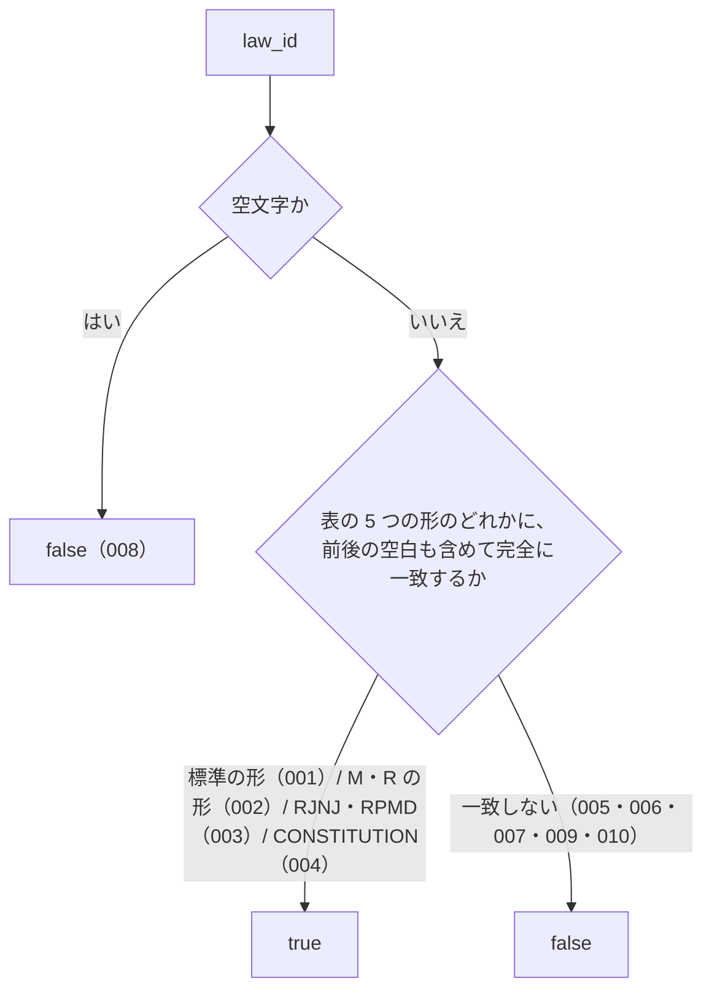

# 機能: isValidLawId（文字列が e-Gov の law_id の形をしているかを判定する）

- 機能 ID: ABBR
- 版: current
- 承認日: 2026-09-27 （PR #26）。差分 `20260927-untested-behaviors` は YYYY-MM-DD（PR #N）
- 起こした元: v0.6.0 の `src/validate.ts`（`isValidLawId`）、`src/index.ts`（そのまま再 export）、`src/validate.test.ts`
- 関連する Issue: houki-abbreviations #6（e-Gov の実データに合わせる）

この文書は「この関数は何をするか」を書きます。どう実装しているか（内部の変数名・正規表現の組み方）は書きません。

## アクター

- houki-abbreviations を import する側（houki-egov-mcp・houki-nta-mcp などの MCP サーバー、辞書を検査する `validateAllEntries`、辞書のテスト）。`law_id` を渡して、e-Gov の法令 ID として形が正しいかを `true` / `false` で受け取る

## 入力

| 引数     | 必須 | 内容                                                                                    |
| -------- | ---- | --------------------------------------------------------------------------------------- |
| `law_id` | 必須 | 判定する文字列。例: `363AC0000000108`。前後の空白は取り除かない（呼び出し側で取り除く） |

## 戻り値

`boolean`。下の表のどれかの形に一致すれば `true`、それ以外は `false`。例外は投げない。

受け付ける `law_id` の形は次の 5 つで、長さはどれも 15 文字、英字は大文字だけです。件数は 2026-09-20 に e-Gov 法令 API v2 `GET /api/2/laws` で取得した全 9,569 件の内訳（v0.6.0 の CHANGELOG の値）です。

| 形                                                             | 対象                                   | 件数  | 例                                    |
| -------------------------------------------------------------- | -------------------------------------- | ----- | ------------------------------------- |
| 数字 3 桁 + `AC` / `CO` / `IO` / `DF` / `DT` + 数字 10 桁      | 法律・政令・勅令・太政官布告・太政官達 | 4,677 | `363AC0000000108`（消費税法）         |
| 数字 3 桁 + `M` か `R` + 数字と `A`〜`F` の 8 文字 + 数字 3 桁 | 省令・府令・庁令・委員会規則・閣令など | 4,735 | `340M50000040011`（所得税法施行規則） |
| 数字 3 桁 + `RJNJ` + 数字 8 桁                                 | 人事院規則                             | 142   | `324RJNJ01001000`                     |
| 数字 3 桁 + `RPMD` + 数字 8 桁                                 | 内閣総理大臣決定                       | 14    | `351RPMD12230000`                     |
| 数字 3 桁 + `CONSTITUTION`                                     | 日本国憲法                             | 1     | `321CONSTITUTION`                     |

先頭の数字 3 桁は元号 1 桁と年 2 桁です。

## 処理の流れ

図の中の番号は「できること」の仕様 ID の末尾 3 桁です。

## できること

### SPEC-ABBR-IS-VALID-LAW-ID-001 法律・政令・勅令・太政官布告・太政官達の形を受け付ける

数字 3 桁 + `AC` / `CO` / `IO` / `DF` / `DT` のどれか + 数字 10 桁の 15 文字なら `true` を返す。

例: `363AC0000000108`（法律）、`505CO0000000034`（政令）、`320IO0000000730`（勅令）、`105DF0000000337`（太政官布告）、`108DT0000000152`（太政官達）は、どれも `true`。`DF` と `DT` は v0.6.0 から受け付ける。

### SPEC-ABBR-IS-VALID-LAW-ID-002 省令・規則などの M・R の形を受け付ける

数字 3 桁 + `M` か `R` + 数字と大文字 `A`〜`F` からなる 8 文字（府省コード）+ 数字 3 桁の 15 文字なら `true` を返す。府省コードに `A`〜`F` 以外の英字があれば `false`。v0.6.0 から受け付ける。

例: `340M50000040011`（所得税法施行規則）、`415M60000F4A003`（共同省令）、`122M10000001012`（明治の閣令）、`322R00000001001`（会計検査院規則）、`326R00000002002`（海上保安庁令）は `true`。`415M60000G4A003`（府省コードに `G`）は `false`。

### SPEC-ABBR-IS-VALID-LAW-ID-003 人事院規則と内閣総理大臣決定の形を受け付ける

数字 3 桁 + `RJNJ` + 数字 8 桁、または数字 3 桁 + `RPMD` + 数字 8 桁なら `true` を返す。v0.6.0 から受け付ける。

例: `324RJNJ01001000`（人事院規則一―一）と `351RPMD12230000`（内閣総理大臣決定）は `true`。

### SPEC-ABBR-IS-VALID-LAW-ID-004 憲法の形を受け付ける

数字 3 桁 + `CONSTITUTION` なら `true` を返す。

例: `321CONSTITUTION` は `true`。

### SPEC-ABBR-IS-VALID-LAW-ID-005 e-Gov に無い MO・RU の形は受け付けない

種別が `MO` / `RU` の形は `false` を返す。v0.5.x では `true` だった（e-Gov の実データに 1 件も無いため v0.6.0 で外した）。

例: `505MO0000000020` と `505RU0000000001` は `false`。

### SPEC-ABBR-IS-VALID-LAW-ID-006 知らない種別コードは受け付けない

表の 5 つの形に無い種別コードなら、長さが 15 文字でも `false` を返す。

例: `363XX0000000108` は `false`。

### SPEC-ABBR-IS-VALID-LAW-ID-007 15 文字でなければ受け付けない

長さが足りない、または余る文字列は `false` を返す。

例: `363AC123`（8 文字）と `363AC00000001080`（16 文字）は `false`。

### SPEC-ABBR-IS-VALID-LAW-ID-008 空文字は受け付けない

`''` は `false` を返す。

### SPEC-ABBR-IS-VALID-LAW-ID-009 前後の空白を取り除かない

前後に空白が付いた文字列は、空白を取り除けば正しい形でも `false` を返す。空白を取り除くのは呼び出し側。

例: `' 363AC0000000108'` は `false`。

### SPEC-ABBR-IS-VALID-LAW-ID-010 小文字の英字は受け付けない

英字が小文字なら `false` を返す（e-Gov の law_id は英字が大文字）。

例: `363ac0000000108` は `false`。

### SPEC-ABBR-IS-VALID-LAW-ID-011 文字列でない値は受け付けない

`law_id` に文字列でない値を渡すと `false` を返す。

例: `null`、`undefined`、`123` は、どれも `false`。

### SPEC-ABBR-IS-VALID-LAW-ID-012 全角の英数字は受け付けない

英字か数字のどれかが全角なら `false` を返す。半角に直してから判定することはしない。

例: `363ＡC0000000108`（`Ａ` が全角）と `363AC000000010８`（`８` が全角）は `false`。

## できないこと

- その `law_id` の法令が e-Gov に実在するかを確かめること（形だけを見る。実在の確認は e-Gov API を呼ぶ `scripts/verify-law-ids.mjs` で、パッケージには含まれない）
- `law_id` から法令名やエントリを引くこと（`lookupByLawId`）
- 前後の空白・全角文字・小文字を直して判定すること（直さずに `false` を返す）
- 法令番号（`昭和六十三年法律第百八号` の形）を判定すること（`law_num` は対象外。表記を揃えるのは `normalizeLawNum`）

## 未決

初版起こしで見つけた、意図か不具合かを人が決める項目です。決まったら「できること」に ID を振るか、`specs/changes/` の差分にします。

意図か不具合かの判断が要る項目は houki-abbreviations の Issue に移し、ここには題と Issue の番号だけを残します。今の振る舞いのままでよくテストが無いだけの項目は、受入テストを書いてから「できること」に ID を振ります。

1. **先頭 3 桁（元号と年）の値を確かめない。** → houki-abbreviations #23
2. **M の形の府省コードの 1 文字目が、実装の注記と違う範囲まで通る。** → houki-abbreviations #23
3. **文字列でない値は `false`。** → SPEC-ABBR-IS-VALID-LAW-ID-011
4. **全角の英数字は `false`。** → SPEC-ABBR-IS-VALID-LAW-ID-012
