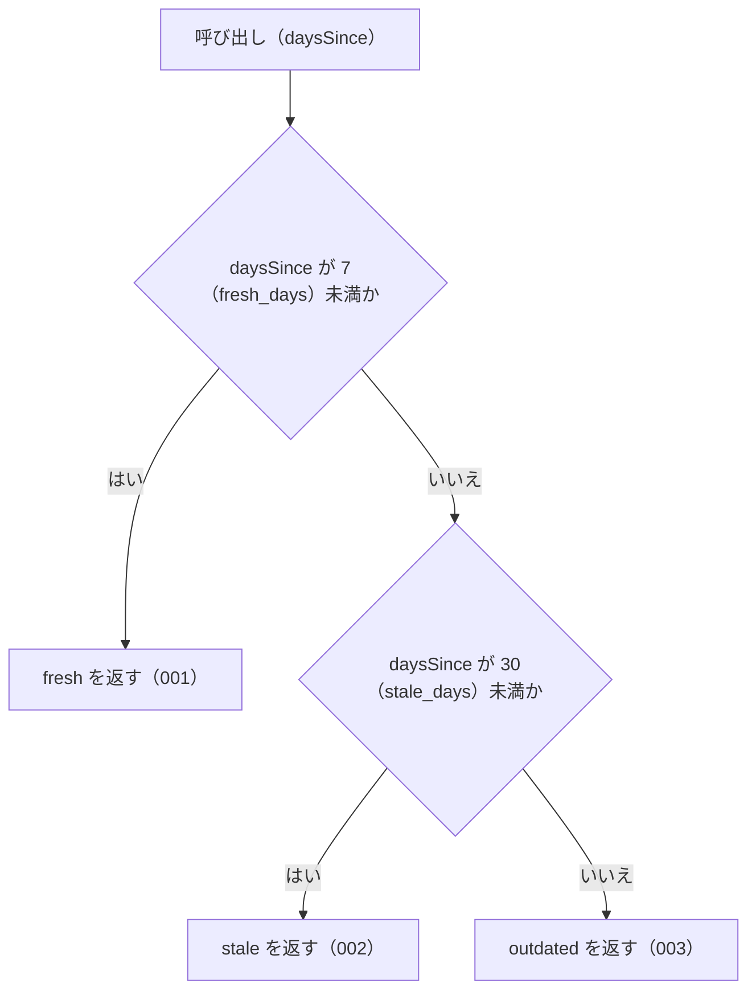

# 機能: judgeStaleness（経過日数から鮮度の段階を返す）

- 機能 ID: ABBR
- 版: current
- 承認日: 2026-09-27 （PR #26）
- 起こした元: v0.6.0 の `src/freshness.ts`（`judgeStaleness`、`StalenessLevel`）、`src/freshness.test.ts`
- 関連する Issue: houki-abbreviations #3（JSDoc の強化）。共通化の発端は houki-nta-mcp #15

この文書は「この関数は何をするか」を書きます。どう実装しているか（内部の変数名・分岐の書き方）は書きません。

## アクター

- houki-hub family の MCP サーバー（houki-nta-mcp など）。`computeDaysSince` で得た経過日数を渡して鮮度の段階を受け取り、自分の応答（取得した文書がどれだけ古いか）に載せる。family のどの MCP サーバーも同じ境界で判定するためにこの関数を使う

## 入力

| 引数        | 必須 | 内容                                                                       |
| ----------- | ---- | -------------------------------------------------------------------------- |
| `daysSince` | 必須 | 経過日数。0 以上の整数を想定する。通常は `computeDaysSince` の戻り値を渡す |

## 戻り値

`StalenessLevel`。次の 3 つの文字列のどれか 1 つ。この 3 つの値は family の MCP サーバーの応答に使われるので変えない。

| 値           | 意味                                                           |
| ------------ | -------------------------------------------------------------- |
| `"fresh"`    | 最近取得した。そのまま使ってよい                               |
| `"stale"`    | やや古い。使ってよいが、MCP サーバーが再取得を勧める警告を出す |
| `"outdated"` | 古い。使う前に再取得を勧める                                   |

境界の日数は `STALENESS_THRESHOLDS`（`fresh_days: 7`、`stale_days: 30`）。

## 処理の流れ

図の中の番号は「できること」の仕様 ID の末尾 3 桁です。

## できること

### SPEC-ABBR-JUDGE-STALENESS-001 7 日未満なら fresh を返す

`daysSince` が `STALENESS_THRESHOLDS.fresh_days`（7）未満のとき `"fresh"` を返す。

例: `0` → `"fresh"`、`6` → `"fresh"`。`computeDaysSince` で 4 日前の取得時刻から数えた値（4）→ `"fresh"`。

### SPEC-ABBR-JUDGE-STALENESS-002 7 日以上 30 日未満なら stale を返す

`daysSince` が `fresh_days`（7）以上で `STALENESS_THRESHOLDS.stale_days`（30）未満のとき `"stale"` を返す。ちょうど 7 日は `"stale"`。

例: `7` → `"stale"`、`29` → `"stale"`。`computeDaysSince` で 14 日前の取得時刻から数えた値（14）→ `"stale"`。

### SPEC-ABBR-JUDGE-STALENESS-003 30 日以上なら outdated を返す

`daysSince` が `stale_days`（30）以上のとき `"outdated"` を返す。ちょうど 30 日は `"outdated"`。

例: `30` → `"outdated"`、`100` → `"outdated"`。`computeDaysSince` で 2 か月前（`2026-03-08T00:00:00Z` から `2026-05-08T00:00:00Z`）の値（61）→ `"outdated"`。

## できないこと

- 取得時刻から経過日数を数えること（`computeDaysSince`）
- MCP サーバーごとに違う境界で判定すること（境界は `STALENESS_THRESHOLDS` の値に固定。違う境界が要る MCP サーバーは、この関数を使わずに自分の判定関数を書く）
- 警告の文言や再取得の手順を返すこと（各 MCP サーバーが持つ）
- 負の値や数でない値を検査して、エラーにすること（未決 1・2）

## 未決

初版起こしで見つけた、意図か不具合かを人が決める項目です。決まったら「できること」に ID を振るか、`specs/changes/` の差分にします。

意図か不具合かの判断が要る項目は houki-abbreviations の Issue に移し、ここには題と Issue の番号だけを残します。今の振る舞いのままでよくテストが無いだけの項目は、受入テストを書いてから「できること」に ID を振ります。

1. **負の値は `fresh` になる。** → houki-abbreviations #18
2. **`NaN` は `outdated` になる。** → houki-abbreviations #18
3. **小数の日数。** `6.99` → `"fresh"`、`29.5` → `"stale"`。整数を想定しているが、小数でも「未満」の比較どおりに判定する。今の振る舞いのままでよい。テストが無い。ID を振るのは受入テストを書いてから。
4. **`STALENESS_THRESHOLDS` を実行時に書き換えると判定が変わる。** → houki-abbreviations #13
