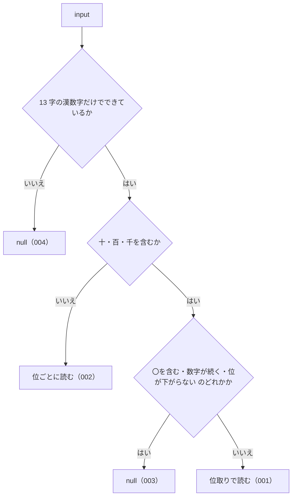

# 機能: kanjiToNumber（漢数字だけの文字列を数値にする）

- 機能 ID: ABBR
- 版: current
- 承認日: 2026-09-27 （PR #10）
- 起こした元: v0.6.0 の `src/normalize.ts`（`kanjiToNumber`）、`src/normalize.test.ts`
- 関連する Issue: houki-abbreviations #6（法令番号の漢数字と算用数字の正規化）

この文書は「この関数は何をするか」を書きます。どう実装しているか（内部の変数名・インデックスの作り方）は書きません。

## アクター

- このパッケージを import するコード（houki-hub family の MCP サーバーなど）。条番号・法令番号から切り出した漢数字の並びを渡して、数値を受け取る
- このパッケージの中では `normalizeLawNum` が、漢数字の並びごとにこの関数を使う

## 入力

| 引数    | 必須 | 内容                                                                                                       |
| ------- | ---- | ---------------------------------------------------------------------------------------------------------- |
| `input` | 必須 | 漢数字だけの文字列。使える文字は `〇` `一` `二` `三` `四` `五` `六` `七` `八` `九` `十` `百` `千` の 13 字 |

## 戻り値

`number | null`。読めたときは数値、読めないときは `null`。例外は投げない。

受け付ける書き方は 2 つ。

| 書き方 | 見分け方                                   | 読み方                                                    | 例                                                        |
| ------ | ------------------------------------------ | --------------------------------------------------------- | --------------------------------------------------------- |
| 位取り | `十` `百` `千` のどれかを含む              | 数字 × 単位の和。単位の前の数字が無いときは 1。千の位まで | `三十` → 30、`百八` → 108、`千五十` → 1050、`一千` → 1000 |
| 位ごと | `十` `百` `千` を含まない（`〇` を使える） | 1 文字を 1 桁として左から並べる（算用数字と同じ）         | `二五` → 25、`一三七` → 137、`三〇` → 30                  |

1 文字（`五`）はどちらで読んでも同じ値になる。

## 処理の流れ

図の中の番号は「できること」の仕様 ID の末尾 3 桁です。

## できること

### SPEC-ABBR-KANJI-TO-NUMBER-001 位取りの漢数字を読む

単位 `十` `百` `千` を使う書き方を、数字 × 単位の和として読む。単位の前に数字が無いときは 1 とする（`十` → 10、`千` → 1000）。単位の前に `一` を書いてもよい（`一千` → 1000）。

例: `一` → 1、`十` → 10、`二十五` → 25、`六十三` → 63、`百八` → 108、`百三十七` → 137、`三百八十二` → 382、`千五十` → 1050、`一千` → 1000、`千` → 1000。

### SPEC-ABBR-KANJI-TO-NUMBER-002 位ごとの漢数字を読む

単位を含まない並びは、1 文字を 1 桁として左から並べて読む。`〇` は 0。

例: `二五` → 25、`一三七` → 137、`三〇` → 30、`一四` → 14、`〇` → 0。

### SPEC-ABBR-KANJI-TO-NUMBER-003 位取りとして成り立たない並びは null を返す

単位を含む並びのうち、次のどれかに当たるものは `null` を返す。

| 並び                                           | 例               |
| ---------------------------------------------- | ---------------- |
| 単位の後の単位が同じか大きい（位が下がらない） | `十十`、`五百百` |
| 数字が 2 つ以上続く                            | `三三十`         |
| 単位と `〇` が混ざる                           | `二〇十`         |

### SPEC-ABBR-KANJI-TO-NUMBER-004 13 字以外の文字を含む入力は null を返す

13 字の漢数字以外の文字を 1 つでも含む入力と、空文字は `null` を返す。算用数字・`元`・`万` も対象外。

例: `元` → `null`、`25` → `null`、`''` → `null`、`二万` → `null`。

## できないこと

- 万以上の単位（`万` `億`）を読むこと
- 大字（`壱` `弐` `拾`）や `零` を読むこと
- 算用数字や全角数字を読むこと（算用数字の入った法令番号は `normalizeLawNum`）
- 文字列の中から漢数字の部分を探して変換すること（渡すのは漢数字だけの文字列。法令番号の中の漢数字を変換するのは `normalizeLawNum`）
- `元年` の `元` を 1 と読むこと（`normalizeLawNum` が扱う）

## 未決

初版起こしで見つけた、意図か不具合かを人が決める項目です。決まったら「できること」に ID を振るか、`specs/changes/` の差分にします。

意図か不具合かの判断が要る項目は houki-abbreviations の Issue に移し、ここには題と Issue の番号だけを残します。今の振る舞いのままでよくテストが無いだけの項目は、受入テストを書いてから「できること」に ID を振ります。

1. **位ごとの並びの先頭の `〇`。** `kanjiToNumber('〇五')` は 5、`kanjiToNumber('〇一三')` は 13、`kanjiToNumber('〇〇')` は 0。先頭の 0 は捨てる。テストが無い。ID を振るのは受入テストを書いてから。
2. **位ごとの長い並びで値が正確でなくなる。** → houki-abbreviations #24
3. **文字列以外の値を渡したとき。** `kanjiToNumber(123)`、`kanjiToNumber(null)`、`kanjiToNumber(undefined)` はどれも `null` を返す。テストが無い。ID を振るのは受入テストを書いてから。
4. **前後や途中に空白があるとき。** `kanjiToNumber(' 五')` も `kanjiToNumber('二十 五')` も `null`。空白を取り除かない。テストが無い。ID を振るのは受入テストを書いてから。
5. **単位の前の `一` と、`一十`。** `kanjiToNumber('一十')` は 10、`kanjiToNumber('千百十')` は 1110。`一千` のテストはあるが `一十` `一百` のテストが無い。ID を振るのは受入テストを書いてから。
