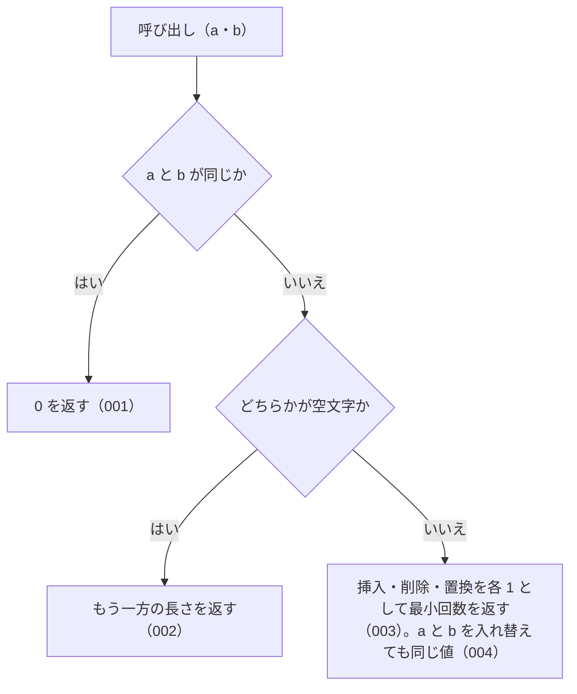

# 機能: levenshtein（2 つの文字列の編集距離を返す）

- 機能 ID: ABBR
- 版: current
- 承認日:
- 起こした元: v0.6.0 の `src/search.ts`（`levenshtein`）、`src/index.ts`（`levenshtein` の再 export）、`src/search.test.ts`
- 関連する Issue: なし（v0.4.0 の Track 1 で追加）

この文書は「この関数は何をするか」を書きます。どう実装しているか（内部の変数名・インデックスの作り方）は書きません。

## アクター

- houki-abbreviations を import する利用者（独自の検索を組むコードやテスト）。2 つの文字列を渡して編集距離を受け取る。`findSimilar` と `suggestCorrection` もこの値で近さを決める

## 入力

| 引数 | 必須 | 内容 |
| --- | --- | --- |
| `a` | 必須 | 比べる文字列の 1 つ目 |
| `b` | 必須 | 比べる文字列の 2 つ目 |

全角・半角をそろえる処理はしない。渡された文字列をそのまま比べる。

## 戻り値

0 以上の整数。`a` を `b` に変えるのに要る、1 文字の挿入・削除・置換の最小回数（どれも 1 回を 1 と数える）。

## 処理の流れ

図の中の番号は「できること」の仕様 ID の末尾 3 桁です。

## できること

### SPEC-ABBR-LEVENSHTEIN-001 同じ文字列には 0 を返す

`a` と `b` が同じ文字列なら 0 を返す。

例: `levenshtein('abc', 'abc')` と `levenshtein('労働基準法', '労働基準法')` はどちらも 0。

### SPEC-ABBR-LEVENSHTEIN-002 片方が空文字ならもう一方の長さを返す

どちらかが空文字なら、もう一方の長さを返す。両方とも空文字なら 0。

例: `levenshtein('', 'abc')` と `levenshtein('abc', '')` はどちらも 3。`levenshtein('', '')` は 0。

### SPEC-ABBR-LEVENSHTEIN-003 挿入・削除・置換を 1 回 1 として最小回数を返す

`a` を `b` に変えるのに要る、1 文字の挿入・削除・置換の最小回数を返す。どの操作も 1 回を 1 と数える。

例: `levenshtein('abc', 'abd')` は 1、`levenshtein('施行例', '施行令')` は 1、`levenshtein('kitten', 'sitting')` は 3（置換 2 回と挿入 1 回）。

### SPEC-ABBR-LEVENSHTEIN-004 引数の順を入れ替えても同じ値を返す

`levenshtein(a, b)` と `levenshtein(b, a)` は同じ値を返す。

例: `levenshtein('abc', 'xyz')` と `levenshtein('xyz', 'abc')` はどちらも 3。

## できないこと

- 全角と半角を同じ文字とみなすこと（`levenshtein('ＰＬ', 'PL')` は 2。`findSimilar` は比べる前に半角にそろえる）
- 英字の大文字・小文字を同じ文字とみなすこと（`levenshtein('A', 'a')` は 1）
- 隣り合う 2 文字の入れ替えを 1 回と数えること（入れ替えは置換 2 回として数える）
- 文字の種類ごとに操作の重みを変えること

## 未決

初版起こしで見つけた、意図か不具合かを人が決める項目です。決まったら「できること」に ID を振るか、`specs/changes/` の差分にします。

意図か不具合かの判断が要る項目は houki-abbreviations の Issue に移し、ここには題と Issue の番号だけを残します。今の振る舞いのままでよくテストが無いだけの項目は、受入テストを書いてから「できること」に ID を振ります。

1. **サロゲートペアの文字は 2 文字として数える。** JavaScript の文字列の長さ（UTF-16 の単位）で数えるので、`𠮷` のような BMP 外の文字は 1 文字でも 2 と数える。`levenshtein('𠮷', '吉')` は 2、`levenshtein('𠮷野家', '吉野家')` も 2（1 文字の置換なのに 2）。法令名に BMP 外の漢字が入ると `findSimilar` の `maxDistance` の判定がずれる。v0.6.0 の辞書の名前には BMP 外の文字は無い。意図か確かめる。
2. **テストの describe 名が「内部 helper」。** `levenshtein` は `src/index.ts` から export され、README の API 節にも載っている公開の関数だが、テストの describe は「levenshtein (内部 helper)」。公開の関数として扱うかを決める。
