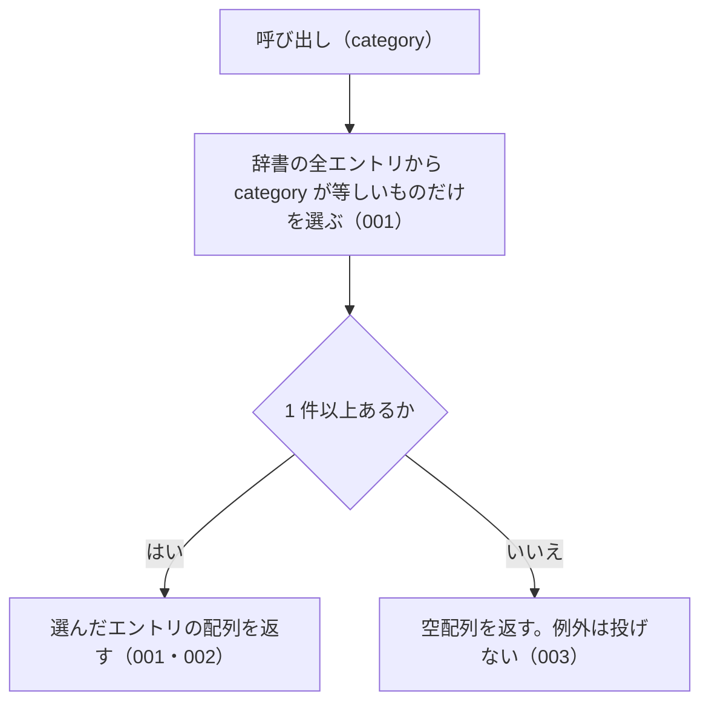

# 機能: listByCategory（指定した種別のエントリをすべて返す）

- 機能 ID: ABBR
- 版: current
- 承認日: 2026-09-27 （PR #26）。差分 `20260927-untested-behaviors` は 2026-09-27（PR #28）
- 起こした元: v0.6.0 の `src/index.ts`（`listByCategory`）、`src/index.test.ts`
- 関連する Issue: なし

この文書は「この関数は何をするか」を書きます。どう実装しているか（内部の変数名・インデックスの作り方）は書きません。

## アクター

- houki-hub family の MCP サーバーと、このパッケージを import する利用者のコード。種別（法律・政令・通達など）を渡して、その種別の辞書のエントリの一覧を受け取る

## 入力

| 引数       | 必須 | 内容                                                                                                                                                                                                                               |
| ---------- | ---- | ---------------------------------------------------------------------------------------------------------------------------------------------------------------------------------------------------------------------------------- |
| `category` | 必須 | 種別。`constitution` / `law` / `cabinet-order` / `imperial-ordinance` / `ministerial-ordinance` / `rule` / `kihon-tsutatsu` / `kobetsu-tsutatsu` / `qa-jirei` / `tax-answer` / `hanrei` / `saiketsu` のどれか（定数 `CATEGORIES`） |

## 戻り値

`AbbreviationEntry[]`。`category` フィールドが `category` と等しいエントリの配列。エントリのフィールドは `resolveAbbreviation` の戻り値と同じ。

v0.6.0 の辞書（174 件）での件数は次のとおり。

| `category`              | 件数 |
| ----------------------- | ---- |
| `constitution`          | 1    |
| `law`                   | 138  |
| `cabinet-order`         | 8    |
| `imperial-ordinance`    | 0    |
| `ministerial-ordinance` | 16   |
| `rule`                  | 2    |
| `kihon-tsutatsu`        | 8    |
| `kobetsu-tsutatsu`      | 1    |
| `qa-jirei`              | 0    |
| `tax-answer`            | 0    |
| `hanrei`                | 0    |
| `saiketsu`              | 0    |

## 処理の流れ

図の中の番号は「できること」の仕様 ID の末尾 3 桁です。

## できること

### SPEC-ABBR-LIST-BY-CATEGORY-001 指定した種別のエントリだけを返す

辞書のエントリのうち、`category` フィールドが引数 `category` と等しいものだけを配列で返す。ほかの種別のエントリは含まない。

例: `listByCategory('law')` は 138 件を返し、どの要素も `category: "law"`。`listByCategory('cabinet-order')` は `所得税法施行令` など正式名称が `施行令` で終わるエントリを含む 8 件を返す。`listByCategory('kihon-tsutatsu')` は `消費税法基本通達` を含む 8 件を返す。

### SPEC-ABBR-LIST-BY-CATEGORY-002 constitution には日本国憲法の 1 件を返す

`listByCategory('constitution')` は、`formal: "日本国憲法"` のエントリ 1 件だけの配列を返す。

### SPEC-ABBR-LIST-BY-CATEGORY-003 エントリの無い種別には空配列を返す

辞書にその種別のエントリが 1 件も無いときは、例外を投げずに空配列を返す。v0.6.0 では `imperial-ordinance` / `qa-jirei` / `tax-answer` / `hanrei` / `saiketsu` の 5 つが空配列になる。

例: `listByCategory('hanrei')` と `listByCategory('saiketsu')` は `[]`。

### SPEC-ABBR-LIST-BY-CATEGORY-004 辞書の並びのまま返す

返す配列の要素は、辞書（`abbreviationEntries`）での並びのまま並ぶ。`abbreviationEntries.filter((e) => e.category === category)` と同じエントリを同じ順で返す。

例: `listByCategory('law')` の先頭の 3 件は `所法` / `法法` / `消法`、`listByCategory('kihon-tsutatsu')` の先頭の 3 件は `消基通` / `所基通` / `法基通` で、どれも `abbreviationEntries` での順と同じ。

### SPEC-ABBR-LIST-BY-CATEGORY-005 呼ぶたびに新しい配列を返す

呼ぶたびに新しい配列を返す。返した配列に要素を足したり、配列から要素を除いたりしても、次の呼び出しの結果は変わらない。

例: `const a = listByCategory('law'); a.push({})` の後も、`listByCategory('law')` は 138 件を返す。`a.splice(0)` の後も同じ。同じ引数で 2 回呼んだ結果は別の配列（`!==`）。

### SPEC-ABBR-LIST-BY-CATEGORY-006 CATEGORIES に無い値には空配列を返す

JavaScript から `CATEGORIES` に無い値を渡したときは、例外を投げずに空配列を返す。

例: `listByCategory('xxx')` と `listByCategory(undefined)` は `[]`。

### SPEC-ABBR-LIST-BY-CATEGORY-007 ministerial-ordinance・rule・kobetsu-tsutatsu にもその種別のエントリを返す

`ministerial-ordinance`（省令）・`rule`（規則）・`kobetsu-tsutatsu`（個別通達）を渡したときも、その種別のエントリだけを返す。

例: `listByCategory('ministerial-ordinance')` は `所規`（`formal: "所得税法施行規則"`）・`労基則`・`会社規` などを含む 16 件、`listByCategory('rule')` は `民訴規`（`formal: "民事訴訟規則"`）と `刑訴規`（`formal: "刑事訴訟規則"`）の 2 件、`listByCategory('kobetsu-tsutatsu')` は `電帳法取通`（`formal: "電子計算機を使用して作成する国税関係帳簿書類の保存方法等の特例に関する法律の取扱通達"`）の 1 件を返す。どの要素もそれぞれの `category` を持つ。

## できないこと

- 複数の種別をまとめて絞り込むこと（`searchByName` の `filter.category` は配列を受け付ける）
- 分野で絞り込むこと（`listByDomain`）
- 本文を持つ MCP で絞り込むこと（`listBySourceMcpHint`）
- 件数だけを返すこと（`getAbbreviationStats` の `byCategory`）

## 未決

初版起こしで見つけた、意図か不具合かを人が決める項目です。決まったら「できること」に ID を振るか、`specs/changes/` の差分にします。

意図か不具合かの判断が要る項目は houki-abbreviations の Issue に移し、ここには題と Issue の番号だけを残します。今の振る舞いのままでよくテストが無いだけの項目は、受入テストを書いてから「できること」に ID を振ります。

1. **返すエントリは凍結されておらず、書き換えると辞書に残る。** → houki-abbreviations #13
2. **返す順序。** → SPEC-ABBR-LIST-BY-CATEGORY-004
3. **返す配列は呼ぶたびに新しい。** → SPEC-ABBR-LIST-BY-CATEGORY-005
4. **`CATEGORIES` に無い値。** → SPEC-ABBR-LIST-BY-CATEGORY-006
5. **`kobetsu-tsutatsu` と `rule` と `ministerial-ordinance` の中身。** → SPEC-ABBR-LIST-BY-CATEGORY-007
