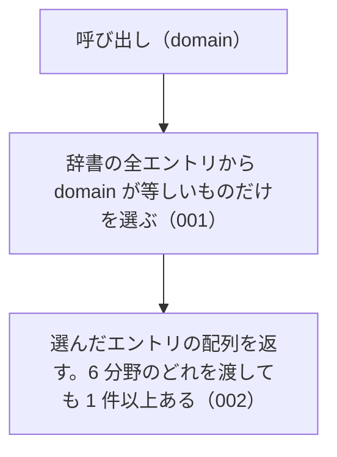

# 機能: listByDomain（指定した分野のエントリをすべて返す）

- 機能 ID: ABBR
- 版: current
- 承認日: 2026-09-27 （PR #10）
- 起こした元: v0.6.0 の `src/index.ts`（`listByDomain`）、`src/index.test.ts`
- 関連する Issue: なし

この文書は「この関数は何をするか」を書きます。どう実装しているか（内部の変数名・インデックスの作り方）は書きません。

## アクター

- houki-hub family の MCP サーバーと、このパッケージを import する利用者のコード。分野を渡して、その分野に属する辞書のエントリの一覧を受け取る

## 入力

| 引数     | 必須 | 内容                                                                                                        |
| -------- | ---- | ----------------------------------------------------------------------------------------------------------- |
| `domain` | 必須 | 分野。`tax` / `labor` / `accounting` / `commercial` / `civil` / `administrative` のどれか（定数 `DOMAINS`） |

## 戻り値

`AbbreviationEntry[]`。`domain` フィールドが `domain` と等しいエントリの配列。エントリのフィールドは `resolveAbbreviation` の戻り値と同じ。

v0.6.0 の辞書（174 件）での件数は次のとおり。

| `domain`         | 件数 |
| ---------------- | ---- |
| `tax`            | 35   |
| `labor`          | 28   |
| `accounting`     | 9    |
| `commercial`     | 31   |
| `civil`          | 23   |
| `administrative` | 48   |

## 処理の流れ

図の中の番号は「できること」の仕様 ID の末尾 3 桁です。

## できること

### SPEC-ABBR-LIST-BY-DOMAIN-001 指定した分野のエントリだけを返す

辞書のエントリのうち、`domain` フィールドが引数 `domain` と等しいものだけを配列で返す。ほかの分野のエントリは含まない。

例: `listByDomain('tax')` は 35 件を返し、どの要素も `domain: "tax"`。

### SPEC-ABBR-LIST-BY-DOMAIN-002 6 分野のどれを渡しても 1 件以上を返す

`DOMAINS` の 6 つの値のどれを渡しても、1 件以上のエントリを返す。v0.6.0 の件数は「戻り値」の表のとおり。

## できないこと

- 複数の分野をまとめて絞り込むこと（`searchByName` の `filter.domain` は配列を受け付ける）
- 種別で絞り込むこと（`listByCategory`）
- 本文を持つ MCP で絞り込むこと（`listBySourceMcpHint`）
- 件数だけを返すこと（`getAbbreviationStats` の `byDomain`）

## 未決

初版起こしで見つけた、意図か不具合かを人が決める項目です。決まったら「できること」に ID を振るか、`specs/changes/` の差分にします。

意図か不具合かの判断が要る項目は houki-abbreviations の Issue に移し、ここには題と Issue の番号だけを残します。今の振る舞いのままでよくテストが無いだけの項目は、受入テストを書いてから「できること」に ID を振ります。

1. **README の件数が実際と違う。** → houki-abbreviations #17
2. **返すエントリは凍結されておらず、書き換えると辞書に残る。** → houki-abbreviations #13
3. **返す順序。** 辞書の並び（`tax` の先頭は `所法` / `所令` / `所規`）のまま返す。順序を約束するのか決まっていない。テストが無い。ID を振るのは受入テストを書いてから。
4. **返す配列は呼ぶたびに新しい。** `listByDomain('tax').push(…)` をしても、次の `listByDomain('tax')` は 35 件のまま。テストが無い。ID を振るのは受入テストを書いてから。
5. **`DOMAINS` に無い値。** 型では受け付けないが、JavaScript から `listByDomain('xxx')` と呼ぶと例外を投げずに空配列を返す。テストが無い。ID を振るのは受入テストを書いてから。
