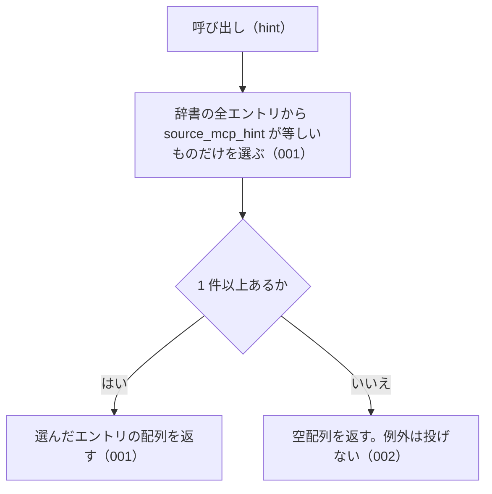

# 機能: listBySourceMcpHint（指定した MCP が本文を持つエントリをすべて返す）

- 機能 ID: ABBR
- 版: current
- 承認日: 2026-09-27 （PR #26）。差分 `20260927-untested-behaviors` は 2026-09-27（PR #28）
- 起こした元: v0.6.0 の `src/index.ts`（`listBySourceMcpHint`）、`src/index.test.ts`
- 関連する Issue: なし

この文書は「この関数は何をするか」を書きます。どう実装しているか（内部の変数名・インデックスの作り方）は書きません。

## アクター

- houki-hub family の MCP サーバー。起動時に自分の名前（例: `houki-nta`）を渡して、自分が本文を返せるエントリだけの一覧を受け取る。それ以外のエントリを問い合わせられたときに、本文を持つ MCP の名前を案内するために使う

## 入力

| 引数   | 必須 | 内容                                                                                                                                         |
| ------ | ---- | -------------------------------------------------------------------------------------------------------------------------------------------- |
| `hint` | 必須 | MCP の名前。`houki-egov` / `houki-nta` / `houki-mhlw` / `houki-jaish` / `houki-court` / `houki-saiketsu` のどれか（定数 `SOURCE_MCP_HINTS`） |

## 戻り値

`AbbreviationEntry[]`。`source_mcp_hint` フィールドが `hint` と等しいエントリの配列。エントリのフィールドは `resolveAbbreviation` の戻り値と同じ。

v0.6.0 の辞書（174 件）での件数は次のとおり。

| `hint`           | 件数 |
| ---------------- | ---- |
| `houki-egov`     | 165  |
| `houki-nta`      | 9    |
| `houki-mhlw`     | 0    |
| `houki-jaish`    | 0    |
| `houki-court`    | 0    |
| `houki-saiketsu` | 0    |

## 処理の流れ

図の中の番号は「できること」の仕様 ID の末尾 3 桁です。

## できること

### SPEC-ABBR-LIST-BY-SOURCE-MCP-HINT-001 指定した MCP が本文を持つエントリだけを返す

辞書のエントリのうち、`source_mcp_hint` フィールドが引数 `hint` と等しいものだけを配列で返す。ほかの MCP のエントリは含まない。

例: `listBySourceMcpHint('houki-egov')` は 165 件（法律・政令・省令など）を返し、どの要素も `source_mcp_hint: "houki-egov"`。`listBySourceMcpHint('houki-nta')` は `消費税法基本通達` を含む 9 件（基本通達 8 件と個別通達 1 件）を返し、どの要素も `source_mcp_hint: "houki-nta"`。

### SPEC-ABBR-LIST-BY-SOURCE-MCP-HINT-002 エントリの無い MCP には空配列を返す

辞書にその MCP のエントリが 1 件も無いときは、例外を投げずに空配列を返す。v0.6.0 では `houki-mhlw` / `houki-jaish` / `houki-court` / `houki-saiketsu` の 4 つが空配列になる。

例: `listBySourceMcpHint('houki-mhlw')` と `listBySourceMcpHint('houki-court')` は `[]`。

### SPEC-ABBR-LIST-BY-SOURCE-MCP-HINT-003 辞書の並びのまま返す

返す配列の要素は、辞書（`abbreviationEntries`）での並びのまま並ぶ。`abbreviationEntries.filter((e) => e.source_mcp_hint === hint)` と同じエントリを同じ順で返す。

例: `listBySourceMcpHint('houki-egov')` の先頭の 3 件は `所法` / `所令` / `所規`、`listBySourceMcpHint('houki-nta')` の先頭の 3 件は `消基通` / `所基通` / `法基通` で、どれも `abbreviationEntries` での順と同じ。

### SPEC-ABBR-LIST-BY-SOURCE-MCP-HINT-004 呼ぶたびに新しい配列を返す

呼ぶたびに新しい配列を返す。返した配列に要素を足したり、配列から要素を除いたりしても、次の呼び出しの結果は変わらない。

例: `const a = listBySourceMcpHint('houki-nta'); a.push({})` の後も、`listBySourceMcpHint('houki-nta')` は 9 件を返す。`a.splice(0)` の後も同じ。同じ引数で 2 回呼んだ結果は別の配列（`!==`）。

### SPEC-ABBR-LIST-BY-SOURCE-MCP-HINT-005 SOURCE_MCP_HINTS に無い値には空配列を返す

JavaScript から `SOURCE_MCP_HINTS` に無い値を渡したときは、例外を投げずに空配列を返す。大文字と小文字は区別する。

例: `listBySourceMcpHint('xxx')` と `listBySourceMcpHint('HOUKI-EGOV')` は `[]`。

## できないこと

- 複数の MCP をまとめて絞り込むこと（`searchByName` の `filter.source_mcp_hint` は配列を受け付ける）
- 分野で絞り込むこと（`listByDomain`）
- 種別で絞り込むこと（`listByCategory`）
- 1 つの名前が、渡した MCP の担当かどうかを判定すること（`resolveAbbreviation` で引いたエントリの `source_mcp_hint` を利用者が比べる）
- 件数だけを返すこと（`getAbbreviationStats` の `bySourceMcpHint`）

## 未決

初版起こしで見つけた、意図か不具合かを人が決める項目です。決まったら「できること」に ID を振るか、`specs/changes/` の差分にします。

意図か不具合かの判断が要る項目は houki-abbreviations の Issue に移し、ここには題と Issue の番号だけを残します。今の振る舞いのままでよくテストが無いだけの項目は、受入テストを書いてから「できること」に ID を振ります。

1. **返すエントリは凍結されておらず、書き換えると辞書に残る。** → houki-abbreviations #13
2. **返す順序。** → SPEC-ABBR-LIST-BY-SOURCE-MCP-HINT-003
3. **返す配列は呼ぶたびに新しい。** → SPEC-ABBR-LIST-BY-SOURCE-MCP-HINT-004
4. **`SOURCE_MCP_HINTS` に無い値。** → SPEC-ABBR-LIST-BY-SOURCE-MCP-HINT-005
5. **`houki-jaish` と `houki-saiketsu`。** → SPEC-ABBR-LIST-BY-SOURCE-MCP-HINT-002（テストを足した）
