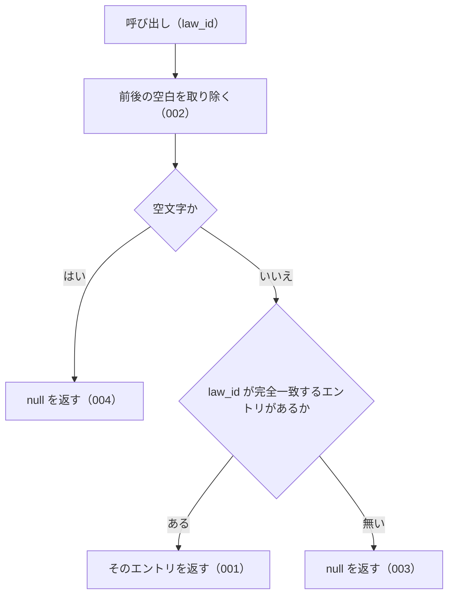

# 機能: lookupByLawId（e-Gov の法令 ID から辞書のエントリを 1 件引く）

- 機能 ID: ABBR
- 版: current
- 承認日:
- 起こした元: v0.6.0 の `src/lookup.ts`（`lookupByLawId`）、`src/index.ts`（`lookupByLawId`）、`src/lookup.test.ts`
- 関連する Issue: なし

この文書は「この関数は何をするか」を書きます。どう実装しているか（内部の変数名・インデックスの作り方）は書きません。

## アクター

- houki-abbreviations を import する利用者（houki-egov-mcp・houki-nta-mcp などの MCP サーバー、またはアプリケーション）。e-Gov の法令 ID（`law_id`）を渡して、その法令の略称・正式名称などを持つ辞書のエントリを受け取る

## 入力

| 引数     | 必須 | 内容                                                                                                   |
| -------- | ---- | ------------------------------------------------------------------------------------------------------ |
| `law_id` | 必須 | e-Gov の法令 ID。例: `363AC0000000108`（消費税法）/ `321CONSTITUTION`（日本国憲法）。前後の空白は無視する |

## 戻り値

`AbbreviationEntry | null`。

- 見つかったとき: 辞書のエントリ（`abbr` / `formal` / `law_id` / `law_num` / `law_type` / `domain` / `category` / `source_mcp_hint` / `aliases` / `note`。`law_num` 以降は辞書にあるときだけ付く）
- 見つからないとき、`law_id` が空文字・空白だけのとき: `null`

v0.6.0 の辞書 174 件のうち、`law_id` を持つ（`null` でない）エントリは 9 件（`所法` / `法法` / `消法` / `労基法` / `育介法` / `会社` / `商` / `民` / `憲`）。この関数で引けるのはこの 9 件だけ。

## 処理の流れ

図の中の番号は「できること」の仕様 ID の末尾 3 桁です。

## できること

### SPEC-ABBR-LOOKUP-BY-LAW-ID-001 law_id が完全一致するエントリを返す

`law_id` が辞書のエントリの `law_id` と完全一致するとき、そのエントリを返す。`363AC0000000108` のような通常の形式でも、`321CONSTITUTION` のような形式でも同じく引ける。

例: `lookupByLawId('363AC0000000108')?.formal` は `'消費税法'`。`lookupByLawId('321CONSTITUTION')?.formal` は `'日本国憲法'`。

### SPEC-ABBR-LOOKUP-BY-LAW-ID-002 前後の空白を無視する

`law_id` の前後の空白を取り除いてから照合する。

例: `lookupByLawId('  363AC0000000108  ')?.formal` は `'消費税法'`。

### SPEC-ABBR-LOOKUP-BY-LAW-ID-003 一致するエントリが無ければ null を返す

どのエントリの `law_id` とも一致しないときは `null` を返す。例外は投げない。

例: `lookupByLawId('999XX0000000000')` は `null`。

### SPEC-ABBR-LOOKUP-BY-LAW-ID-004 空文字・空白だけの law_id には null を返す

`law_id` が空文字、または空白だけのときは、辞書を照合せずに `null` を返す。

例: `lookupByLawId('')` と `lookupByLawId('   ')` はどちらも `null`。

## できないこと

- 大文字・小文字の違いを吸収すること（`363ac0000000108` は `null`。未決 1）
- 全角・半角の違いを吸収すること（`３６３AC0000000108` は `null`。未決 1）
- 通達など `law_id` が `null` のエントリ（v0.6.0 の辞書で 174 件中 165 件）を引くこと
- 法令番号から引くこと（`lookupByLawNum`）
- 略称・正式名称・別名から引くこと（`resolveAbbreviation`）
- `law_id` の形式が e-Gov の規則に合うかを確かめること（`isValidLawId`）
- 1 回の呼び出しで複数の `law_id` を引くこと

## 未決

初版起こしで見つけた、意図か不具合かを人が決める項目です。決まったら「できること」に ID を振るか、`specs/changes/` の差分にします。

意図か不具合かの判断が要る項目は houki-abbreviations の Issue に移し、ここには題と Issue の番号だけを残します。今の振る舞いのままでよくテストが無いだけの項目は、受入テストを書いてから「できること」に ID を振ります。

1. **大文字・小文字と全角・半角を区別する。** 照合は完全一致で、`lookupByLawId('363ac0000000108')` も `lookupByLawId('３６３AC0000000108')` も `null` を返す。大文字・小文字の区別は JSDoc に「大小区別あり」と書かれているが、テストが無い。一方で `lookupByLawNum` は全角数字を吸収するので、2 つの逆引きで入力の扱いが揃っていない。全角を吸収しないのが意図かどうかを決める。
2. **`law_id` が `null` のエントリを対象にしないことのテスト。** テスト名「law_id=null のエントリはヒットしない」の中身は `lookupByLawId(fixtures, '')` が `null` になることを確かめているだけで、`law_id` が `null` のエントリ（fixtures の `労基法`）を引こうとしていない。文字列の引数で `null` のエントリに一致することは起きないので振る舞いとしては成り立つが、テスト名と中身が合っていない。このテストには SPEC-ABBR-LOOKUP-BY-LAW-ID-004 を付けた。
3. **返すエントリは辞書のオブジェクトそのもの。** 返したエントリは `abbreviationEntries` の要素と同じオブジェクトで、凍結されていない（配列は凍結されている）。呼び出し側が書き換えると辞書そのものが変わる。例: `lookupByLawId('363AC0000000108').formal = 'X'` の後、`resolveAbbreviation('消法')?.formal` も `lookupByLawNum('昭和63年法律第108号')?.formal` も `'X'` を返す。`resolveAbbreviation` など他の関数も同じオブジェクトを返すので、ライブラリ全体で決める。
