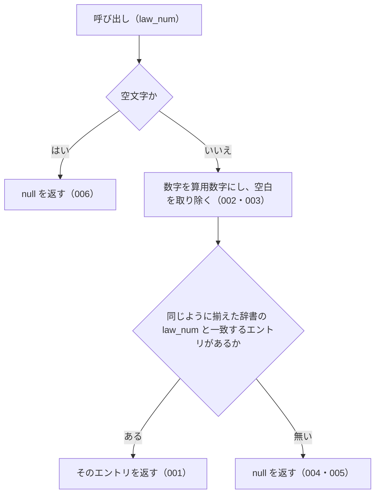

# 機能: lookupByLawNum（法令番号から辞書のエントリを 1 件引く）

- 機能 ID: ABBR
- 版: current
- 承認日: 2026-09-27 （PR #26）。差分 `20260927-untested-behaviors` は 2026-09-27（PR #28）
- 起こした元: v0.6.0 の `src/lookup.ts`（`lookupByLawNum`）、`src/index.ts`（`lookupByLawNum`）、`src/lookup.test.ts`、`src/normalize.test.ts`
- 関連する Issue: houki-abbreviations #6（法令番号の漢数字・算用数字の正規化）

この文書は「この関数は何をするか」を書きます。どう実装しているか（内部の変数名・インデックスの作り方）は書きません。

## アクター

- houki-abbreviations を import する利用者（houki-egov-mcp・houki-nta-mcp などの MCP サーバー、またはアプリケーション）。条文や通達に書かれた法令番号（`昭和六十三年法律第百八号` など）を渡して、その法令の略称・正式名称などを持つ辞書のエントリを受け取る

## 入力

| 引数      | 必須 | 内容                                                                                                                                                                                                  |
| --------- | ---- | ----------------------------------------------------------------------------------------------------------------------------------------------------------------------------------------------------- |
| `law_num` | 必須 | 法令番号。漢数字（`昭和六十三年法律第百八号`）・算用数字（`昭和63年法律第108号`）・全角数字（`昭和６３年法律第１０８号`）・位ごとの漢数字（`昭和六三年法律第一〇八号`）のどれでもよい。空白は無視する |

## 戻り値

`AbbreviationEntry | null`。

- 見つかったとき: 辞書のエントリ（`abbr` / `formal` / `law_id` / `law_num` / `law_type` / `domain` / `category` / `source_mcp_hint` / `aliases` / `note`。`law_num` 以降は辞書にあるときだけ付く）。`law_num` は辞書に登録された漢数字の形のまま
- 見つからないとき、`law_num` が空文字のとき: `null`

v0.6.0 の辞書 174 件のうち、`law_num` を持つエントリは 9 件（`所法` / `法法` / `消法` / `労基法` / `育介法` / `会社` / `商` / `民` / `憲`）。この関数で引けるのはこの 9 件だけ。

## 処理の流れ

図の中の番号は「できること」の仕様 ID の末尾 3 桁です。

## できること

### SPEC-ABBR-LOOKUP-BY-LAW-NUM-001 漢数字の法令番号でエントリを返す

`law_num` が辞書のエントリの `law_num` と同じ法令番号のとき、そのエントリを返す。辞書と同じ漢数字の形で渡せば引ける。

例: `lookupByLawNum('昭和六十三年法律第百八号')?.formal` は `'消費税法'`。

### SPEC-ABBR-LOOKUP-BY-LAW-NUM-002 算用数字・全角数字・位ごとの漢数字でも同じエントリを返す

数字の書き方が違っても、同じ法令番号なら同じエントリ（同じオブジェクト）を返す。対応する書き方は、位取りの漢数字（`百八`）、位ごとの漢数字（`一〇八`）、算用数字（`108`）、全角数字（`１０８`）。

例: `昭和六十三年法律第百八号` / `昭和63年法律第108号` / `昭和６３年法律第１０８号` / `昭和六三年法律第一〇八号` はどれも `消費税法` のエントリを返す。`lookupByLawNum('昭和21年憲法')?.formal` は `'日本国憲法'`（辞書の `law_num` は `昭和二十一年憲法`）。

### SPEC-ABBR-LOOKUP-BY-LAW-NUM-003 空白を無視する

`law_num` の前後と途中の空白を取り除いてから照合する。

例: `lookupByLawNum(' 昭和63年 法律 第108号 ')?.formal` は `'消費税法'`。

### SPEC-ABBR-LOOKUP-BY-LAW-NUM-004 第・号を省いた形や元号の違う形には null を返す

数字の書き方以外の違いは吸収しない。`第` や `号` を省いた形、元号が違う形は、一致するエントリが無いものとして `null` を返す。

例: `lookupByLawNum('昭和63年法律108号')` と `lookupByLawNum('平成63年法律第108号')` はどちらも `null`。

### SPEC-ABBR-LOOKUP-BY-LAW-NUM-005 一致するエントリが無ければ null を返す

どのエントリの `law_num` とも一致しないときは `null` を返す。例外は投げない。

例: `lookupByLawNum('令和九十九年法律第千号')` は `null`。

### SPEC-ABBR-LOOKUP-BY-LAW-NUM-006 空文字の law_num には null を返す

`law_num` が空文字のときは、辞書を照合せずに `null` を返す。

例: `lookupByLawNum('')` は `null`。

### SPEC-ABBR-LOOKUP-BY-LAW-NUM-007 空白だけの law_num には null を返す

`law_num` が空白（半角スペース・タブなど）だけのときは `null` を返す。

例: `lookupByLawNum('   ')` も `lookupByLawNum('\t')` も `null`。

### SPEC-ABBR-LOOKUP-BY-LAW-NUM-008 数字の先頭の 0 を無視する

年や番号の算用数字の先頭に 0 が付いていても、付いていないものと同じ法令番号として照合する。

例: `lookupByLawNum('昭和063年法律第0108号')?.formal` は `'消費税法'`、`lookupByLawNum('昭和63年法律第00108号')?.formal` は `'消費税法'`。

### SPEC-ABBR-LOOKUP-BY-LAW-NUM-009 元年と 1 年を同じ年として照合する

`law_num` の `元年` と `1年`（`一年`）は同じ年として照合する。入力が `元年` でも辞書の `law_num` が `元年` でもよい。v0.6.0 の辞書には `元年` の `law_num` を持つエントリが無いので、辞書を差し替えて確かめる。

例: `law_num` が `令和元年法律第一号` のエントリ 1 件だけの辞書で、`令和1年法律第1号`・`令和元年法律第一号`・`令和元年法律第01号` はどれもそのエントリを返す（`src/lookup.ts` の `lookupByLawNum(entries, law_num)` で確かめた）。

## できないこと

- 元号の別表記（`S63` / `昭63`）を吸収すること（`lookupByLawNum('S63年法律第108号')` は `null`）
- `第` や `号` の省略を吸収すること（SPEC-ABBR-LOOKUP-BY-LAW-NUM-004）
- 法令の種別名（`法律` / `政令`）を補うこと
- `law_num` を持たないエントリ（v0.6.0 の辞書で 174 件中 165 件）を引くこと
- e-Gov の法令 ID から引くこと（`lookupByLawId`）
- 略称・正式名称・別名から引くこと（`resolveAbbreviation`）
- 法令番号の表記を揃えた文字列そのものを返すこと（`normalizeLawNum`）
- 1 回の呼び出しで複数の法令番号を引くこと

## 未決

初版起こしで見つけた、意図か不具合かを人が決める項目です。決まったら「できること」に ID を振るか、`specs/changes/` の差分にします。

意図か不具合かの判断が要る項目は houki-abbreviations の Issue に移し、ここには題と Issue の番号だけを残します。今の振る舞いのままでよくテストが無いだけの項目は、受入テストを書いてから「できること」に ID を振ります。テストの名前と中身が合っていない項目は、テストを直します（ID を振っていないものは、直してから振ります）。

1. **テスト「Issue #6 の完了条件」が `null` 同士で通っている。** → SPEC-ABBR-LOOKUP-BY-LAW-NUM-002（テストを直した。v0.6.1）
2. **テスト「law_num 未設定エントリは引けない」の中身が名前と合っていない。** （テストを直した。v0.6.1）
3. **空白だけの `law_num`。** → SPEC-ABBR-LOOKUP-BY-LAW-NUM-007
4. **`元年` と数字の先頭の 0。** → SPEC-ABBR-LOOKUP-BY-LAW-NUM-008、SPEC-ABBR-LOOKUP-BY-LAW-NUM-009
5. **返すエントリは辞書のオブジェクトそのもの。** → houki-abbreviations #13
