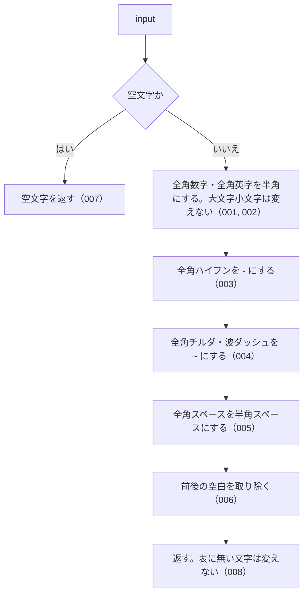

# 機能: normalizeJpText（全角の数字・英字・一部の記号を半角に揃える）

- 機能 ID: ABBR
- 版: current
- 承認日:
- 起こした元: v0.6.0 の `src/normalize.ts`（`normalizeJpText`）、`src/normalize.test.ts`
- 関連する Issue: なし（v0.3.0 で houki-nta-mcp の正規化の一部を移したもの。CHANGELOG の 0.3.0）

この文書は「この関数は何をするか」を書きます。どう実装しているか（内部の変数名・インデックスの作り方）は書きません。

## アクター

- このパッケージを import するコード（houki-hub family の MCP サーバーなど）。法令・通達の本文や利用者の入力を渡して、全角と半角の書き分けを揃えた文字列を受け取る。DB に入れる文字列と検索に使う文字列の両方に同じ関数を通して照合する
- このパッケージの中では、`resolveAbbreviation(name, { normalize: true })` と `searchByName` / `findSimilar` の `normalize` がこの関数を使う

## 入力

| 引数    | 必須 | 内容                                         |
| ------- | ---- | -------------------------------------------- |
| `input` | 必須 | 揃える文字列。法令名・条番号・検索語など何でもよい |

## 戻り値

`string`。次の表の変換をしたうえで、前後の空白を取り除いた文字列。

| 変換前                                            | 変換後                  |
| ------------------------------------------------- | ----------------------- |
| 全角数字 `０`〜`９`（U+FF10〜U+FF19）             | 半角数字 `0`〜`9`       |
| 全角英大文字 `Ａ`〜`Ｚ`（U+FF21〜U+FF3A）         | 半角英大文字 `A`〜`Z`   |
| 全角英小文字 `ａ`〜`ｚ`（U+FF41〜U+FF5A）         | 半角英小文字 `a`〜`z`   |
| 全角ハイフン `－`（U+FF0D FULLWIDTH HYPHEN-MINUS） | `-`（U+002D）           |
| 全角チルダ `～`（U+FF5E FULLWIDTH TILDE）         | `~`（U+007E）           |
| 波ダッシュ `〜`（U+301C WAVE DASH）               | `~`（U+007E）           |
| 全角スペース `　`（U+3000）                       | 半角スペース（U+0020）  |

表に無い文字は変えない。変えない文字の例: 漢字、ひらがな、カタカナ、半角カナ（`ｱ`）、中黒 `・`、漢数字、`共` `の` `条` `項` などの条番号の語、表以外の全角記号（`／` `（` `）` `＃` など）、表以外のダッシュ類（`‐` U+2010、`―` U+2015、`−` U+2212 など）。

## 処理の流れ

図の中の番号は「できること」の仕様 ID の末尾 3 桁です。

## できること

### SPEC-ABBR-NORMALIZE-JP-TEXT-001 全角数字を半角数字にする

`０`〜`９` を `0`〜`9` にする。

例: `normalizeJpText('１８３')` は `'183'`。`normalizeJpText('０１２３４５６７８９')` は `'0123456789'`。

### SPEC-ABBR-NORMALIZE-JP-TEXT-002 全角英字を半角英字にし、大文字小文字は変えない

`Ａ`〜`Ｚ` を `A`〜`Z` に、`ａ`〜`ｚ` を `a`〜`z` にする。大文字を小文字にすることはしない（小文字にするのは `normalizeSearchQuery`）。

例: `normalizeJpText('ＰＬ法')` は `'PL法'`、`normalizeJpText('ｐｌ法')` は `'pl法'`。

### SPEC-ABBR-NORMALIZE-JP-TEXT-003 全角ハイフンを半角ハイフンにする

`－`（U+FF0D）を `-` にする。

例: `normalizeJpText('１８３－２')` は `'183-2'`、`normalizeJpText('第２－３条')` は `'第2-3条'`。

### SPEC-ABBR-NORMALIZE-JP-TEXT-004 全角チルダと波ダッシュを半角チルダにする

`～`（U+FF5E）と `〜`（U+301C）のどちらも `~` にする。

例: `normalizeJpText('１８３～１９３')` も `normalizeJpText('１８３〜１９３')` も `'183~193'`。

### SPEC-ABBR-NORMALIZE-JP-TEXT-005 全角スペースを半角スペースにする

`　`（U+3000）を 1 文字ずつ半角スペース 1 つにする。続いた空白を 1 つにまとめることはしない。

例: `normalizeJpText('消　法')` は `'消 法'`。

### SPEC-ABBR-NORMALIZE-JP-TEXT-006 前後の空白を取り除く

変換のあと、先頭と末尾の空白を取り除く。途中の空白は残す。

例: `normalizeJpText('  消法  ')` は `'消法'`。`normalizeJpText('  ＰＬ法１８３－２ 消　法  ')` は `'PL法183-2 消 法'`。

### SPEC-ABBR-NORMALIZE-JP-TEXT-007 空文字には空文字を返す

`input` が空文字のときは `''` を返す。

### SPEC-ABBR-NORMALIZE-JP-TEXT-008 表に無い文字は変えない

漢字・ひらがな・カタカナ・半角カナ・中黒 `・`・条番号の語（`共` `の` `条` `項` `号`）は変えない。

例: `normalizeJpText('１の３・１の４共-1')` は `'1の3・1の4共-1'`。`normalizeJpText('ｱｲｳｴｵ')` は `'ｱｲｳｴｵ'`。`normalizeJpText('第１条第２項第３号')` は `'第1条第2項第3号'`。

## できないこと

- 英大文字を小文字にすること、続いた空白を 1 つにまとめること（`normalizeSearchQuery`）
- 漢数字を算用数字にすること（法令番号なら `normalizeLawNum`、漢数字だけの文字列なら `kanjiToNumber`）
- 半角カナを全角カナにすること
- 表に無い全角記号（`／` `（` `）` など）やダッシュ類を半角にすること（未決 2、3）

## 未決

初版起こしで見つけた、意図か不具合かを人が決める項目です。決まったら「できること」に ID を振るか、`specs/changes/` の差分にします。

意図か不具合かの判断が要る項目は houki-abbreviations の Issue に移し、ここには題と Issue の番号だけを残します。今の振る舞いのままでよくテストが無いだけの項目は、受入テストを書いてから「できること」に ID を振ります。

1. **`null` / `undefined` を渡したとき。** JSDoc は「`null`/`undefined` 相当（`!input`）の場合は空文字を返す」と書き、実際に `normalizeJpText(null)` も `normalizeJpText(undefined)` も `''` を返す。テスト名は「empty / falsy input」だが、確かめているのは `''` だけ。テストが無い。ID を振るのは受入テストを書いてから。
2. **表以外の全角記号を変えない。** `normalizeJpText('／（）＃＿！')` は `'／（）＃＿！'` のまま。JSDoc は「記号（全角スラッシュ等）は範囲外として保持する」と書く。テストが無い。ID を振るのは受入テストを書いてから。
3. **全角ハイフン以外のダッシュ類を変えない。** `normalizeJpText('１８３‐２')`（U+2010）は `'183‐2'`、`'１８３―２'`（U+2015）は `'183―2'`、`'１８３−２'`（U+2212）は `'183−2'`。同じパッケージの `normalizeLawNum` はこれらを `-` に揃えるので、2 つの関数で結果が分かれる（`normalizeLawNum` の未決 4 も参照）。この関数でも揃えるかどうかを人が決める。
4. **取り除く「前後の空白」の範囲。** 半角スペースだけでなく、タブ・改行・ノーブレークスペース（U+00A0）も取り除く（`normalizeJpText('\t消法\n')` も `normalizeJpText(' 消法 ')` も `'消法'`）。テストは半角スペースと全角スペースだけ。ID を振るのは受入テストを書いてから。
