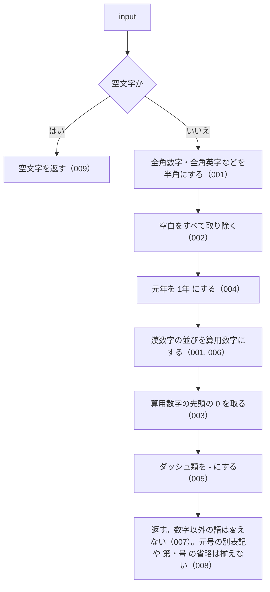

# 機能: normalizeLawNum（法令番号の数字の書き方を算用数字に揃える）

- 機能 ID: ABBR
- 版: current
- 承認日: 2026-09-27 （PR #26）。差分 `20260927-untested-behaviors` は YYYY-MM-DD（PR #N）
- 起こした元: v0.6.0 の `src/normalize.ts`（`normalizeLawNum`）、`src/normalize.test.ts`
- 関連する Issue: houki-abbreviations #6（法令番号の漢数字と算用数字の正規化）

この文書は「この関数は何をするか」を書きます。どう実装しているか（内部の変数名・インデックスの作り方）は書きません。

## アクター

- このパッケージを import するコード（houki-hub family の MCP サーバーなど）。漢数字・算用数字・全角数字のどれで書かれた法令番号でも、照合に使う 1 つの文字列を受け取る。比べる 2 つの法令番号の両方にこの関数を通してから比べる
- このパッケージの中では `lookupByLawNum` が、入力と辞書の `law_num` の両方にこの関数を通してから比べる

## 入力

| 引数    | 必須 | 内容                                                                                              |
| ------- | ---- | ------------------------------------------------------------------------------------------------- |
| `input` | 必須 | 法令番号。例: `昭和二十五年法律第百三十七号` / `昭和25年法律第137号` / `昭和２５年法律第１３７号` |

## 戻り値

`string`。次の順に変換した文字列。

| 順  | 変換                           | 変換前                                                                                                                       | 変換後                                             |
| --- | ------------------------------ | ---------------------------------------------------------------------------------------------------------------------------- | -------------------------------------------------- |
| 1   | `normalizeJpText` と同じ変換   | 全角数字・全角英字・`－`（U+FF0D）・`～`（U+FF5E）・`〜`（U+301C）・全角スペース                                             | `normalizeJpText` の表のとおり                     |
| 2   | 空白を取り除く                 | すべての空白（半角スペース・タブ・改行など。前後も途中も）                                                                   | なし                                               |
| 3   | 元年を 1 年にする              | `元年`                                                                                                                       | `1年`                                              |
| 4   | 漢数字を算用数字にする         | `〇一二三四五六七八九十百千` が続いた並び。`kanjiToNumber` で読める並びだけ                                                  | その値の算用数字。読めない並びはそのまま           |
| 5   | 算用数字の先頭の 0 を取る      | 算用数字の並び（`0137`）                                                                                                     | 先頭の 0 を除いた数（`137`）。`0` だけのときは `0` |
| 6   | ダッシュ類を半角ハイフンにする | `―`（U+2015）、`‐`（U+2010）、`‑`（U+2011）、`–`（U+2013）、`—`（U+2014）、`−`（U+2212）。`－`（U+FF0D）は順 1 で `-` になる | `-`（U+002D）                                      |

表に無い文字（元号、`年` `法律` `第` `号`、省名、中黒 `・` など）は変えない。

## 処理の流れ

図の中の番号は「できること」の仕様 ID の末尾 3 桁です。

## できること

### SPEC-ABBR-NORMALIZE-LAW-NUM-001 漢数字・算用数字・全角数字の法令番号を同じ文字列にする

年と番号の数字を算用数字にそろえる。漢数字は位取り（`百三十七`）でも位ごと（`一三七`）でもよい。全角数字は半角にする。

例: 次の 4 つはどれも `'昭和25年法律第137号'` を返す。

- `normalizeLawNum('昭和二十五年法律第百三十七号')`
- `normalizeLawNum('昭和25年法律第137号')`
- `normalizeLawNum('昭和２５年法律第１３７号')`
- `normalizeLawNum('昭和二五年法律第一三七号')`

### SPEC-ABBR-NORMALIZE-LAW-NUM-002 空白をすべて取り除く

前後だけでなく途中の空白も取り除く。

例: `normalizeLawNum('  昭和25年 法律 第137号 ')` は `'昭和25年法律第137号'`。

### SPEC-ABBR-NORMALIZE-LAW-NUM-003 算用数字の先頭の 0 を取る

例: `normalizeLawNum('昭和25年法律第0137号')` は `'昭和25年法律第137号'`。

### SPEC-ABBR-NORMALIZE-LAW-NUM-004 元年を 1 年にする

`元年` を `1年` にする。

例: `normalizeLawNum('令和元年法律第一号')` は `'令和1年法律第1号'`、`normalizeLawNum('平成元年法律第四十二号')` は `'平成1年法律第42号'`。

### SPEC-ABBR-NORMALIZE-LAW-NUM-005 人事院規則の番号のダッシュを半角ハイフンにする

戻り値の表の順 6 のダッシュ類を `-` にする。人事院規則の番号（`一―一`）はこれで `1-1` になる。

例: `normalizeLawNum('昭和二十四年人事院規則一―一')` は `'昭和24年人事院規則1-1'`、`normalizeLawNum('昭和三十五年人事院規則九―三〇')` は `'昭和35年人事院規則9-30'`、`normalizeLawNum('昭和二十四年人事院規則二―〇')` は `'昭和24年人事院規則2-0'`。

### SPEC-ABBR-NORMALIZE-LAW-NUM-006 番号の無い法令番号も年の数字を揃える

`第…号` の無い法令番号（憲法・勅令など）も、年の数字を算用数字にする。

例: `normalizeLawNum('昭和二十一年憲法')` は `'昭和21年憲法'`、`normalizeLawNum('明治十九年勅令')` は `'明治19年勅令'`。

### SPEC-ABBR-NORMALIZE-LAW-NUM-007 数字以外の語は変えない

元号・法令の種別名・省名・中黒 `・` は変えない。共同省令の長い種別名もそのまま残る。

例: `normalizeLawNum('平成十五年内閣府・総務省・財務省・厚生労働省・農林水産省・経済産業省・国土交通省令第三号')` は `'平成15年内閣府・総務省・財務省・厚生労働省・農林水産省・経済産業省・国土交通省令第3号'`。

### SPEC-ABBR-NORMALIZE-LAW-NUM-008 元号の別表記と「第」「号」の省略は揃えない

元号の別表記（`S25` / `昭25`）を元号名にすることと、`第` や `号` の有無をそろえることはしない。書き方が違えば、戻り値も違う文字列のまま。

例: `normalizeLawNum('S25年法律第137号')` は `'S25年法律第137号'`。`normalizeLawNum('昭和25年法律137号')` は `'昭和25年法律137号'` で、`normalizeLawNum('昭和25年法律第137号')` と一致しない。

### SPEC-ABBR-NORMALIZE-LAW-NUM-009 空文字には空文字を返す

`input` が空文字のときは `''` を返す。

### SPEC-ABBR-NORMALIZE-LAW-NUM-010 読めない漢数字の並びはそのまま残す

`kanjiToNumber` が `null` を返す漢数字の並びは、算用数字にせず元の文字のまま残す。同じ入力の中の読める並びは算用数字にする。

例: `normalizeLawNum('昭和十十年法律第一号')` は `'昭和十十年法律第1号'`。

### SPEC-ABBR-NORMALIZE-LAW-NUM-011 空白で分かれた元年も 1 年にする

空白を取り除いてから `元年` を `1年` にするので、`元` と `年` のあいだや前後に空白があっても `1年` になる。

例: `normalizeLawNum('令和 元 年法律第一号')` は `'令和1年法律第1号'`。

### SPEC-ABBR-NORMALIZE-LAW-NUM-012 U+2015 以外のダッシュ類も半角ハイフンにする

`‐`（U+2010）、`‑`（U+2011）、`–`（U+2013）、`—`（U+2014）、`−`（U+2212）も、`―`（U+2015）と同じく `-` にする。

例: `normalizeLawNum('昭和二十四年人事院規則一‐一')`、`normalizeLawNum('昭和二十四年人事院規則一‑一')`、`normalizeLawNum('昭和二十四年人事院規則一–一')`、`normalizeLawNum('昭和二十四年人事院規則一—一')`、`normalizeLawNum('昭和二十四年人事院規則一−一')` はどれも `'昭和24年人事院規則1-1'`。

### SPEC-ABBR-NORMALIZE-LAW-NUM-013 罫線と長音は半角ハイフンにしない

罫線 `─`（U+2500）と長音 `ー`（U+30FC）はダッシュ類として扱わず、変えない。

例: `normalizeLawNum('昭和二十四年人事院規則一─一')` は `'昭和24年人事院規則1─1'`、`normalizeLawNum('昭和二十四年人事院規則一ー一')` は `'昭和24年人事院規則1ー1'`。

### SPEC-ABBR-NORMALIZE-LAW-NUM-014 null と undefined には空文字を返す

`input` が `null` または `undefined` のときは `''` を返す。

例: `normalizeLawNum(null)` も `normalizeLawNum(undefined)` も `''`。

## できないこと

- 元号の別表記（`S25` / `昭25`）を元号名にすること、`第` や `号` を補うこと、法令の種別名（`法律` / `政令`）を補うこと（呼び出し側で揃える）
- 万以上の単位を読むこと。`normalizeLawNum('第二万三千号')` は `'第2万3000号'` になり、`第23000号` とは一致しない（`kanjiToNumber` が万を読まないため）
- 元号を西暦にすること
- 法令番号として正しい形かを確かめること（どんな文字列でも変換して返す）
- 辞書から法令を引くこと（`lookupByLawNum`）

## 未決

初版起こしで見つけた、意図か不具合かを人が決める項目です。決まったら「できること」に ID を振るか、`specs/changes/` の差分にします。

意図か不具合かの判断が要る項目は houki-abbreviations の Issue に移し、ここには題と Issue の番号だけを残します。今の振る舞いのままでよくテストが無いだけの項目は、受入テストを書いてから「できること」に ID を振ります。

1. **数字でない語の中の漢数字も算用数字になる。** → houki-abbreviations #24
2. **読めない漢数字の並びはそのまま残す。** → SPEC-ABBR-NORMALIZE-LAW-NUM-010
3. **`元年` は場所を問わず `1年` になる。** → SPEC-ABBR-NORMALIZE-LAW-NUM-011
4. **ダッシュ類のうちテストがあるのは `―`（U+2015）だけ。** → SPEC-ABBR-NORMALIZE-LAW-NUM-012、SPEC-ABBR-NORMALIZE-LAW-NUM-013
5. **桁数の大きい算用数字で値が変わる。** → houki-abbreviations #24
6. **`null` / `undefined` を渡したとき。** → SPEC-ABBR-NORMALIZE-LAW-NUM-014
