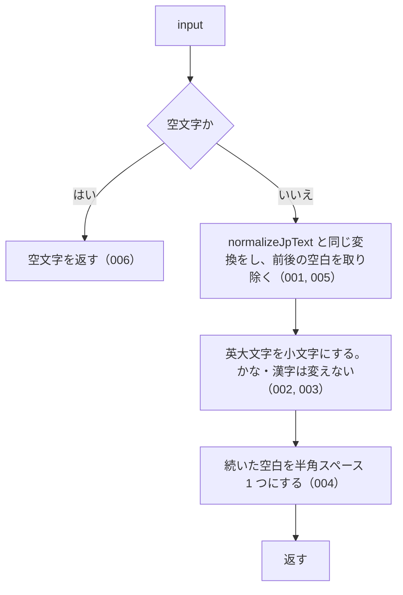

# 機能: normalizeSearchQuery（検索語を半角・小文字・単一の空白に揃える）

- 機能 ID: ABBR
- 版: current
- 承認日: 2026-09-27 （PR #10）
- 起こした元: v0.6.0 の `src/normalize.ts`（`normalizeSearchQuery`）、`src/normalize.test.ts`
- 関連する Issue: なし（v0.3.0 で houki-nta-mcp の正規化の一部を移したもの。CHANGELOG の 0.3.0）

この文書は「この関数は何をするか」を書きます。どう実装しているか（内部の変数名・インデックスの作り方）は書きません。

## アクター

- このパッケージを import するコード（houki-hub family の MCP サーバーなど）。利用者が入力した検索語を渡して、全文検索にかける前の文字列を受け取る。検索の構文に使う記号（`"` `^` など）のエスケープは呼び出し側が別に行う
- このパッケージの中ではどの関数もこの関数を使わない（`resolveAbbreviation` の `normalize` は大文字小文字を区別するため `normalizeJpText` を使う）

## 入力

| 引数    | 必須 | 内容   |
| ------- | ---- | ------ |
| `input` | 必須 | 検索語 |

## 戻り値

`string`。次の順に変換した文字列。

| 順  | 変換                         | 変換前                                             | 変換後                                               |
| --- | ---------------------------- | -------------------------------------------------- | ---------------------------------------------------- |
| 1   | `normalizeJpText` と同じ変換 | 全角数字・全角英字・`－`・`～`・`〜`・全角スペース | `normalizeJpText` の表のとおり。前後の空白も取り除く |
| 2   | 英大文字を小文字にする       | `A`〜`Z`                                           | `a`〜`z`                                             |
| 3   | 続いた空白を 1 つにまとめる  | 1 文字以上続く空白（半角スペース・タブ・改行など） | 半角スペース 1 つ                                    |

## 処理の流れ

図の中の番号は「できること」の仕様 ID の末尾 3 桁です。

## できること

### SPEC-ABBR-NORMALIZE-SEARCH-QUERY-001 normalizeJpText と同じ全角→半角の変換をする

全角数字・全角英字・全角ハイフン・全角チルダ・波ダッシュ・全角スペースを、`normalizeJpText` と同じ規則で半角にする。

例: `normalizeSearchQuery('１８３－２')` は `'183-2'`、`normalizeSearchQuery('１８３〜１９３')` は `'183~193'`。

### SPEC-ABBR-NORMALIZE-SEARCH-QUERY-002 英大文字を小文字にする

半角の英大文字を小文字にする。全角の英大文字は半角にしたうえで小文字にする。

例: `normalizeSearchQuery('PL法')` も `normalizeSearchQuery('ＰＬ法')` も `'pl法'`。

### SPEC-ABBR-NORMALIZE-SEARCH-QUERY-003 漢字・かなは変えない

漢字・ひらがな・カタカナは変えない。

例: `normalizeSearchQuery('消費税法')` は `'消費税法'`、`normalizeSearchQuery('カタカナ')` は `'カタカナ'`。

### SPEC-ABBR-NORMALIZE-SEARCH-QUERY-004 続いた空白を半角スペース 1 つにする

半角スペース・タブ・改行が 1 文字以上続いたところを、半角スペース 1 つにする。

例: `normalizeSearchQuery('消    法')` は `'消 法'`、`normalizeSearchQuery('a   b\tc\n d')` は `'a b c d'`。

### SPEC-ABBR-NORMALIZE-SEARCH-QUERY-005 前後の空白を取り除く

先頭と末尾の空白を取り除いたうえで、途中の続いた空白を 1 つにする。

例: `normalizeSearchQuery('  消    法  ')` は `'消 法'`。

### SPEC-ABBR-NORMALIZE-SEARCH-QUERY-006 空文字には空文字を返す

`input` が空文字のときは `''` を返す。

## できないこと

- 大文字小文字を区別したまま揃えること（`normalizeJpText`）
- 検索の構文に使う記号のエスケープ（呼び出し側が行う）
- 漢数字を算用数字にすること（`normalizeLawNum` / `kanjiToNumber`）
- ひらがなとカタカナ、半角カナと全角カナを同じにすること

## 未決

初版起こしで見つけた、意図か不具合かを人が決める項目です。決まったら「できること」に ID を振るか、`specs/changes/` の差分にします。

意図か不具合かの判断が要る項目は houki-abbreviations の Issue に移し、ここには題と Issue の番号だけを残します。今の振る舞いのままでよくテストが無いだけの項目は、受入テストを書いてから「できること」に ID を振ります。

1. **英字以外の大文字も小文字になる。** JSDoc・CHANGELOG・テスト名は「ASCII 大文字 → 小文字」と書くが、実際には ASCII 以外の大文字も小文字になる。`normalizeSearchQuery('ⅠⅡ')`（ローマ数字 U+2160, U+2161）は `'ⅰⅱ'`、`normalizeSearchQuery('ΑΒΓ')` は `'αβγ'`、`normalizeSearchQuery('ÀÉ')` は `'àé'`。法令本文のローマ数字（`Ⅰ`）が DB 側と検索語側で同じ関数を通れば照合は合うが、ドキュメントとは食い違う。ASCII だけにするか、ドキュメントを直すかを人が決める。
2. **`null` / `undefined` を渡したとき。** `normalizeSearchQuery(null)` は `''` を返す。テストが無い。ID を振るのは受入テストを書いてから。
