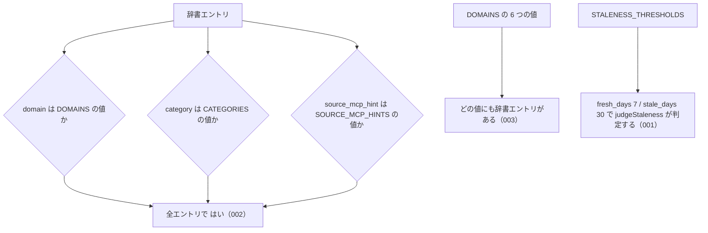

# 機能: 公開定数（CATEGORIES / DOMAINS / LAW_TYPE_CODES / SOURCE_MCP_HINTS / STALENESS_THRESHOLDS）

- 機能 ID: ABBR
- 版: current
- 承認日: 2026-09-27 （PR #10）
- 起こした元: v0.6.0 の `src/types.ts`（`CATEGORIES`、`DOMAINS`、`LAW_TYPE_CODES`、`SOURCE_MCP_HINTS`）、`src/freshness.ts`（`STALENESS_THRESHOLDS`）、`src/freshness.test.ts`、`src/index.test.ts`
- 関連する Issue: houki-abbreviations #3（`STALENESS_THRESHOLDS` の JSDoc の強化）。`STALENESS_THRESHOLDS` の共通化の発端は houki-nta-mcp #15

この文書は「この定数は何の値を持ち、何に使うか」を書きます。どう実装しているか（内部の変数名・データの持ち方）は書きません。

## アクター

- houki-hub family の MCP サーバー（houki-egov-mcp・houki-nta-mcp など）。辞書エントリの `domain` / `category` / `source_mcp_hint` がとりうる値の一覧として読み、引数の検査や管轄の判定に使う。鮮度の判定では `STALENESS_THRESHOLDS` の境界を使う
- このパッケージの辞書データ（`src/data/*.json`）。各エントリの値はこれらの定数の値のどれかにする

## 値

件数は v0.6.0 の辞書（全 174 件）で数えた、その値を持つエントリの数です。

### `DOMAINS`

辞書エントリの `domain`（実務の分野）がとりうる値の一覧。`listByDomain` の引数や `getAbbreviationStats` の `byDomain` のキーに使う。6 つの値を持つ。

| 値               | 分野 | 件数 |
| ---------------- | ---- | ---- |
| `tax`            | 税務 | 35   |
| `labor`          | 労務 | 28   |
| `accounting`     | 会計 | 9    |
| `commercial`     | 商事 | 31   |
| `civil`          | 民事 | 23   |
| `administrative` | 行政 | 48   |

### `CATEGORIES`

辞書エントリの `category`（法律・通達・判例など、どの種類の文書か）がとりうる値の一覧。`listByCategory` の引数や `getAbbreviationStats` の `byCategory` のキーに使う。12 の値を持つ。

| 値                      | 文書の種類       | 本文を持つ MCP サーバー | 件数 |
| ----------------------- | ---------------- | ----------------------- | ---- |
| `constitution`          | 憲法             | houki-egov-mcp          | 1    |
| `law`                   | 法律             | houki-egov-mcp          | 138  |
| `cabinet-order`         | 政令             | houki-egov-mcp          | 8    |
| `imperial-ordinance`    | 勅令             | houki-egov-mcp          | 0    |
| `ministerial-ordinance` | 省令             | houki-egov-mcp          | 16   |
| `rule`                  | 規則             | houki-egov-mcp          | 2    |
| `kihon-tsutatsu`        | 基本通達         | houki-nta-mcp など      | 8    |
| `kobetsu-tsutatsu`      | 個別通達         | houki-nta-mcp など      | 1    |
| `qa-jirei`              | 質疑応答事例     | houki-nta-mcp など      | 0    |
| `tax-answer`            | タックスアンサー | houki-nta-mcp など      | 0    |
| `hanrei`                | 判例             | （未定）                | 0    |
| `saiketsu`              | 裁決             | （未定）                | 0    |

件数 0 の値は、辞書にまだエントリが無い種類として先に定義している。

### `SOURCE_MCP_HINTS`

辞書エントリの `source_mcp_hint`（そのエントリの本文をどの MCP サーバーで取得するか）がとりうる値の一覧。各 MCP サーバーは、エントリの `source_mcp_hint` が自分の名前でないときに管轄外と判定し、この値の MCP サーバーを案内する。`listBySourceMcpHint` の引数や `getAbbreviationStats` の `bySourceMcpHint` のキーに使う。6 つの値を持つ。

| 値               | 本文の取得元                                   | 件数 |
| ---------------- | ---------------------------------------------- | ---- |
| `houki-egov`     | e-Gov 法令 API（法律・政令・省令・規則・告示） | 165  |
| `houki-nta`      | 国税庁の通達・質疑応答事例・タックスアンサー   | 9    |
| `houki-mhlw`     | 厚生労働省の通達・通知                         | 0    |
| `houki-jaish`    | 労働安全衛生の通達（未決 3）                   | 0    |
| `houki-court`    | 裁判所サイトの判例                             | 0    |
| `houki-saiketsu` | 国税不服審判所の裁決                           | 0    |

### `LAW_TYPE_CODES`

e-Gov の法令種別の名前と、e-Gov の法令 ID（`law_id`）の 4〜5 文字目に入る種別コードの対応。辞書エントリの `law_type` がとりうる値はこのキーの 5 つ。`law_type` は非推奨で、`category` に集約する予定。

| キー（`law_type` の値） | 値（`law_id` の種別コード） | 法令種別 | `law_type` の件数 |
| ----------------------- | --------------------------- | -------- | ----------------- |
| `Act`                   | `AC`                        | 法律     | 138               |
| `CabinetOrder`          | `CO`                        | 政令     | 8                 |
| `ImperialOrdinance`     | `IO`                        | 勅令     | 0                 |
| `MinisterialOrdinance`  | `MO`                        | 省令     | 16                |
| `Rule`                  | `RU`                        | 規則     | 2                 |

例: 消費税法の `law_id` `363AC0000000108` の `AC` が `Act`（法律）を表す。

### `STALENESS_THRESHOLDS`

鮮度の判定（`judgeStaleness`）の境界の日数。family のどの MCP サーバーも同じ境界で `fresh` / `stale` / `outdated` を判定するために共有する。

| キー         | 値   | 意味                                                        |
| ------------ | ---- | ----------------------------------------------------------- |
| `fresh_days` | `7`  | 経過日数がこの値未満なら `fresh`                            |
| `stale_days` | `30` | 経過日数がこの値未満なら `stale`、この値以上なら `outdated` |

7 日は週 1 回の確認、30 日は月 1 回の一括取得を想定した値（houki-nta-mcp v0.6.0 で決めた値）。違う境界が要る MCP サーバーは、この定数を書き換えずに自分の判定関数を書く。

## 処理の流れ

定数なので呼び出しの流れは無い。辞書エントリの値と定数の関係を示します。図の中の番号は「できること」の仕様 ID の末尾 3 桁です。

## できること

### SPEC-ABBR-PUBLIC-CONSTANTS-001 STALENESS_THRESHOLDS は fresh_days 7・stale_days 30 を持つ

`STALENESS_THRESHOLDS.fresh_days` は `7`、`STALENESS_THRESHOLDS.stale_days` は `30`。`fresh_days` は `stale_days` より小さい。

### SPEC-ABBR-PUBLIC-CONSTANTS-002 辞書の全エントリの domain・category・source_mcp_hint は定数の値のどれかである

辞書（`abbreviationEntries`）のどのエントリも、`domain` は `DOMAINS` の値、`category` は `CATEGORIES` の値、`source_mcp_hint` は `SOURCE_MCP_HINTS` の値のどれかを持つ。定数に無い値を持つエントリは無い。

### SPEC-ABBR-PUBLIC-CONSTANTS-003 DOMAINS のどの値にも辞書のエントリがある

`DOMAINS` の 6 つの値それぞれについて、その `domain` を持つ辞書のエントリが 1 件以上ある。`getAbbreviationStats().byDomain` の 6 つの値はどれも 1 以上。

例: v0.6.0 で最も少ない `accounting` は 9 件。

## できないこと

- 値を追加・変更する手段を持つこと（値を変えるにはこのパッケージの新しい版が要る）
- 鮮度を判定すること（`judgeStaleness`）。この文書は境界の値だけを書く
- エントリの `law_id` の形を検査すること（`isValidLawId`）
- エントリの一覧を分野・種類・MCP サーバー別に返すこと（`listByDomain`・`listByCategory`・`listBySourceMcpHint`）

## 未決

初版起こしで見つけた、意図か不具合かを人が決める項目です。決まったら「できること」に ID を振るか、`specs/changes/` の差分にします。

意図か不具合かの判断が要る項目は houki-abbreviations の Issue に移し、ここには題と Issue の番号だけを残します。今の振る舞いのままでよくテストが無いだけの項目は、受入テストを書いてから「できること」に ID を振ります。

1. **定数は実行時に書き換えられる。** → houki-abbreviations #13
2. **`LAW_TYPE_CODES` の値を確かめるテストが無い。** `src/index.test.ts` の `law_type` の検査は、`LAW_TYPE_CODES` を使わずにテストの中に同じキーの一覧を別に書いている。種別コード（`AC` など）と `law_id` の対応も確かめていない。v0.6.0 で `law_id` と `law_type` の両方を持つ 8 件は、どれも `law_id` の 4〜5 文字目が `LAW_TYPE_CODES[law_type]` と一致する。テストが無い。ID を振るのは受入テストを書いてから。
3. **`houki-jaish` の説明。** → houki-abbreviations #17
4. **値の一覧そのものを固定するテストが無い。** `CATEGORIES` の 12 値、`SOURCE_MCP_HINTS` の 6 値、`DOMAINS` の 6 値の中身と順序を確かめるテストが無い（002・003 は辞書が定数に収まることだけを確かめる）。値を減らしたり名前を変えたりすると、family の MCP サーバーの引数や応答が変わる。テストが無い。ID を振るのは受入テストを書いてから。
5. **`CATEGORIES` の説明と e-Gov の範囲。** → houki-abbreviations #25
