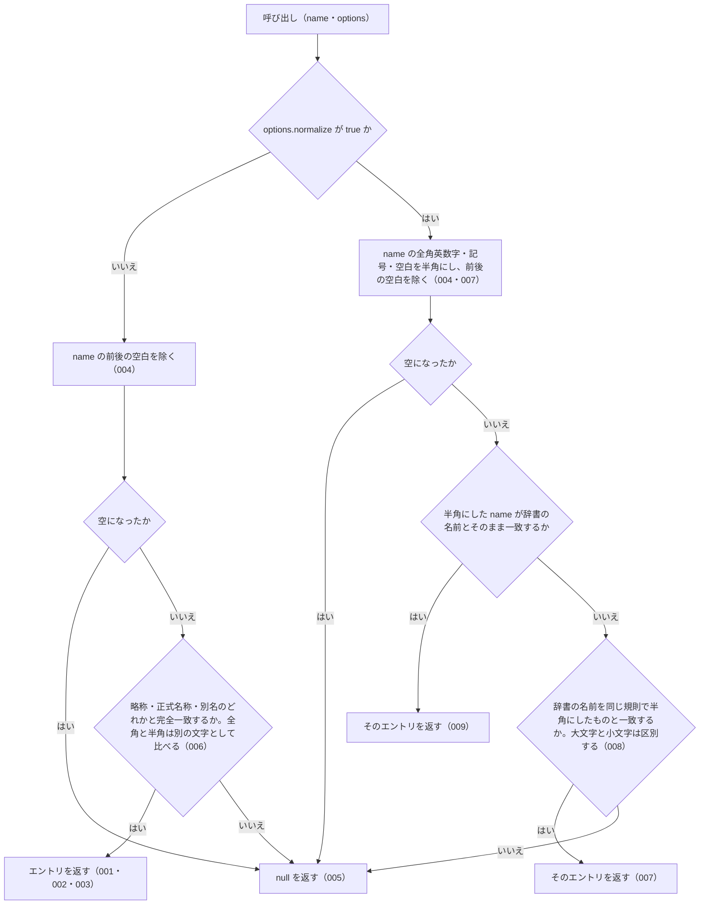

# 機能: resolveAbbreviation（略称・正式名称・別名から辞書のエントリを 1 件引く）

- 機能 ID: ABBR
- 版: current
- 承認日:
- 起こした元: v0.6.0 の `src/index.ts`（`resolveAbbreviation`、`ResolveAbbreviationOptions`）、`src/index.test.ts`、`src/normalize.test.ts`
- 関連する Issue: なし

この文書は「この関数は何をするか」を書きます。どう実装しているか（内部の変数名・インデックスの作り方）は書きません。

## アクター

- houki-hub family の MCP サーバー（houki-egov-mcp・houki-nta-mcp など）と、このパッケージを import する利用者のコード。`name` を渡して、その名前が辞書のどのエントリ（法令・通達）を指すかを受け取る

## 入力

| 引数                | 必須 | 内容                                                                                                                                                                                                                  |
| ------------------- | ---- | --------------------------------------------------------------------------------------------------------------------------------------------------------------------------------------------------------------------- |
| `name`              | 必須 | 略称・正式名称・別名（辞書の `aliases`）のどれか。例: `消法` / `消費税法` / `消費税`。前後の空白は除いてから照合する。完全一致で引く（部分一致はしない）                                                           |
| `options`           | 任意 | `ResolveAbbreviationOptions`。省略してよい                                                                                                                                                                            |
| `options.normalize` | 任意 | 既定は `false`。`true` のときは `name` の全角英数字・全角ハイフン（`－`）・全角チルダ（`～` `〜`）・全角空白を半角にしてから照合する。辞書側の名前も同じ規則で半角にしたものと比べる。大文字と小文字は区別したままにする |

## 戻り値

`AbbreviationEntry | null`。見つかったときは辞書のエントリそのもの、見つからないときは `null`。

| フィールド        | 内容                                                                                                    |
| ----------------- | ------------------------------------------------------------------------------------------------------- |
| `abbr`            | 辞書に登録された略称。正式名称や別名で引いたときもこれは略称（`消費税法` → `消法`）                     |
| `formal`          | 正式名称                                                                                                |
| `law_id`          | e-Gov の法令 ID。通達など e-Gov に無いものは `null`                                                     |
| `law_num`         | 法令番号。法令系のエントリにだけ付く                                                                    |
| `law_type`        | e-Gov の法令種別（`Act` など）。法令系のエントリにだけ付く                                              |
| `domain`          | 分野。`tax` / `labor` / `accounting` / `commercial` / `civil` / `administrative` のどれか              |
| `category`        | 種別。例: `constitution`（憲法）/ `law`（法律）/ `cabinet-order`（政令）/ `kihon-tsutatsu`（基本通達） |
| `source_mcp_hint` | 本文を持つ MCP の名前。例: `houki-egov` / `houki-nta`                                                   |
| `aliases`         | 別名の一覧。辞書にあるときだけ付く                                                                      |
| `note`            | 備考。辞書にあるときだけ付く                                                                            |

例: `resolveAbbreviation('消法')` は `abbr: "消法"`、`formal: "消費税法"`、`law_id: "363AC0000000108"`、`law_num: "昭和六十三年法律第百八号"`、`law_type: "Act"`、`domain: "tax"`、`category: "law"`、`source_mcp_hint: "houki-egov"`、`aliases`（`消費税` / `インボイス` など 10 件）、`note` を持つエントリを返す。

## 処理の流れ

`name` を受け取ってからエントリを返すまでに、何をどの順で確かめるかを示します。図の中の番号は「できること」の仕様 ID の末尾 3 桁です。

## できること

### SPEC-ABBR-RESOLVE-ABBREVIATION-001 略称からエントリを返す

`name` が辞書のエントリの略称（`abbr`）と一致するとき、そのエントリを返す。辞書の 6 分野すべてのエントリが同じ規則で引ける。

例: `resolveAbbreviation('消法')` は `formal: "消費税法"`、`domain: "tax"`、`category: "law"`、`source_mcp_hint: "houki-egov"`、`law_id: "363AC0000000108"` のエントリを返す。`労基法` は `domain: "labor"`、`公認会計士法` は `accounting`、`会社` は `commercial`、`民` は `civil`、`個情法` は `administrative` のエントリを返す。`憲法` は `formal: "日本国憲法"`、`category: "constitution"` のエントリを返す。

### SPEC-ABBR-RESOLVE-ABBREVIATION-002 正式名称からエントリを返す

`name` が辞書のエントリの正式名称（`formal`）と一致するとき、そのエントリを返す。返すエントリの `abbr` は略称のまま。

例: `resolveAbbreviation('消費税法')` は `abbr: "消法"` のエントリを返す。

### SPEC-ABBR-RESOLVE-ABBREVIATION-003 別名からエントリを返す

`name` が辞書のエントリの別名（`aliases` の要素）と一致するとき、そのエントリを返す。通称もこの規則で引ける。

例: `消費税` は `formal: "消費税法"`、`景品表示法` は `abbr: "景表法"`、`PL法` は `formal: "製造物責任法"`、`個人情報保護法` は `abbr: "個情法"`、`独占禁止法` は `abbr: "独禁法"` のエントリを返す。

### SPEC-ABBR-RESOLVE-ABBREVIATION-004 前後の空白を除いてから照合する

`name` の前後の空白を除いてから照合する。`options.normalize` が `false` でも `true` でも同じ。

例: `resolveAbbreviation('  消法  ')` は `formal: "消費税法"` のエントリを返す。`resolveAbbreviation('　消法　', { normalize: true })`（前後が全角空白）も同じエントリを返す。

### SPEC-ABBR-RESOLVE-ABBREVIATION-005 辞書に無い名前と空の名前には null を返す

`name` が辞書のどのエントリの略称・正式名称・別名とも一致しないときは `null` を返す。例外は投げない。`name` が空文字、または前後の空白を除くと空になるときも `null` を返す。`options.normalize` が `true` でも同じ。

例: `resolveAbbreviation('存在しない法律')`、`resolveAbbreviation('')`、`resolveAbbreviation('   ')` はどれも `null`。`{ normalize: true }` を付けたときも同じで、`resolveAbbreviation('　　　', { normalize: true })` も `null`。

### SPEC-ABBR-RESOLVE-ABBREVIATION-006 既定では全角と半角を別の文字として照合する

`options` を渡さないとき（`options.normalize` の既定は `false`）は、全角と半角の違いを吸収しない。辞書の名前と文字が 1 つでも違えば `null` を返す。

例: `resolveAbbreviation('ＰＬ法')`（全角英字）は `null`（辞書にあるのは半角の `PL法`）。`resolveAbbreviation('消　法')`（間に全角空白）は `null`。

### SPEC-ABBR-RESOLVE-ABBREVIATION-007 normalize: true では全角英字を半角にして照合する

`options.normalize` が `true` のとき、`name` の全角英字を半角にしてから照合する。辞書の名前も同じ規則で半角にしたものと比べる。

例: `resolveAbbreviation('ＰＬ法', { normalize: true })` は `formal: "製造物責任法"` のエントリを返す。

### SPEC-ABBR-RESOLVE-ABBREVIATION-008 normalize: true でも大文字と小文字は区別する

`options.normalize` が `true` でも、英字の大文字と小文字は別の文字として照合する。

例: `resolveAbbreviation('PL法', { normalize: true })` は `formal: "製造物責任法"` のエントリを返すが、`resolveAbbreviation('pl法', { normalize: true })` と `resolveAbbreviation('ｐｌ法', { normalize: true })` は `null`。

### SPEC-ABBR-RESOLVE-ABBREVIATION-009 normalize: true でも、半角にする前から一致する名前は同じエントリを返す

`options.normalize` が `true` でも、`name` が辞書の略称・正式名称・別名とそのまま一致するときは、`options` を渡さないときと同じエントリ（同じオブジェクト）を返す。

例: `resolveAbbreviation('PL法', { normalize: true })` は `resolveAbbreviation('PL法')` と同じオブジェクトを返す。`resolveAbbreviation('消法', { normalize: true })` は `formal: "消費税法"`、`resolveAbbreviation('個人情報保護法', { normalize: true })` は `abbr: "個情法"` のエントリを返す。

## できないこと

- 部分一致で探すこと（`searchByName`）
- 似た名前（打ち間違い）から探すこと（`findSimilar` / `suggestCorrection`）
- e-Gov の法令 ID から引くこと（`lookupByLawId`）
- 法令番号から引くこと（`lookupByLawNum`）
- 1 件のエントリの名前をすべて返すこと（`getAllNames`）
- 文章の中から法令名を探すこと（`extractLawNames`）
- 1 回の呼び出しで複数の名前を引くこと
- 名前の途中にある空白を無視して照合すること（`normalize: true` でも、全角空白を半角空白にするだけで取り除かない。未決 1）
- 英字の大文字と小文字の違いを吸収すること（`normalize: true` でも区別する）
- 見つからなかったときに候補や理由を返すこと（`null` だけを返す）

## 未決

初版起こしで見つけた、意図か不具合かを人が決める項目です。決まったら「できること」に ID を振るか、`specs/changes/` の差分にします。

意図か不具合かの判断が要る項目は houki-abbreviations の Issue に移し、ここには題と Issue の番号だけを残します。今の振る舞いのままでよくテストが無いだけの項目は、受入テストを書いてから「できること」に ID を振ります。

1. **README と JSDoc の `消　法` の例が実際の結果と違う。** README の「正規化 API」節と `resolveAbbreviation` の JSDoc は `resolveAbbreviation('消　法', { normalize: true })` が `消費税法` を返す（全角空白を吸収する）と書いているが、実際は `null` を返す。`normalize: true` は全角空白を半角空白 `消 法` にするだけで、辞書には空白を含む名前が 1 件も無いため一致しない。`resolveAbbreviation('消費　税法', { normalize: true })` も `null`。例を直すのか、名前の途中の空白を取り除くようにするのかを決める。テスト `{ normalize: true } absorbs full-width spaces` はこの例を避けて前後の全角空白だけを確かめている。
2. **返すエントリは凍結されておらず、書き換えると辞書に残る。** 辞書の配列 `abbreviationEntries` は凍結されているが、要素のエントリは凍結されていない（`Object.isFrozen(resolveAbbreviation('消法'))` は `false`）。`const e = resolveAbbreviation('消法'); e.formal = 'X'` とすると例外は出ず、以後の `resolveAbbreviation('消法').formal` は `'X'` になる。同じエントリを返す `listByDomain` などでも同じことが起きる。利用者が書き換えないことを前提にするのか、エントリも凍結するのかを決める。
3. **全角数字・全角ハイフン・全角チルダの吸収。** `normalize: true` はこれらも半角にするが、v0.6.0 の辞書（174 件）の略称・正式名称・別名には数字・ハイフン・チルダを含む名前が無い（英字を含むのは `IT書面一括法` / `AML` / `PL法` / `JPKI法` の 4 つだけ）ため、辞書を引いて確かめられない。テスト `{ normalize: true } absorbs full-width digits` は `消法` を引いているだけで、全角数字を渡していない。テストが無い。ID を振るのは受入テストを書いてから。
4. **既定の照合で前後の全角空白・タブ・改行も除く。** `options` を渡さなくても、`resolveAbbreviation('　消法　')`（前後が全角空白）と `resolveAbbreviation('\t消法\n')` は `消費税法` のエントリを返す。JSDoc は「前後の空白はトリム」とだけ書いている。テストがあるのは前後の半角空白だけ。ID を振るのは受入テストを書いてから。
5. **半角にした名前が複数のエントリで重なるときは先に登録されたエントリを返す。** `normalize: true` で辞書の名前を半角にしたとき、同じ名前が 2 件のエントリにあれば、辞書で先に来るエントリを返す（コードのコメントにある「先勝ち」）。v0.6.0 の辞書では、半角にする前も後も名前の重なりは 0 件。テストが無い。ID を振るのは受入テストを書いてから。
6. **`options.normalize` に `false` を明示したとき、`{}` や `null` を渡したとき。** どれも `options` を省いたときと同じ結果になる（`resolveAbbreviation('消法', { normalize: false })` / `resolveAbbreviation('消法', {})` / `resolveAbbreviation('消法', null)` はどれも `消費税法` のエントリ）。テスト `default ({ normalize: false }) does not absorb full-width variations` は名前に反して `options` を渡していない。テストが無い。ID を振るのは受入テストを書いてから。
7. **`normalize: true` で別名から引くこと。** テスト `{ normalize: true } still works on aliases` が渡している `個人情報保護法` は、`個情法` のエントリの正式名称で、別名ではない。`normalize: true` で別名（例: `消費税`）から引くテストが無い。ID を振るのは受入テストを書いてから。
8. **文字列でない `name`。** 型は `string` だけを受け付けるが、JavaScript から呼ぶと `null` と `undefined` は `null` を返し、`123` は `TypeError: name.trim is not a function` を投げる。テストが無い。ID を振るのは受入テストを書いてから。
