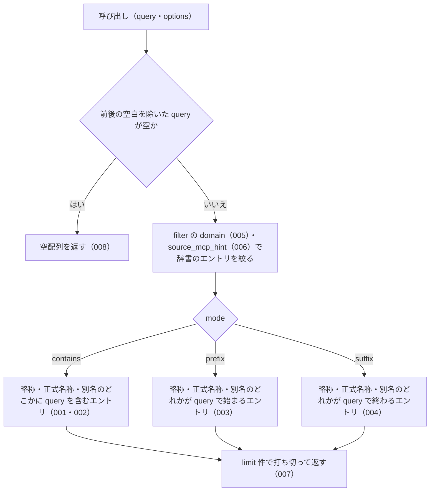

# 機能: searchByName（辞書のエントリを名前の部分一致で探す）

- 機能 ID: ABBR
- 版: current
- 承認日: 2026-09-27 （PR #26）
- 起こした元: v0.6.0 の `src/search.ts`（`searchByName`・`SearchOptions`・`SearchFilter`・`SearchMode`）、`src/index.ts`（`searchByName`）、`src/search.test.ts`
- 関連する Issue: なし（v0.4.0 の Track 1 で追加。`aliases` に通称を足したテストは houki-nta-mcp #3 に対応したもの）

この文書は「この関数は何をするか」を書きます。どう実装しているか（内部の変数名・インデックスの作り方）は書きません。

## アクター

- houki-abbreviations を import する利用者（houki-nta-mcp・houki-egov-mcp などの MCP サーバー、または独自のコード）。`労働` のような名前の一部を渡して、略称・正式名称・別名のどれかにその文字列を含む辞書のエントリを受け取る

## 入力

| 引数                | 必須 | 内容                                                                                                             |
| ------------------- | ---- | ---------------------------------------------------------------------------------------------------------------- |
| `query`             | 必須 | 探す文字列。例: `労働` / `施行令` / `インボイス`。前後の空白は無視する                                           |
| `options.mode`      | 任意 | 一致の仕方。`contains`（既定。どこかに含む）/ `prefix`（先頭が一致）/ `suffix`（末尾が一致）。型は `SearchMode`  |
| `options.filter`    | 任意 | 絞り込み。型は `SearchFilter`。キーは `domain` / `category` / `source_mcp_hint` で、それぞれ単一の値か配列を取る |
| `options.limit`     | 任意 | 返す件数の上限。既定 50。1 未満は 1、500 を超える値は 500 として扱う                                             |
| `options.normalize` | 任意 | 全角英数字・全角ハイフン・全角チルダ・全角スペースを半角にしてから比べるか。既定 `true`                          |

辞書は関数が持っている（v0.6.0 で 174 件）。エントリの配列を渡す引数は無い。

## 戻り値

辞書のエントリ（`AbbreviationEntry`）の配列。1 件も一致しなければ空配列。フィールドは辞書のエントリと同じで、`abbr`（略称）・`formal`（正式名称）・`aliases`（別名の一覧）・`law_id`・`domain`・`category`・`source_mcp_hint` などを持つ。

## 処理の流れ

呼び出しを受けてから配列を返すまでに、何をどの順で確かめるかを示します。図の中の番号は「できること」の仕様 ID の末尾 3 桁です。

## できること

### SPEC-ABBR-SEARCH-BY-NAME-001 既定の contains で、query を含むエントリを返す

`mode` を省くと `contains` として扱い、略称・正式名称・別名のどこかに `query` を含むエントリを返す。

例: `searchByName('労働')` は 12 件を返す。先頭から `労基法`・`労基則`・`労契法`・`労組法`・`労調法`・`安衛法`・`安衛則`・`派遣法` の順で、`formal` が `労働基準法` のエントリを含む。

### SPEC-ABBR-SEARCH-BY-NAME-002 別名（aliases）に一致したエントリも返す

略称と正式名称に `query` が無くても、別名のどれかに一致すればそのエントリを返す。

例: `searchByName('インボイス')` は `abbr: "消法"`（`formal: "消費税法"`）の 1 件を返す。`searchByName('ふるさと納税')` は `所法`（所得税法）、`searchByName('マイナ')` は `マイナンバー法` を返す。

### SPEC-ABBR-SEARCH-BY-NAME-003 prefix は query で始まる名前を持つエントリを返す

`mode: 'prefix'` のときは、略称・正式名称・別名のどれかが `query` で始まるエントリだけを返す。

例: `searchByName('労働', { mode: 'prefix' })` は 10 件を返し、どのエントリも `労働` で始まる名前を持つ。

### SPEC-ABBR-SEARCH-BY-NAME-004 suffix は query で終わる名前を持つエントリを返す

`mode: 'suffix'` のときは、略称・正式名称・別名のどれかが `query` で終わるエントリだけを返す。

例: `searchByName('施行令', { mode: 'suffix' })` は 8 件を返し、どのエントリも `施行令` で終わる名前を持つ。

### SPEC-ABBR-SEARCH-BY-NAME-005 filter.domain で分野を絞る

`filter.domain` を渡すと、`domain` がその値のエントリだけを返す。配列を渡すと、配列のどれかに当たる `domain` のエントリを返す。

例: `searchByName('税', { filter: { domain: 'tax' } })` は 35 件を返し、すべて `domain: "tax"`。`searchByName('法', { filter: { domain: ['tax', 'labor'] }, limit: 100 })` の結果は、すべて `domain` が `tax` か `labor`。

### SPEC-ABBR-SEARCH-BY-NAME-006 filter.source_mcp_hint で本文を持つ MCP を絞る

`filter.source_mcp_hint` を渡すと、`source_mcp_hint` がその値のエントリだけを返す。

例: `searchByName('税', { filter: { source_mcp_hint: 'houki-egov' }, limit: 100 })` は 28 件を返し、すべて `source_mcp_hint: "houki-egov"`。

### SPEC-ABBR-SEARCH-BY-NAME-007 limit の件数で打ち切る

一致したエントリが `limit` を超えるときは、`limit` 件で打ち切って返す。

例: `searchByName('法', { limit: 3 })` は 3 件を返す（`limit` を付けなければ 50 件、`limit: 500` なら 167 件）。

### SPEC-ABBR-SEARCH-BY-NAME-008 空の query には空配列を返す

`query` が空文字か、前後の空白を除くと空になるときは、辞書を調べずに空配列を返す。エラーにはしない。

例: `searchByName('')` と `searchByName('   ')` はどちらも `[]`。

## できないこと

- 綴りの誤りを許して探すこと（`findSimilar`）
- 完全一致で 1 件に決めること（`resolveAbbreviation`）
- 英字の大文字・小文字の違いを同じとみなすこと（`searchByName('pl法')` は `PL法` を別名に持つ `製造物責任法` を返さず `[]`）
- 一致の近さで並べ替えること（返す順は辞書の並び。未決 1）
- 法令 ID や法令番号から探すこと（`lookupByLawId` / `lookupByLawNum`）

## 未決

初版起こしで見つけた、意図か不具合かを人が決める項目です。決まったら「できること」に ID を振るか、`specs/changes/` の差分にします。

意図か不具合かの判断が要る項目は houki-abbreviations の Issue に移し、ここには題と Issue の番号だけを残します。今の振る舞いのままでよくテストが無いだけの項目は、受入テストを書いてから「できること」に ID を振ります。

1. **返す順は辞書の並び。** 結果は `abbreviationEntries` の並びのまま返す（`searchByName('労働')` の 12 件は辞書の 35〜42・45・46・52・54 番目）。1 つのエントリが略称と正式名称の両方に一致しても 1 回しか入らない。どちらもテストが無い。ID を振るのは受入テストを書いてから。
2. **全角・半角の吸収（`normalize`）。** 既定の `normalize: true` では、全角英数字を半角にしてから比べる。`searchByName('ＰＬ法')` は `製造物責任法` を返し、`normalize: false` なら `[]`。テスト「normalize=true (default) で全角入力でもヒット」は `労働`（全角英数字を含まない）で引いているだけで、この振る舞いを確かめていない。ID を振るのは受入テストを書いてから。
3. **filter.category と、filter の複数のキーの組み合わせ。** `filter.category` を渡すと `category` がその値のエントリだけを返す（`searchByName('通達', { filter: { category: ['kihon-tsutatsu'] } })` は `消基通` など 8 件）。複数のキーを渡すとすべてを満たすエントリだけを返す（`{ domain: 'tax', source_mcp_hint: 'houki-nta' }` で `税` を引くと 9 件）。空の配列はそのキーの絞り込みをしない（`{ domain: [] }` で `税` を引くと絞り込みなしと同じ 37 件）。どれもテストが無い。ID を振るのは受入テストを書いてから。
4. **`limit` の既定値と 1 未満の値。** 既定の 50 件と、1 未満の値の扱いにテストが無い。`limit: 0` と `limit: -3` は 1 件、`limit: 2.5` は 3 件を返す。`NaN` の扱いは未決 5。テストが無い。ID を振るのは受入テストを書いてから。
5. **`limit` に `NaN` を渡したときの扱いと上限。** → houki-abbreviations #22
