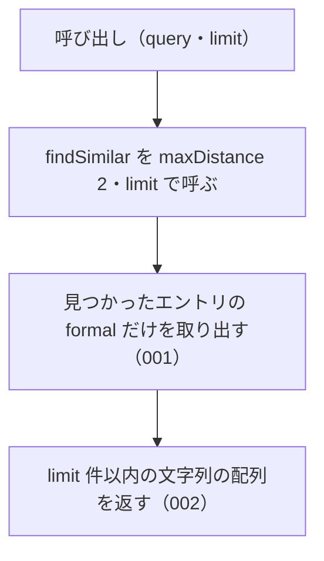

# 機能: suggestCorrection（誤った名前に近いエントリの正式名称を並べて返す）

- 機能 ID: ABBR
- 版: current
- 承認日: 2026-09-27 （PR #10）
- 起こした元: v0.6.0 の `src/search.ts`（`suggestCorrection`）、`src/index.ts`（`suggestCorrection`）、`src/search.test.ts`
- 関連する Issue: なし（v0.4.0 の Track 1 で追加）

この文書は「この関数は何をするか」を書きます。どう実装しているか（内部の変数名・インデックスの作り方）は書きません。

## アクター

- houki-abbreviations を import する利用者（houki-nta-mcp・houki-egov-mcp などの MCP サーバー、または独自のコード）。辞書に無い名前を渡して、「もしかして」として示す正式名称の一覧を文字列の配列で受け取る。LLM へのプロンプトにそのまま入れる用途を想定する

## 入力

| 引数    | 必須 | 内容                                               |
| ------- | ---- | -------------------------------------------------- |
| `query` | 必須 | 誤っているかもしれない名前。例: `労働基準法施行例` |
| `limit` | 任意 | 返す件数の上限。既定 5                             |

編集距離の上限・絞り込み・全角と半角の扱いは指定できない。`findSimilar` の既定値（`maxDistance: 2`、`sortByScore: true`、`normalize: true`、`filter` なし）で探す。

## 戻り値

文字列の配列。各要素はエントリの `formal`（正式名称）。並びは `findSimilar` と同じ（編集距離の小さい順）。1 件も無ければ空配列。

## 処理の流れ

呼び出しを受けてから配列を返すまでの流れを示します。図の中の番号は「できること」の仕様 ID の末尾 3 桁です。

## できること

### SPEC-ABBR-SUGGEST-CORRECTION-001 近いエントリの正式名称を文字列の配列で返す

`query` に編集距離が近いエントリ（`findSimilar` が返すもの）の `formal` を、同じ順に並べた文字列の配列で返す。エントリそのものや編集距離は返さない。

例: `suggestCorrection('労働基準法施行例')` は `['労働基準法施行規則']`。`suggestCorrection('法')` は `['所得税法', '法人税法', '法人税法施行令', '法人税法施行規則', '消費税法']`。

### SPEC-ABBR-SUGGEST-CORRECTION-002 limit の件数で打ち切る

`limit` を渡すと、その件数までで打ち切って返す。

例: `suggestCorrection('法', 3)` は `['所得税法', '法人税法', '法人税法施行令']`。

## できないこと

- 編集距離の上限（`maxDistance`）や `filter` を指定すること（指定したいときは `findSimilar` を使う）
- どの名前に近かったか・どれだけ近かったかを返すこと（`findSimilar` の `matchedKey` と `distance`）
- 名前の一部で探すこと（`searchByName`）

## 未決

初版起こしで見つけた、意図か不具合かを人が決める項目です。決まったら「できること」に ID を振るか、`specs/changes/` の差分にします。

意図か不具合かの判断が要る項目は houki-abbreviations の Issue に移し、ここには題と Issue の番号だけを残します。今の振る舞いのままでよくテストが無いだけの項目は、受入テストを書いてから「できること」に ID を振ります。

1. **ドキュメントの例と実際の結果が違う。** `src/index.ts` と `src/search.ts` の JSDoc と README は「`suggestCorrection('労働基準法施行例')` → `['労働基準法施行令']`」と書くが、v0.6.0 の辞書に `労働基準法施行令` のエントリは無く、実際の結果は `['労働基準法施行規則']`。テスト「typo に近い formal を文字列配列で返す」は、結果が空配列でも通る書き方になっている（要素があるときだけ型を確かめる）。
2. **一致した名前も「もしかして」に入る。** `query` が辞書の名前と一致しても、そのエントリの `formal` を先頭に入れて返す。`suggestCorrection('民法')` は `['民法', '所得税法', '法人税法', '消費税法', '租税特別措置法']`。訂正の候補として `query` と同じものを返してよいか確かめる。短い `query` が意味の違う略称に当たる件は find_similar の未決 2 と同じ。
3. **`limit` の既定値と境界値。** 既定の 5 件を確かめるテストが無い。`limit: 0` は 1 件（`['所得税法']`）を返す。範囲外の値の扱いは find_similar の未決 5 と同じ。
4. **空の `query`。** `suggestCorrection('')` は `[]` を返す。テストが無い。ID を振るのは受入テストを書いてから。
