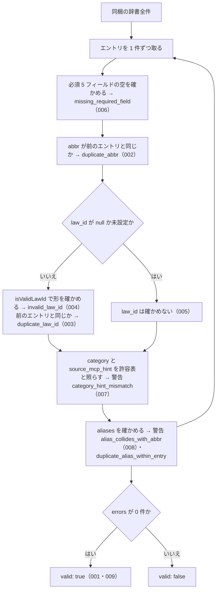

# 機能: validateAllEntries（同梱の辞書全件の整合性を検査し、エラーと警告の一覧を返す）

- 機能 ID: ABBR
- 版: current
- 承認日: 2026-09-27 （PR #10）
- 起こした元: v0.6.0 の `src/validate.ts`（`validateAllEntries`、型 `ValidationIssue` / `ValidationReport`）、`src/index.ts`（`validateAllEntries`）、`src/validate.test.ts`
- 関連する Issue: なし

この文書は「この関数は何をするか」を書きます。どう実装しているか（内部の変数名・インデックスの作り方）は書きません。

## アクター

- houki-abbreviations の辞書を編集する人と CI。辞書にエントリを足したり直したりしたあとで呼び、同梱の辞書全件に重複・欠損・形の誤りが無いかを受け取る
- `npm run validate`（`dist/index.js` の `validateAllEntries` を呼び、警告を `WARN:`、エラーを `ERROR:` で出力し、エラーがあれば終了コード 1 で終わる）

## 入力

引数は無い。検査するのは同梱の辞書全件（v0.6.0 では 174 件。`abbreviationEntries` と同じもの）。

## 戻り値

`ValidationReport`。

| フィールド | 型                  | 内容                                                           |
| ---------- | ------------------- | -------------------------------------------------------------- |
| `valid`    | `boolean`           | `errors` が 0 件なら `true`。警告があっても `true` のまま      |
| `errors`   | `ValidationIssue[]` | エラーの一覧（辞書の誤り。CI を失敗させる対象）。無ければ `[]` |
| `warnings` | `ValidationIssue[]` | 警告の一覧（CI を失敗させない不整合）。無ければ `[]`           |

`ValidationIssue`（エラーと警告で同じ型）。

| フィールド | 型                  | 内容                                                                                            |
| ---------- | ------------------- | ----------------------------------------------------------------------------------------------- |
| `code`     | `string`            | 種類を表す文字列。下の 2 つの表のどれか                                                         |
| `message`  | `string`            | 日本語の説明。該当する `abbr` や値を含む。例: `law_id の形式が不正です: 'INVALID'（abbr=消法）` |
| `entry`    | `AbbreviationEntry` | 問題のあったエントリ。v0.6.0 の実装ではすべてのエラーと警告に付く（型の上では省略可）           |

エラーの種類（`errors` に入る）。

| `code`                   | 起きる条件                                                                                                                | 仕様 ID |
| ------------------------ | ------------------------------------------------------------------------------------------------------------------------- | ------- |
| `missing_required_field` | `abbr` / `formal` / `domain` / `category` / `source_mcp_hint` のどれかが空（空文字・未設定）。欠けたフィールドごとに 1 件 | 006     |
| `duplicate_abbr`         | 同じ `abbr` のエントリが 2 件以上ある。2 件目以降に 1 件ずつ                                                              | 002     |
| `invalid_law_id`         | `law_id` が `null` でも未設定でもなく、`isValidLawId` が `false`                                                          | 004     |
| `duplicate_law_id`       | 同じ `law_id` のエントリが 2 件以上ある。2 件目以降に 1 件ずつ                                                            | 003     |

警告の種類（`warnings` に入る）。

| `code`                         | 起きる条件                                               | 仕様 ID |
| ------------------------------ | -------------------------------------------------------- | ------- |
| `category_hint_mismatch`       | `category` に対して `source_mcp_hint` が下の許容表に無い | 007     |
| `alias_collides_with_abbr`     | `aliases` のどれかが、ほかのエントリの `abbr` と同じ     | 008     |
| `duplicate_alias_within_entry` | 1 件のエントリの `aliases` に同じ値が 2 回以上ある       | 未決 1  |

`category_hint_mismatch` の許容表（`category` ごとに許す `source_mcp_hint`）。

| `category`                                                                                         | 許す `source_mcp_hint`     |
| -------------------------------------------------------------------------------------------------- | -------------------------- |
| `constitution` / `law` / `cabinet-order` / `imperial-ordinance` / `ministerial-ordinance` / `rule` | `houki-egov`               |
| `kihon-tsutatsu` / `kobetsu-tsutatsu`                                                              | `houki-nta` / `houki-mhlw` |
| `qa-jirei` / `tax-answer`                                                                          | `houki-nta`                |
| `hanrei`                                                                                           | `houki-court`              |
| `saiketsu`                                                                                         | `houki-saiketsu`           |

## 処理の流れ

辞書のエントリを 1 件ずつ、次の順で確かめます。図の中の番号は「できること」の仕様 ID の末尾 3 桁です。

## できること

### SPEC-ABBR-VALIDATE-ALL-ENTRIES-001 エラーが無ければ valid: true と空の errors を返す

どのエントリにもエラーの条件が当てはまらなければ、`valid: true` と `errors: []` を返す。

例: `{ abbr: "消法", formal: "消費税法", law_id: "363AC0000000108", domain: "tax", category: "law", source_mcp_hint: "houki-egov" }` 1 件だけの辞書なら `valid: true`、`errors: []`。

### SPEC-ABBR-VALIDATE-ALL-ENTRIES-002 abbr の重複をエラーにする

同じ `abbr` のエントリが 2 件以上あれば、`code: "duplicate_abbr"` のエラーを返し、`valid` は `false`。

例: 上の `消法` のエントリと、`formal` だけを `別の法` にした `消法` のエントリの 2 件なら `valid: false` で、`errors` に `duplicate_abbr` がある。

### SPEC-ABBR-VALIDATE-ALL-ENTRIES-003 law_id の重複をエラーにする

同じ `law_id` のエントリが 2 件以上あれば、`code: "duplicate_law_id"` のエラーを返す。`abbr` が違っても同じ。

例: `law_id: "363AC0000000108"` のエントリが `消法` と `別法` の 2 件あれば、`errors` に `duplicate_law_id` がある。

### SPEC-ABBR-VALIDATE-ALL-ENTRIES-004 形の誤った law_id をエラーにする

`law_id` が値を持ち、`isValidLawId` が `false` を返す形なら、`code: "invalid_law_id"` のエラーを返す。受け付ける形は `isValidLawId` の仕様（SPEC-ABBR-IS-VALID-LAW-ID-001〜010）のとおり。

例: `law_id: "INVALID"` のエントリがあれば、`errors` に `invalid_law_id` がある。

### SPEC-ABBR-VALIDATE-ALL-ENTRIES-005 law_id が null のエントリは law_id を確かめない

`law_id` が `null` のエントリ（通達など e-Gov に無いもの）は、`invalid_law_id` にも `duplicate_law_id` にもしない。

例: 上の `消法` のエントリの `law_id` を `null` にした 1 件なら `valid: true`。

### SPEC-ABBR-VALIDATE-ALL-ENTRIES-006 必須フィールドの欠けをエラーにする

`abbr` / `formal` / `domain` / `category` / `source_mcp_hint` のどれかが空文字か未設定なら、欠けたフィールドごとに `code: "missing_required_field"` のエラーを返す。

例: `formal: ""` のエントリがあれば、`errors` に `missing_required_field` がある（`message` は `formal が空です（abbr=消法）`）。

### SPEC-ABBR-VALIDATE-ALL-ENTRIES-007 category と source_mcp_hint の組み合わせの食い違いは警告にする

`category` に対して `source_mcp_hint` が「戻り値」の許容表に無ければ、`code: "category_hint_mismatch"` の警告を返す。エラーにはしないので、これだけなら `valid` は `true` のまま。

例: `category: "law"` で `source_mcp_hint: "houki-nta"` のエントリがあれば、`warnings` に `category_hint_mismatch` があり、`errors` には無い。

### SPEC-ABBR-VALIDATE-ALL-ENTRIES-008 ほかのエントリの abbr と同じ別名は警告にする

あるエントリの `aliases` に、ほかのエントリの `abbr` と同じ値があれば、`code: "alias_collides_with_abbr"` の警告を返す。自分の `abbr` と同じ値は対象にしない。

例: `消法` のエントリと、`aliases: ["消法"]` を持つ `法人税` のエントリの 2 件なら、`warnings` に `alias_collides_with_abbr` がある。

### SPEC-ABBR-VALIDATE-ALL-ENTRIES-009 v0.6.0 の同梱辞書は全件エラーなし

v0.6.0 の同梱辞書 174 件を検査すると `valid: true` を返す（`errors` は 0 件。v0.6.0 では `warnings` も 0 件だが、テストが確かめるのは `valid` だけ）。辞書を変えたときにこれが崩れないことを、辞書の回帰の確認に使う。

## できないこと

- 利用者が用意したエントリの配列を渡して検査すること（公開する `validateAllEntries` は引数を取らず、同梱の辞書だけを検査する）
- `law_id` の法令が e-Gov に実在するか、`formal` や `law_num` が e-Gov の値と一致するかを確かめること（e-Gov API を呼ぶ `scripts/verify-law-ids.mjs` で行う。パッケージには含まれない）
- `formal` の重複、`aliases` がほかのエントリの `formal` や `aliases` と同じことを見つけること（未決 3）
- `category` / `domain` / `source_mcp_hint` の値が決められた一覧にあるかを確かめること（未決 2）
- 誤りを直すこと（見つけて返すだけで、辞書は変えない）

## 未決

初版起こしで見つけた、意図か不具合かを人が決める項目です。決まったら「できること」に ID を振るか、`specs/changes/` の差分にします。

意図か不具合かの判断が要る項目は houki-abbreviations の Issue に移し、ここには題と Issue の番号だけを残します。今の振る舞いのままでよくテストが無いだけの項目は、受入テストを書いてから「できること」に ID を振ります。

1. **`duplicate_alias_within_entry` の警告。** 1 件のエントリの `aliases` に同じ値が 2 回あると、`duplicate_alias_within_entry` の警告を返す（例: `aliases: ["Q", "Q"]` → `同一エントリ内で aliases が重複: 'Q'（abbr=A1）`）。テストが無い。ID を振るのは受入テストを書いてから。
2. **一覧に無い `category` を見逃す。** `category: "foo"` のように決められた値に無い `category` は、許容表を引けないので警告も出さない。`{ abbr: "A", formal: "F", law_id: null, domain: "x", category: "foo", source_mcp_hint: "houki-zzz" }` 1 件で `valid: true`、`warnings: []`（`domain: "x"` も見逃す）。辞書のテスト（`src/index.test.ts`）は `category` と `domain` と `source_mcp_hint` の値を確かめているが、この関数は確かめない。エラーにするかを決める。
3. **`formal` や別名どうしの重複を見逃す。** 2 件のエントリの `formal` が同じでも、2 件のエントリが同じ別名を持っていても、別名がほかのエントリの `formal` と同じでも、エラーも警告も出さない。例: `{ abbr: "A1", formal: "F" }` と `{ abbr: "A2", formal: "F" }` の 2 件で `valid: true`、`warnings: []`。名前から 1 件に解決する関数（`resolveAbbreviation` など）が、どちらを返すか決まらなくなる。v0.6.0 の同梱辞書にはこの重複は無い。エラーか警告にするかを決める。
4. **自分の `abbr` や `formal` と同じ別名を見逃す。** `aliases` に自分の `abbr` か `formal` と同じ値があっても警告しない。v0.6.0 の同梱辞書では 66 件のエントリがこれに当たる（例: `酒税法` は `abbr` と `formal` がどちらも `酒税法`、`民` は `formal: "民法"` で `aliases: ["民法"]`）。この重ね方のために `extractLawNames` が同じ一致を 2 件返す（extract_law_names の未決 1）。警告にするかを決める。
5. **`law_id` が空文字のとき。** `law_id: ""` は `null` とは扱わず、`invalid_law_id` のエラーを返す。同じ誤った `law_id` のエントリが 2 件あると、`invalid_law_id` 2 件と `duplicate_law_id` 1 件を返す。テストが無い。ID を振るのは受入テストを書いてから。
6. **`message` の文言と `entry` の有無。** テストは `code` だけを確かめていて、`message` の文言と、`entry` が付くことは確かめていない。ID を振るのは受入テストを書いてから。
7. **`npm run validate` を CI で呼んでいない。** README には「CI で `npm run validate` を呼ぶと、`errors > 0` の場合に exit 1」とあるが、v0.6.0 の `.github/workflows/ci.yml` は lint・format:check・test・build だけを実行し、`npm run validate` は呼ばない。辞書の検査は `npm test` の中の SPEC-ABBR-VALIDATE-ALL-ENTRIES-009 のテストで行われている。また `npm run validate` は `dist/index.js` を読むので、`npm run build` の後でないと動かない。CI に足すか、README を直すかを決める。
